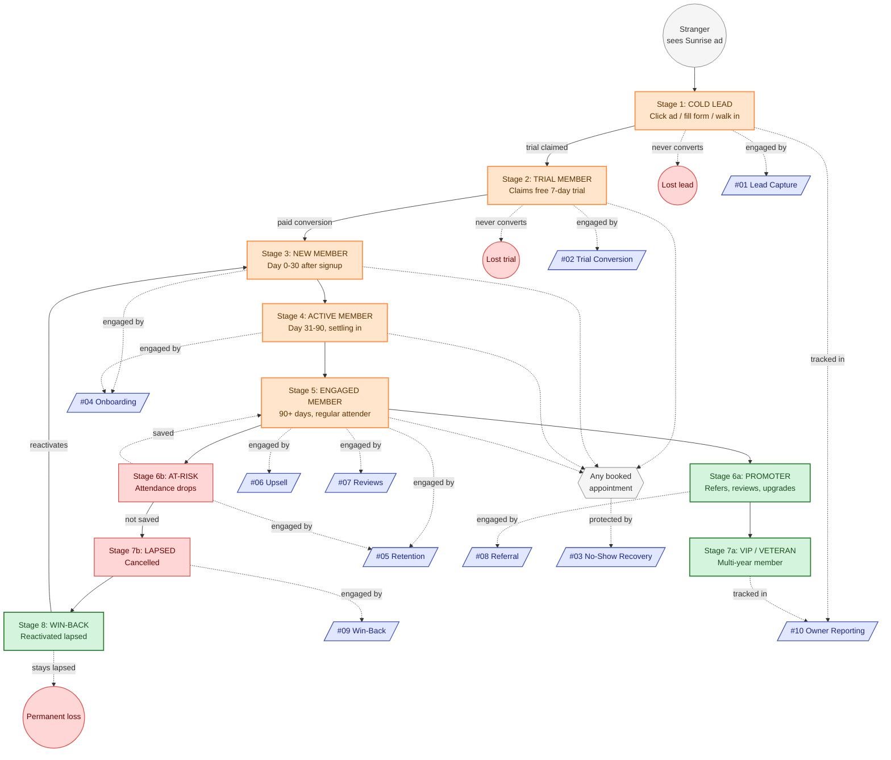

# Customer Journey — Cold Lead → Promoter

> The same person, walking through every stage of the relationship with Sunrise Wellness — and the systems that engage them at each point.

---

## The Full Journey

---

## Stage-by-Stage Narrative

| Stage | Who they are | What happens | Which system carries them |
|---|---|---|---|
| **Stranger** | Hasn't heard of Sunrise yet | Sees Meta ad, Google search result, or hears from a friend | (acquired by marketing — outside this build's scope) |
| **1. Cold Lead** | Clicked, scrolled, filled a form, called, or walked in | First touch with Sunrise — must be greeted within 5 min or they go cold | **#01** Lead Capture & Instant Response |
| **2. Trial Member** | Claimed the free 7-day trial | Has 7 days to fall in love or wander off | **#02** Trial-to-Paid Conversion |
| **3. New Member (0–30d)** | Paid, signed up | The fragile period — the first 30 days predict everything | **#04** New Member Onboarding |
| **4. Settling-In Member (31–90d)** | Past the cliff | Building routine, attendance stabilizing or wobbling | **#04** continues; **#05** starts watching |
| **5. Engaged Member (90d+)** | Steady-state | The bulk of MRR lives here; bulk of growth opportunity too | **#05** Retention, **#06** Upsell, **#07** Reviews |
| **6a. Promoter** | Loves the studio, tells people | Convert love into measurable referrals | **#08** Referral Engine |
| **6b. At-Risk** | Engagement dropping | Window to intervene before cancellation | **#05** Retention (saves ~30–40%) |
| **7a. VIP / Veteran** | Multi-year, often upgraded to Premium/VIP | Recognize, retain, leverage | **#06** Upsell, **#08** Referral, **#10** Reporting flags |
| **7b. Lapsed** | Cancelled (voluntary or involuntary) | Don't write off — most valuable lead pool | **#09** Win-Back |
| **8. Win-Back** | Reactivated lapsed member | Re-enters at Stage 3 (new member onboarding restart) | Loops back into **#04** |
| **All appointments** | Any stage that books PT, class, nutrition | Reminder cadence + no-show recovery | **#03** No-Show Recovery |
| **All stages** | Owner needs visibility into all of the above | Dashboard + weekly digest | **#10** Owner Reporting |

---

## Key Loops & Branches

**The successful loop:** Stage 1 → 2 → 3 → 4 → 5 → 6a → 7a — the prospect becomes a multi-year VIP who refers friends. Every system in the build is biased toward keeping members on this path.

**The save loop:** Stage 5 → 6b (at-risk) → back to Stage 5 — system #05 catches the at-risk member and saves them. Industry-standard save rate is 30–40% with a good system; without one it's near zero.

**The reactivation loop:** Stage 7b (lapsed) → 8 → re-enters at Stage 3 — system #09 brings cancelled members back into onboarding. 15–25% reactivation rate is realistic.

**The fatal branches** (dashed gray):
- Cold lead never converts (filtered by #01 + nurture)
- Trial never converts (filtered by #02)
- At-risk member not saved (best effort by #05)
- Lapsed member stays gone (best effort by #09)

These losses are unavoidable in any business. The systems minimize them; they don't eliminate them.

---

## Related Diagrams

- **[problem-map.md](problem-map.md)** — pains by persona.
- **[revenue-impact.md](revenue-impact.md)** — dollar value per stage transition.
- **[../integration/master-automation-graph.md](../integration/master-automation-graph.md)** — the technical wiring between systems.
