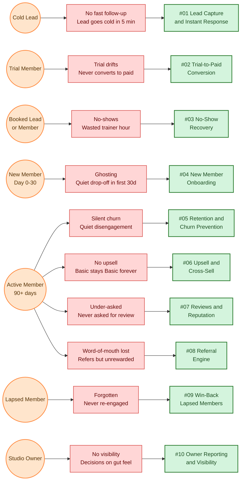

# Master Problem Map — Sunrise Wellness Studio

> This is the single most important diagram in this folder. It shows **who has which pain**, and **which system we built to solve it**. Walk a prospect through this diagram and they will understand the entire build in two minutes.

---

## The Master Map

---

## How to Read This

**Left column (orange circles) — the seven personas.** Each represents a real customer state Sunrise Wellness deals with daily. See [00-business-overview.md](../00-business-overview.md) for full persona descriptions.

**Middle column (red boxes) — the pain each persona suffers.** These are the problems an owner would describe in plain English. "My leads go cold." "My trials drift." "My members quietly disappear." Note that the **Active Member** persona has four pains — because the active-member stage is where the most value lives, and the most opportunities are lost.

**Right column (green boxes) — the system we built to solve it.** Each maps to a folder in `problems/`. Click through to see the pitch and the build.

---

## Persona-to-Solution Index

| Persona | Pains | Systems that serve them |
|---|---|---|
| **P1 Cold Lead** | No fast follow-up | #01 |
| **P2 Trial Member** | Trial drifts | #02 |
| **P3 Booked Lead/Member** | No-shows | #03 |
| **P4 New Member (0–30d)** | Ghosting | #04 |
| **P5 Active Member (90d+)** | Silent churn, no upsell, under-asked for reviews, unrewarded word-of-mouth | #05, #06, #07, #08 |
| **P6 Lapsed Member** | Forgotten | #09 |
| **P7 Studio Owner** | No visibility | #10 |

The Active Member persona is the **center of gravity** — four of the ten systems serve them, because they generate the bulk of MRR, the bulk of upsell potential, and the bulk of organic growth.

---

## Related Diagrams

- **[customer-journey.md](customer-journey.md)** — shows the lifecycle from cold lead → promoter, with which systems engage them at each stage.
- **[revenue-impact.md](revenue-impact.md)** — shows the dollar impact of each system.
- **[../integration/master-automation-graph.md](../integration/master-automation-graph.md)** — shows how the ten systems connect to each other once built.
