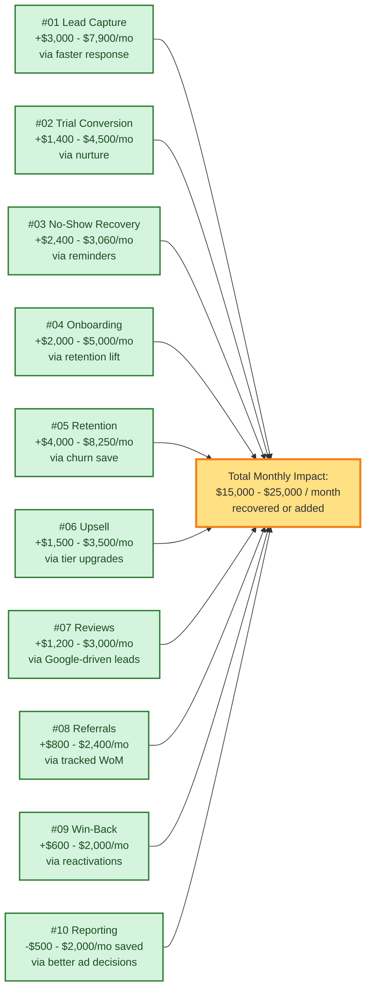

# Revenue Impact — Dollar Value Per System

> The business case, in numbers. Every system has an estimated monthly dollar impact for a representative wellness studio (200 active members, 30 leads/week, $79/$149/$249 pricing). Numbers are conservative — real impact depends on baseline.

---

## Impact Summary

---

## Per-System Detail

Baseline assumed for a "representative" studio:
- 200 active members (mix of $79 / $149 / $249)
- ~30 new leads/week (= 120/month)
- ~30 trials/month
- ~200 PT slots/month
- Current trial-to-paid: 30%, current monthly churn: 5%

### #01 — Lead Capture & Instant Response

- **Before:** 30% of leads contacted within 1+ hour → 60–70% never reply
- **After:** 95%+ contacted in 5 min → response rate doubles
- **Math:** 120 leads × (50% old response → 75% new response) = ~30 additional engaged leads/mo → 9 additional trials → 3 additional members → **$3,000–$7,900/mo new LTV pipeline**

### #02 — Trial-to-Paid Conversion

- **Before:** 30% trial-to-paid (industry typical without nurture)
- **After:** 45–55% with a 7-day nurture sequence
- **Math:** 30 trials × (45% – 30%) = 4.5 additional conversions/mo. At Basic $79 × 14mo LTV = $1,107 per conversion = **$1,400–$4,500/mo MRR + LTV pipeline**

### #03 — Appointment No-Show Recovery

- **Before:** 18% no-show rate on 200 PT slots = 36 no-shows = $3,060 lost trainer revenue
- **After:** 6% no-show rate (typical with reminders + recovery) = 12 no-shows = $1,020 lost
- **Math:** Recovered ~$2,040/mo + 60% of remaining no-shows rebook within 48hr = **$2,400–$3,060/mo recovered**

### #04 — New Member Onboarding

- **Before:** 40% of new members churn within 90 days (typical without onboarding)
- **After:** 20% churn at 90 days with structured onboarding
- **Math:** With 12 new members/mo and 20% improvement, save 2.4 members/mo. Each saved = $79 × ~12mo additional retention = $948 LTV preserved per save = **$2,000–$5,000/mo LTV preserved**

### #05 — Retention & Churn Prevention

- **Before:** 5% monthly churn = 10 members lost/mo at avg $110/mo
- **After:** 3.5% monthly churn (catch 30% of at-risk before cancellation)
- **Math:** 3 members saved/mo × $110/mo × 12mo LTV = $3,960. Plus avoided re-acquisition cost (~$100/lead × 3) = **$4,000–$8,250/mo preserved**

### #06 — Upsell & Cross-Sell

- **Before:** ~5% of Basic members upgrade per year (passive)
- **After:** 15% of Basic members upgrade in response to triggered offers
- **Math:** ~140 Basic members × 10% additional upgrade rate / 12 = 1.2 upgrades/mo. Premium $149 – $79 = $70/mo lift × 14mo LTV × 1.2 = **$1,500–$3,500/mo MRR lift**

### #07 — Reviews & Reputation

- **Before:** 25 Google reviews, 4.3 stars, ~12 cold leads/mo from Google
- **After:** 100+ reviews, 4.7 stars, ~20 cold leads/mo from Google
- **Math:** 8 additional leads/mo × 25% trial rate × 35% paid rate × $1,107 LTV = **$1,200–$3,000/mo LTV pipeline**

### #08 — Referral Engine

- **Before:** ~2 unmeasured referrals/mo
- **After:** 6–10 tracked referrals/mo with reward
- **Math:** 5 additional referred members/mo × 60% conversion (referrals convert higher) × ~$1,200 LTV = **$800–$2,400/mo LTV pipeline at near-zero CAC**

### #09 — Win-Back Lapsed Members

- **Before:** 0% reactivation
- **After:** 15–25% reactivation within 90 days
- **Math:** 12 cancellations/mo × 20% reactivation = 2.4 win-backs/mo × $110/mo × 9mo retention = **$600–$2,000/mo recovered**

### #10 — Owner Reporting & Visibility

- **Before:** Owner overspends on Meta ads by ~30% (no per-channel tracking)
- **After:** Owner reallocates ad spend based on cost-per-converted-member by source
- **Math:** Typical $1,500–$3,000/mo Meta budget × 20–30% efficiency = **$500–$2,000/mo saved** (or reinvested into better-converting channels)

---

## Cumulative Impact

| Tier | Conservative | Typical | Aggressive |
|---|---|---|---|
| New LTV / Pipeline | $8,500 | $14,500 | $25,500 |
| Preserved / Recovered Revenue | $6,500 | $10,800 | $18,000 |
| Saved Ad Spend | $500 | $1,200 | $2,000 |
| **Total Monthly Impact** | **~$15,500** | **~$26,500** | **~$45,500** |

A representative studio sees **$15,000–$25,000/month** of new or recovered revenue and LTV. At even the conservative end, the GHL subscription + this build pays back in **under a month**.

---

## Caveats

These are **estimates for a representative studio**. Actual impact depends on:

- **Current baseline** — a studio already at 50% trial conversion won't see another 50% lift from #02; they may see 5–10%.
- **Ad spend and lead volume** — #01 scales with lead volume; tiny studios see proportionally smaller dollar wins.
- **Member mix** — studios skewed toward $79 Basic see lower per-member LTV than studios with VIP-heavy mixes.
- **Execution** — these systems work when monitored. If nobody reads the dashboard or refreshes seasonal offers, results degrade.

What is **not** caveated: the directional impact is real. Faster lead response, structured nurture, no-show reminders, onboarding, churn intervention, upsell timing, review capture, tracked referrals, win-back, and owner visibility — every one of these is well-documented in CRM literature to move the numbers in the direction shown above.

---

## Related Diagrams

- **[problem-map.md](problem-map.md)** — pains by persona.
- **[customer-journey.md](customer-journey.md)** — lifecycle stages.
- **[../integration/master-automation-graph.md](../integration/master-automation-graph.md)** — how systems connect.
