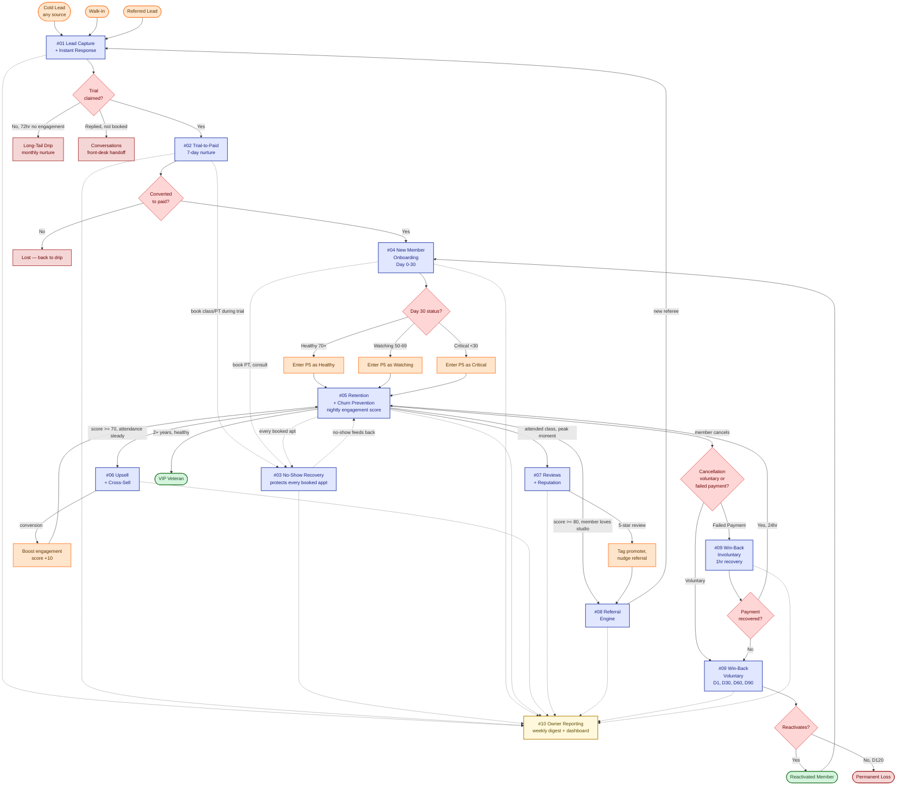

# Master Automation Graph — How the 10 Systems Connect

> The single most important diagram for understanding why this is a *business*, not a pile of automations. Each of the 10 problem folders builds an isolated system. This file shows how they wire into one engine.

---

## The Full Engine

---

## How to Read This

**Solid arrows** = direct triggering (one system fires another via tag/workflow handoff).

**Dotted arrows** = data feed (one system writes to fields/pipelines that another reads).

**Decision diamonds** = branching points where contact state determines next system.

---

## The Spine — End-to-End Happy Path

A new lead's ideal journey through the engine:

1. **Lead arrives** (Instagram ad, walk-in, or referral link) → `#01` captures, tags by source, fires Email in <5 min.
2. **Lead books trial** → handoff to `#02`. Lead added to Membership Sales pipeline "Trial Booked" stage.
3. **Trial runs 7 days** → `#02` nurtures across emails. Day-5 conversion offer fires.
4. **Trial converts to paid** → `#02` exits, `#04` activates. Onboarding pipeline opportunity created. Lead becomes Active Member.
5. **Day 30 onboarding completes** → `#04` exits, `#05` watches. Retention pipeline opportunity created at "Healthy" stage.
6. **Member stays 90+ days** → `#05` engagement score stays 70+. Member tagged `risk-healthy`.
7. **Member attends 12+ classes/month** → `#06` fires "upgrade to Premium" offer.
8. **Member has peak class moment** → `#07` fires post-class review Email. 5-star → Google review.
9. **Member tagged top referrer** → `#08` quarterly recognition + referral link encouragement. Referee signs up → loops back to step 1.
10. **Multi-year veteran** → `member-vip-veteran` tag, leveraged by `#06` for VIP upsell and `#08` for referral campaigns. Featured in `#10` reporting as anchor revenue.

Throughout: every appointment booked is protected by `#03` reminder cadence + no-show recovery. The owner sees the whole engine via `#10`'s dashboard and Monday digest.

---

## The Save Path — When Things Go Wrong

If a member's engagement drops:

1. **Score falls below 70** → `#05` transitions tag to `risk-watching`. Light Email check-in fires.
2. **Score falls below 50** → `risk-at-risk`. Personal email from owner. Free PT session offer.
3. **Score falls below 30** → `risk-critical`. Direct owner Email. Saves opportunity moves to "Save In Progress" in Retention pipeline.
4. **Member re-engages** → score recovers. Tag updates upward. Pipeline opportunity moves to "Saved" (Won).
5. **Member cancels anyway** → handoff to `#09`. Branches:
   - **Voluntary** → 90-day soft win-back (D1 goodbye → D30 check-in → D60 offer → D90 last call).
   - **Involuntary (payment failure)** → 1-hour intervention emails with payment-update link. 70% recovery rate.
6. **Member reactivates** → tag `member-reactivated`. Re-enters `#04` onboarding to rebuild routine.
7. **No reactivation by D120** → `member-permanent-loss`. Logged in `#10`. Lessons fed to ad-targeting exclusion.

---

## Critical Handoffs (the wiring connections)

| From | To | Trigger event | Tag handoff |
|---|---|---|---|
| `#01` | `#02` | Trial booked (calendar appt created with `service-trial` flag) | `lead-contacted` → `trial-claimed` |
| `#02` | `#04` | First successful payment | `trial-converted` → `member-active` + `member-onboarding` + `tier-*` |
| `#04` | `#05` | Day 30 reached | `member-onboarding` removed → `risk-healthy`/`risk-watching`/`risk-critical` based on score |
| `#05` | `#06` | Mature member (90+ days), `risk-healthy`, attended 12+ classes/30d | `campaign-upsell-basic-premium` |
| `#05` | `#07` | Member attended class, status="showed", no review in 30d | `campaign-review-ask` |
| `#05` | `#08` | Member 6+ months, `risk-healthy`, no recent referral attempt | `referral-prompt-ready` |
| `#07` | `#08` | Member submitted 5-star review | `campaign-referral-promoter` candidate |
| `#08` | `#01` | Referee clicks referral link | `source-referral` + `referred_by_contact_id` populated |
| `#05` | `#09` | Member cancels (tag `member-cancelled` applied) | `member-cancelled` → 30 days later `member-lapsed` |
| `#09` | `#04` | Reactivated lapsed member | `member-reactivated` → re-enroll in `#04` |
| `#03` (no-show) | `#05` | No-show count 90d increments | Feeds `engagement_score` calculation |
| Every system | `#10` | Any state change | Pipeline + tag + field updates roll up into smart lists + dashboard widgets |

---

## What Makes This an Engine

Three properties make this more than 10 separate workflows:

### 1. Pipeline Coordination

The three pipelines from [shared-foundation/pipelines.md](../shared-foundation/pipelines.md) — Membership Sales, Onboarding, Retention — form the visible scaffold. Every system advances opportunities through stages. The owner can glance at three kanbans and see the entire business in motion.

### 2. Shared Tag Vocabulary

Tags from [shared-foundation/tags.md](../shared-foundation/tags.md) are the *common language* between systems. `#04` adding `risk-healthy` is the same `risk-healthy` `#05` reads. No system invents its own labels; everything composes.

### 3. Engagement Score as the Heartbeat

The `engagement_score` field computed by `#05`'s nightly workflow is the single most-read number in the engine:
- `#05` uses it to trigger interventions
- `#06` uses it to filter upsell candidates (don't pitch upgrades to disengaged members)
- `#07` uses it to filter review-ask targets (don't ask disengaged members for reviews)
- `#08` uses it to filter referral prompts (only ask happy members to refer)
- `#10` uses it as the headline at-risk-members count

One number, computed once nightly, gates four downstream decisions. That's why `#05` is the keystone system.

---

## Build Order Implication

Because so many systems read from `#05`'s outputs, build order matters:

1. **Build [#05](../problems/05-retention-and-churn-prevention/) before #06, #07, #08** — those systems' workflows will reference `engagement_score`, `at_risk_flag`, and `risk-*` tags. If `#05` isn't computing them, downstream systems trigger on stale or empty data.
2. **Build [#04](../problems/04-new-member-onboarding/) before #05** — onboarding sets the initial state that retention picks up.
3. **Build [#03](../problems/03-appointment-no-show-recovery/) early** — every system from `#02` onward involves appointments, and unprotected appointments mean compounded no-show damage during testing.

Full sequencing in [build-order.md](build-order.md).

---

## Related Files

- **[build-order.md](build-order.md)** — exact sequence to construct the engine.
- **[end-to-end-scenario.md](end-to-end-scenario.md)** — narrative trace of one lead through every system.
- **[../diagrams/problem-map.md](../diagrams/problem-map.md)** — pains by persona (the why).
- **[../diagrams/customer-journey.md](../diagrams/customer-journey.md)** — lifecycle stages with system engagement.
