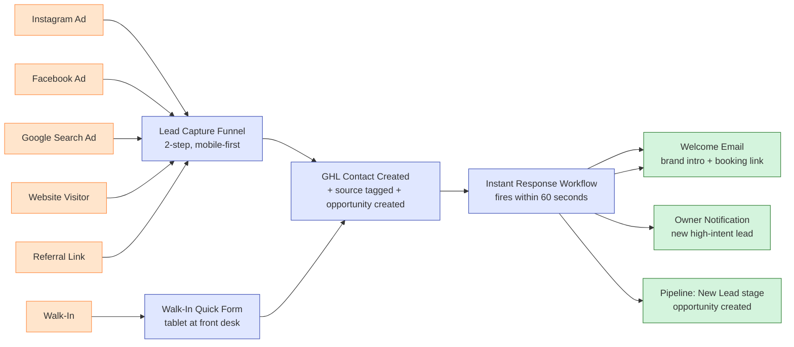

# #01 — Lead Capture & Instant Response

> **The Problem:** Leads from Instagram, Google, and walk-ins go cold before anyone responds. A lead contacted in 5 minutes is **10× more likely** to convert than one contacted an hour later — and most studios are taking hours.

---

## Who This Hurts

**P1 — The Cold Lead.** A real person who just saw your ad, searched "yoga near me," or walked past your studio window. They're interested but not committed. They have **about 5 minutes** of attention before they move on to the next thing in their feed.

If you don't engage them in that window:

- They scroll past your competitor's ad.
- They Google your address and read 3 mediocre reviews.
- They forget they were ever curious about you.

The lead doesn't say "no." They just disappear. And you don't even know they were there.

---

## Cost of Inaction

Conservative math for a studio getting **30 leads/week** (120/month):

| Scenario | Lead-to-trial rate | Trials/month | Conversions ($79 × 14mo LTV) |
|---|---|---|---|
| **Slow response (1hr+)** | 25% | 30 | ~$11,000 LTV pipeline |
| **Fast response (<5 min)** | 50% | 60 | ~$22,000 LTV pipeline |
| **Delta lost** | — | **30 leads** | **~$11,000/month** in lost LTV |

For an aggressive studio at 80 leads/month, the delta is **$7,000–$8,000/month** in measurable lost LTV pipeline — every single month.

---

## What We Built

A three-part system that captures every lead, regardless of channel or time of day, and responds in under 5 minutes:

**Three components:**

1. **Lead Capture Funnel** — a 2-step, mobile-first funnel with strong social proof and a single CTA ("Claim Your Free 7-Day Pass"). Built so the same funnel works whether the lead arrives from Instagram, Google, or a referral link — just different UTM parameters.
2. **Walk-In Quick Form** — a 4-field tablet form at the front desk for walk-ins. Same downstream wiring as the funnel.
3. **Instant Response Workflow** — fires the moment a lead lands in GHL. Sends Email in under 5 minutes, sends a welcome email, notifies the owner, creates a Membership Sales pipeline opportunity, and tags the lead by source.

---

## Outcome & KPIs

Move these numbers within 30 days of launch:

| KPI | Baseline | Target | How we measure |
|---|---|---|---|
| Time to first response | 1–4 hours | **<5 min, 95%+ of leads** | `lead_first_response_at` − `lead_captured_at` |
| Lead → trial booking rate | 20–30% | **45%+** | Trials booked ÷ leads captured |
| Off-hours lead capture (8PM–8AM) | Lost or 12hr+ delay | **Same <5 min response, automated** | Same as above, filtered by hour |
| Source attribution accuracy | "Where'd you hear about us?" guesswork | **100% tracked** | `lead_source` tag populated on every lead |

The owner sees these in the **Lead Capture** dashboard widget built in [#10 Owner Reporting](../10-owner-reporting-and-visibility/).

---

## What Changes for the Studio Owner

Before:

- The owner checks email when she has time, sees 4 leads from the last 6 hours, panics, sends 4 copy-pasted emails. Two never reply.
- The walk-in at 7:45 PM gets the front desk's promise to "call you tomorrow." Front desk forgets.
- An Instagram lead from 11 PM wakes up to no contact, scrolls past a competitor at 9 AM, gone.

After:

- Every lead is in GHL within 60 seconds — including at 11 PM.
- Every lead gets a personal-sounding Email within 5 minutes — including at 11 PM.
- The owner gets a single morning summary: *"You got 7 leads overnight. 4 already engaged. 2 booked trials. 1 needs your personal touch."*
- The owner spends her time on the *one* lead that needs human attention, not the six that don't.

---

## Build It

Full step-by-step build in **[build.md](build.md)** — funnel pages, form fields, every workflow step, exact GHL clicks.

Production copy for every asset:

- **[assets/funnel.md](assets/funnel.md)** — funnel page-by-page (headlines, body, CTAs, button microcopy)
- **[assets/emails.md](assets/emails.md)** — welcome email
- **[assets](assets)** — instant-response Email variants
- **[assets/workflow.md](assets/workflow.md)** — workflow spec (trigger, every action, every condition)
- **[assets/forms.md](assets/forms.md)** — form fields and validation

---

## How This Connects to Other Systems

This system **feeds** [#02 Trial-to-Paid Conversion](../02-trial-to-paid-conversion/) — every lead that books a trial enters the trial nurture sequence.

It also feeds [#10 Owner Reporting](../10-owner-reporting-and-visibility/) — every lead is source-tagged so the owner can see cost-per-converted-member by channel.

Full integration map: [../../integration/master-automation-graph.md](../../integration/master-automation-graph.md)
