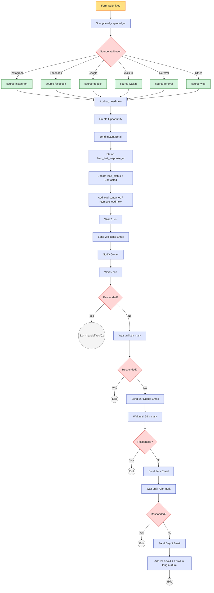

# #01 — Workflow Spec: Instant Response

> Complete workflow specification — every trigger, action, wait, and condition in writing. This is the canonical reference; the GHL workflow builder should match this 1:1.

---

## Workflow Header

| Property | Value |
|---|---|
| **Workflow Name** | `01 — Instant Response — Lead Capture` |
| **Folder** | `01 - Lead Capture` |
| **Status** | Published / On |
| **Re-entry** | Disabled (one contact = one workflow run) |
| **Quiet hours respected** | No (this is transactional response, not marketing) |

---

## Trigger

**Type:** Form Submitted

**Filters:**
- Form is `Lead Capture — Free 7-Day Pass` OR `Lead Capture — Walk-In Tablet`
- Contact does NOT have tag `member-active`
- Contact does NOT have tag `lead-contacted` (prevents re-trigger on repeat submission)

**Why these filters:** Avoids re-entry by existing members who refill the form (testing the funnel, sharing with friends, etc.) and prevents duplicate response sequences if a lead submits twice in quick succession.

---

## Actions (in order)

### Action 1 — Stamp Lead Capture Timestamp

| Property | Value |
|---|---|
| **Action type** | Update Contact Field |
| **Field** | `lead_captured_at` |
| **Value** | `{{date_added}}` |
| **Wait before** | None |

---

### Action 2 — Source Attribution (If/Else Chain)

| Property | Value |
|---|---|
| **Action type** | If / Else |
| **Branches** | 7 (one per source value) |

**Branch logic:**

```
IF custom field "lead_source" equals "Instagram"
  → Add Tag: source-instagram
ELSE IF custom field "lead_source" equals "Facebook"
  → Add Tag: source-facebook
ELSE IF custom field "lead_source" equals "Google"
  → Add Tag: source-google
ELSE IF custom field "lead_source" equals "Walk-in"
  → Add Tag: source-walkin
ELSE IF custom field "lead_source" equals "Referral"
  → Add Tag: source-referral
ELSE IF custom field "lead_source" equals "Event"
  → Add Tag: source-event
ELSE (default fallback)
  → Add Tag: source-web
```

After the branches reconverge, continue to Action 3.

---

### Action 3 — Add Lead Lifecycle Tag

| Property | Value |
|---|---|
| **Action type** | Add Tag |
| **Tag** | `lead-new` |
| **Wait before** | None |

---

### Action 4 — Create Membership Sales Opportunity

| Property | Value |
|---|---|
| **Action type** | Create Opportunity |
| **Pipeline** | Membership Sales |
| **Stage** | New Lead |
| **Opportunity Name** | `{{contact.first_name}} {{contact.last_name}} — Trial Lead` |
| **Monetary Value** | 948 (= $79 × 12mo projected) |
| **Status** | Open |
| **Owner** | Round-robin between Owner and Front Desk |
| **Skip if** | Contact already has an Open opportunity in Membership Sales |

---

### Action 5 — Send Instant Response Email

| Property | Value |
|---|---|
| **Action type** | Send Email |
| **From** | `{{custom_values.business.sms_number}}` |
| **To** | `{{contact.phone}}` |
| **Template** | `01 — Instant Lead Response` (from [](), message A) |
| **Wait before** | None — fires immediately |
| **Skip if** | Contact has tag `do-not-email` OR `sms_opt_in` ≠ "Yes" |

---

### Action 6 — Stamp First-Response Timestamp

| Property | Value |
|---|---|
| **Action type** | Update Contact Field |
| **Field** | `lead_first_response_at` |
| **Value** | `{{now}}` |
| **Wait before** | None |

---

### Action 7 — Update Lead Status Field

| Property | Value |
|---|---|
| **Action type** | Update Contact Field |
| **Field** | `lead_status` |
| **Value** | `Contacted` |

---

### Action 8 — Add `lead-contacted` Tag, Remove `lead-new`

| Property | Value |
|---|---|
| **Action 8a** | Add Tag: `lead-contacted` |
| **Action 8b** | Remove Tag: `lead-new` |

---

### Action 9 — Wait 2 Minutes (let Email land first)

| Property | Value |
|---|---|
| **Action type** | Wait |
| **Duration** | 2 minutes |

---

### Action 10 — Send Welcome Email

| Property | Value |
|---|---|
| **Action type** | Send Email |
| **From Name** | `{{custom_values.team.owner_first}} from {{custom_values.business.short_name}}` |
| **From Email** | `{{custom_values.business.email}}` |
| **Reply-To** | `{{custom_values.business.owner_email}}` |
| **Subject** | `Welcome, {{contact.first_name}} — your free 7-day pass is ready ☀️` |
| **Template** | `01 — Welcome — Free 7-Day Pass` (from [emails.md](emails.md)) |
| **Skip if** | Contact has tag `do-not-email` OR `email_opt_in` ≠ "Yes" |

---

### Action 11 — Owner Internal Notification

| Property | Value |
|---|---|
| **Action type** | Send Internal Notification |
| **Channel** | Email |
| **To** | `{{custom_values.business.owner_email}}` |
| **Subject** | `New lead: {{contact.first_name}} {{contact.last_name}} from {{contact.lead_source}}` |
| **Body** | See template below |

**Body template:**

```
New lead just came in.

Name: {{contact.first_name}} {{contact.last_name}}
Phone: {{contact.phone}}
Email: {{contact.email}}
Goal: {{contact.fitness_goal_primary}}
Source: {{contact.lead_source}} ({{contact.lead_source_detail}})

Auto-response already sent. They'll likely book within the hour.

Open contact: {{contact_url}}
```

**Quiet hours:** If owner-local time is between 10 PM and 7 AM, queue notification for 7 AM next morning (use a Wait-Until-Time action). Otherwise send immediately.

---

### Action 12 — Wait 5 Minutes, Check for Reply

| Property | Value |
|---|---|
| **Action 12a** | Wait 5 minutes |
| **Action 12b** | If/Else: Contact has tag `lead-responded` OR `trial-claimed` |
| **YES branch** | Exit Workflow (success — handed off to #02) |
| **NO branch** | Continue to Action 13 |

---

### Action 13 — Wait 2 Hours, Send Nudge Email

| Property | Value |
|---|---|
| **Action 13a** | Wait — until 2 hours after capture timestamp, **respecting contact-local time 8 AM – 9 PM** |
| **Action 13b** | If/Else: Contact has tag `lead-responded` OR `trial-claimed` |
| **YES branch** | Exit |
| **NO branch** | Send Email template `01 — 2hr Nudge` (from [](), message B) |

---

### Action 14 — Wait 24 Hours, Send Soft Follow-Up Email

| Property | Value |
|---|---|
| **Action 14a** | Wait — until 24 hours after capture, contact-local time 8 AM – 8 PM |
| **Action 14b** | If/Else: Contact has tag `lead-responded` OR `trial-claimed` |
| **YES branch** | Exit |
| **NO branch** | Send email template `01 — 24hr Soft Follow-Up` |

---

### Action 15 — Wait 48 Hours, Send Day-3 Email Last Touch

| Property | Value |
|---|---|
| **Action 15a** | Wait — until 72 hours total after capture, contact-local time 8 AM – 8 PM |
| **Action 15b** | If/Else: Contact has tag `lead-responded` OR `trial-claimed` |
| **YES branch** | Exit |
| **NO branch** | Send Email template `01 — Day 3 Last Touch` (from [](), message C) |

---

### Action 16 — Hand Off to Long-Tail Nurture

| Property | Value |
|---|---|
| **Action type** | Add Tag |
| **Tag** | `lead-cold` |
| **Action type** | Add to Workflow |
| **Workflow** | `Lead Nurture — 30-Day Drip` (out of scope here — separate workflow) |
| **Action type** | Exit Workflow |

---

## Visual Workflow Diagram



---

## Edge Cases & Handling

| Scenario | Workflow behavior |
|---|---|
| Contact already has `member-active` | Trigger filter blocks entry. No workflow runs. |
| Contact already has open opportunity in Membership Sales | Action 4 skipped (no duplicate opportunity created); rest of workflow continues. |
| Contact has `do-not-email` | Email actions (5, 13b, 15b) skip silently. Email actions still fire. |
| Contact has `do-not-email` | Email actions (10, 14b) skip silently. Email actions still fire. |
| Contact has BOTH `do-not-email` AND `do-not-email` | Only owner notification (Action 11) fires. Owner contacts manually. |
| Form submitted at 3 AM contact-local | Instant Email still fires (transactional). Owner notification queues for 7 AM. 2hr nudge respects 8 AM start. |
| Contact replies to instant Email within 5 min | Tag `lead-responded` applied by inbound-email handler workflow. Action 12 sees the tag, exits to #02. |
| Contact books trial within 5 min | Tag `trial-claimed` applied by booking trigger. Action 12 exits to #02. |
| Contact replies "STOP" | GHL applies `do-not-email` automatically. All future Email actions skip. |

---

## Monitoring & Alerts

Build a smart list **"Lead Capture — Stuck Leads"** for owner inspection:

- Has tag `lead-cold`
- Captured in last 14 days
- No `trial-claimed`

Build a smart list **"Lead Capture — Workflow Failures"**:

- Has tag `lead-new` for more than 1 hour (should have moved to `lead-contacted` within seconds)
- Indicates the Email/email step failed — investigate

Both lists feed the [#10 Owner Reporting](../../10-owner-reporting-and-visibility/) dashboard.

---

## What Lives Outside This Workflow

This workflow only owns the first 72 hours of lead engagement. Adjacent systems own:

- **Lead books trial → #02 Trial-to-Paid Conversion takes over**
- **Lead replies but doesn't book → manual handoff to front-desk Conversations**
- **Lead never engages after 72hr → long-tail Lead Nurture (30-day drip, monthly thereafter)**
- **Lead source attribution data → flows into #10 Owner Reporting**
