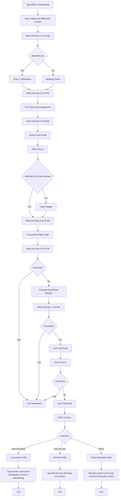

# #02 — Trial-to-Paid Conversion

> **The Problem:** A trial member is the single most expensive lead in the funnel — you've already paid the ad dollars, the front-desk hello, the trainer's tour. Most studios convert **25–35%** of trials. Every percentage point under 50% is recurring revenue you'll never get back.

---

## Who This Hurts

**P2 — The Trial Member.** Someone who claimed the free 7-day pass and walked through the door. They're not a stranger anymore — they've met Morgan, taken a class, maybe done the intro consult. But they're also not committed. They're comparing Sunrise to the gym down the street, to the $9 Planet Fitness across town, to the YouTube workouts at home, to their own willpower.

If we don't nurture them deliberately across the 7 days:

- Day 2 they forget what time class is and skip.
- Day 4 their motivation dips and the trial blurs into "I'll figure it out next week."
- Day 7 the trial silently expires. No drama. No goodbye. Just gone.

**P7 — The Studio Owner** also hurts here. Every non-converted trial is the worst kind of loss — full acquisition cost, zero recurring revenue. It's the line item that quietly bleeds the studio.

---

## Cost of Inaction

Conservative math for a studio generating **30 trials/month**:

| Scenario | Trial-to-paid rate | New paid members/mo | Annualized MRR added |
|---|---|---|---|
| **No nurture (status quo)** | 30% | 9 | $711/mo new MRR ($79 × 9) |
| **Full 7-day nurture** | 50% | 15 | $1,185/mo new MRR ($79 × 15) |
| **Delta** | — | **6 members** | **+$474/mo NEW MRR every month, compounding** |

That compounding is the whole game. Six extra members this month, six more next month, six more the month after — at a 14-month average tenure, **one year of consistent +6/mo conversion adds ~$13,600 in run-rate MRR**.

For a studio doing 60 trials/month, double everything. The trial nurture is the highest-ROI workflow in the entire build.

---

## What We Built

A 7-day emails nurture sequence that runs the moment a trial pass is claimed, branches based on attendance, and ends with a one-page conversion checkout funnel.

**Four components:**

1. **7-Day Trial Nurture Workflow** — fires the moment `trial-claimed` is applied. Runs an emails sequence across days 0, 1, 2, 4, 5, 6, 7 with attendance-aware branching.
2. **Conversion Offer Funnel** — a single-page checkout for the trial conversion offer (`20% off first month + waived $49 enrollment fee`). Pre-fills the contact's info; checkout in under 60 seconds.
3. **Reply-handling micro-workflow** — when the trial replies "not now" or asks a question, route to Conversations + Morgan, exit the marketing branch.
4. **Day-7 outcome router** — tags the contact based on what happened (`trial-converted`, `trial-not-now`, `trial-expired`) and hands off to either [#04 Onboarding](../04-new-member-onboarding/) or the long-tail lead nurture.

---

## Outcome & KPIs

Move these numbers within 60 days of launch:

| KPI | Baseline | Target | How we measure |
|---|---|---|---|
| Trial-to-paid conversion rate | 30% | **50%+** | `trial-converted` count ÷ `trial-claimed` count, rolling 30-day |
| Trial classes attended (avg) | 1.2 | **3+** | Sum of `total_visits_lifetime` change ÷ active trials, rolling 7-day |
| Day-7 silent expirations | 50%+ | **<25%** | `trial-expired` without `trial-not-now` reply ÷ total trials |
| Conversion offer open rate | n/a (no offer existed) | **45%+** | Email opens / sent, GHL native analytics |
| Time-to-first-class (trial signup → first visit) | 4–6 days | **<2 days** | `last_visit_date` − `lead_captured_at` for `trial-claimed` cohort |

The owner sees these in the **Trial Funnel** widget built in [#10 Owner Reporting](../10-owner-reporting-and-visibility/).

---

## What Changes for the Studio Owner

Before:

- Trial sign-ups land in GHL. Front desk says "welcome, here's the schedule" once, then silence.
- Trial day 3: member hasn't been back, no one notices.
- Trial day 7: pass expires. Owner sees the name on a list weeks later, thinks "huh, never converted, oh well."
- Conversion happens only for the trials motivated enough to chase it themselves. ~30%.

After:

- The moment a trial pass is claimed, the 7-day machine fires.
- Members who attend 3+ classes get a *confident pitch* email on day 5 ("you already love it — lock in 20% off").
- Members who haven't been in by day 2 get a *first-class anxiety* email ("here's exactly what to expect, who you'll meet, what to wear").
- Day 6 is the only message that asks the owner to do anything: a one-line Email from Morgan saying "hey, any questions before your trial wraps?" — the owner reviews and approves in Conversations, then it sends.
- Day 7: every trial has either bought, said "not now" (and entered a longer drip), or silently expired (and entered the long-tail nurture). No trial dies in silence.

---

## Build It

Full step-by-step build in **[build.md](build.md)** — workflow steps, funnel pages, every emails in order.

Production copy for every asset:

- **[assets/funnel.md](assets/funnel.md)** — conversion offer funnel (single-page checkout, prefilled)
- **[assets/emails.md](assets/emails.md)** — 5+ emails across the 7-day sequence
- **[assets](assets)** — 4+ Email messages with branching variants
- **[assets/workflow.md](assets/workflow.md)** — complete workflow spec with mermaid diagram

---

## How This Connects to Other Systems

This system **receives** from [#01 Lead Capture](../01-lead-capture-and-instant-response/) — every lead that claims the trial pass enters this workflow.

It **feeds** [#04 New Member Onboarding](../04-new-member-onboarding/) — trials that convert get tagged `member-active` + `trial-converted` and immediately enter the 30-day onboarding pipeline.

It **also feeds** the long-tail nurture (out of scope here — a separate "Trial Expired — 30 Day Drip" workflow) for trials that don't convert.

Source attribution from #01 flows through this workflow untouched, so [#10 Owner Reporting](../10-owner-reporting-and-visibility/) can compute trial-to-paid rate *by source* (do Instagram trials convert better than Google trials? Answerable.).

Full integration map: [../../integration/master-automation-graph.md](../../integration/master-automation-graph.md)
