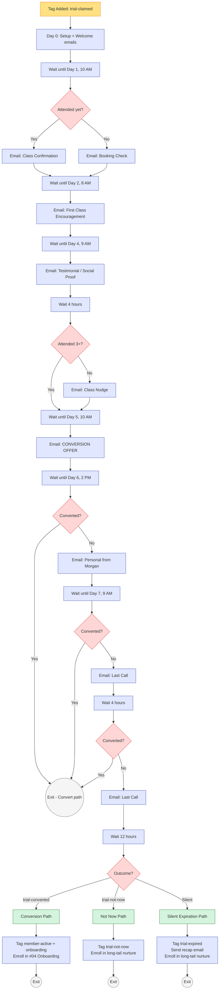

# #02 — Workflow Spec: 7-Day Trial Nurture

> Complete workflow specification. Every trigger, action, wait, and condition. The GHL workflow builder should match this 1:1.

---

## Workflow Header

| Property | Value |
|---|---|
| **Workflow Name** | `02 — Trial Nurture — 7 Day Conversion` |
| **Folder** | `02 - Trial Conversion` |
| **Status** | Published / On |
| **Re-entry** | Disabled (one contact = one run; new trials use a fresh `trial-claimed` cycle) |
| **Quiet hours respected** | Yes — all marketing Email/email respect 8 AM – 9 PM contact-local |

---

## Trigger

**Type:** Tag Added

**Filters:**
- Tag is `trial-claimed`
- Contact does NOT have tag `member-active`
- Contact does NOT have tag `campaign-trial-nurture` (prevents re-entry)

**Why these filters:** Prevents re-entry by existing members and double-fires on rapid tag re-application by front desk.

---

## Actions (in order)

### Action 1 — Setup (Day 0)

| Sub-action | Property | Value |
|---|---|---|
| 1a | Add Tag | `campaign-trial-nurture` |
| 1b | Update Contact Field | `lead_status` = `Trial Active` |
| 1c | Update Opportunity Stage | Pipeline `Membership Sales` → Stage `Trial Active` |
| 1d | Send Email | Template `02 — Day 0 — Trial Welcome` |
| 1e | Send Email | Template `02 — Day 0 — Trial Welcome Email` |

**Wait before:** None — Day 0 fires immediately on trigger.

---

### Action 2 — Wait Until Day 1, 10 AM Contact-Local

| Property | Value |
|---|---|
| **Action type** | Wait — Until Specific Time |
| **Wait until** | `lead_captured_at + 1 day` at 10:00 AM contact-local |

---

### Action 3 — Day 1 Email (Attendance-Branching)

| Property | Value |
|---|---|
| **Action type** | If / Else |
| **Condition** | `last_visit_date` >= `lead_captured_at` AND `total_visits_lifetime` >= 1 |
| **YES branch** | Send Email `02 — Day 1 — Class Confirmation` |
| **NO branch** | Send Email `02 — Day 1 — Booking Check` |
| **Skip if** | Contact has tag `do-not-email` |

---

### Action 4 — Wait Until Day 2, 8 AM Contact-Local

| Property | Value |
|---|---|
| **Action type** | Wait — Until Specific Time |
| **Wait until** | `lead_captured_at + 2 days` at 8:00 AM contact-local |

---

### Action 5 — Send Day 2 Email

| Property | Value |
|---|---|
| **Action type** | Send Email |
| **Template** | `02 — Day 2 — First Class Encouragement` |
| **Note** | Template uses internal If/Else blocks for "attended" vs "not attended" copy |
| **Skip if** | Contact has tag `do-not-email` |

---

### Action 6 — Wait Until Day 4, 9 AM Contact-Local

| Property | Value |
|---|---|
| **Action type** | Wait — Until Specific Time |
| **Wait until** | `lead_captured_at + 4 days` at 9:00 AM contact-local |

---

### Action 7 — Day 4 Email + Conditional Nudge Email

| Sub-action | Property | Value |
|---|---|---|
| 7a | Send Email | `02 — Day 4 — Testimonial / Social Proof` |
| 7b | Wait | 4 hours |
| 7c | If/Else | Contact has tag `trial-attended-3plus`? |
| 7c-YES | (Skip nudge — already in love) | — |
| 7c-NO | Send Email | `02 — Day 4 — Class Nudge` |

---

### Action 8 — Wait Until Day 5, 10 AM Contact-Local

| Property | Value |
|---|---|
| **Action type** | Wait — Until Specific Time |
| **Wait until** | `lead_captured_at + 5 days` at 10:00 AM contact-local |

---

### Action 9 — Day 5 Conversion Offer

| Sub-action | Property | Value |
|---|---|---|
| 9a | Update Opportunity Stage | `Conversion Offer Sent` |
| 9b | Send Email | `02 — Day 5 — Conversion Offer` (contains coupon `TRIAL2PAID` and funnel CTA) |

---

### Action 10 — Wait Until Day 6, 2 PM → Personal Email

| Sub-action | Property | Value |
|---|---|---|
| 10a | Wait — Until Specific Time | `lead_captured_at + 6 days` at 2:00 PM contact-local |
| 10b | If/Else | Contact has tag `trial-converted`? |
| 10b-YES | Exit Workflow | (success path) |
| 10b-NO | Send Email | `02 — Day 6 — Personal from Morgan` |

**Why 2 PM specifically:** Afternoon is the highest-reply window for personal-tone Email. Morning gets buried, evening reads as desperate.

---

### Action 11 — Wait Until Day 7, 9 AM Contact-Local

| Property | Value |
|---|---|
| **Action type** | Wait — Until Specific Time |
| **Wait until** | `lead_captured_at + 7 days` at 9:00 AM contact-local |

---

### Action 12 — Day 7 Last Call

| Sub-action | Property | Value |
|---|---|---|
| 12a | If/Else | `trial-converted`? |
| 12a-YES | Exit Workflow | (success — handed off to #04 via Action 14a) |
| 12a-NO | Send Email | `02 — Day 7 — Last Call` |
| 12b | Wait | 4 hours |
| 12c | If/Else | `trial-converted`? |
| 12c-YES | Exit Workflow | |
| 12c-NO | Send Email | `02 — Day 7 — Last Call Email` |

---

### Action 13 — Wait 12 Hours → Outcome Detection

| Property | Value |
|---|---|
| **Action type** | Wait |
| **Duration** | 12 hours |

---

### Action 14 — Outcome Router (If/Else Chain)

| Branch | Condition | Path |
|---|---|---|
| 14a | `trial-converted` exists | → **Conversion Path** |
| 14b | `trial-not-now` exists | → **Not Now Path** |
| 14c | Else (silent expiration) | → **Silent Expiration Path** |

---

#### Path 14a — Conversion Path

| Sub-action | Property | Value |
|---|---|---|
| 14a-1 | Update Opportunity Stage | `Won — Paid Member` |
| 14a-2 | Opportunity Status | `Won` |
| 14a-3 | Update Contact Field | `membership_start_date` = `{{today}}` |
| 14a-4 | Update Contact Field | `membership_status` = `Active` |
| 14a-5 | Add Tag | `member-active` |
| 14a-6 | Add Tag | `member-onboarding` |
| 14a-7 | Remove Tag | `campaign-trial-nurture` |
| 14a-8 | Add to Workflow | `04 — New Member Onboarding` |
| 14a-9 | Exit Workflow | |

(Note: `tier-*` tags and `membership_tier` field are set by the companion `02 — Trial Conversion Detected` workflow on Order Submitted, not here.)

---

#### Path 14b — Not Now Path

| Sub-action | Property | Value |
|---|---|---|
| 14b-1 | Add Tag | `trial-not-now` |
| 14b-2 | Update Contact Field | `lead_status` = `Lost` |
| 14b-3 | Remove Tag | `campaign-trial-nurture` |
| 14b-4 | Add to Workflow | `Long-Tail Nurture — 30 Day Drip` |
| 14b-5 | Exit Workflow | |

---

#### Path 14c — Silent Expiration Path

| Sub-action | Property | Value |
|---|---|---|
| 14c-1 | Add Tag | `trial-expired` |
| 14c-2 | Update Opportunity Stage | `Lost — Trial Expired` |
| 14c-3 | Opportunity Status | `Lost` |
| 14c-4 | Update Contact Field | `lead_status` = `Lost` |
| 14c-5 | Send Email | `02 — Recap — Trial Expired (Soft)` |
| 14c-6 | (Optional) Send Email | `02 — Day 8 — Soft Goodbye` |
| 14c-7 | Remove Tag | `campaign-trial-nurture` |
| 14c-8 | Add to Workflow | `Long-Tail Nurture — 30 Day Drip` |
| 14c-9 | Exit Workflow | |

---

## Visual Workflow Diagram

---

## Companion Workflows

This workflow does not stand alone. Two companion workflows handle reply detection and conversion detection.

### Companion 1: `02 — Trial Reply Handler`

| Property | Value |
|---|---|
| **Trigger** | Inbound Email Received |
| **Filter** | Contact has tag `campaign-trial-nurture` |

**Actions:**

1. **If body contains** "not now" / "no thanks" / "later" / "stop trying" → Add tag `trial-not-now`, send auto-reply, exit main workflow.
2. **Else if body contains** "yes" / "interested" / "sign me up" / "i'm in" → Add tag `trial-warm`, send conversion funnel link.
3. **Else if body contains** "$" / "cost" / "expensive" → Send pricing reply, internal notification to Morgan.
4. **Else** → Internal notification to Morgan, add tag `trial-needs-personal-touch`.

### Companion 2: `02 — Trial Conversion Detected`

| Property | Value |
|---|---|
| **Trigger** | Order Submitted |
| **Filter 1** | Product is `Basic Membership` OR `Premium Membership` OR `VIP Membership` |
| **Filter 2** | Contact has tag `campaign-trial-nurture` |

**Actions:**

1. Add tag `trial-converted`.
2. Based on which product purchased:
   - Basic: add tag `tier-basic`, set `membership_tier` = `Basic`, `monthly_rate` = $79
   - Premium: add tag `tier-premium`, set `membership_tier` = `Premium`, `monthly_rate` = $149
   - VIP: add tag `tier-vip`, set `membership_tier` = `VIP`, `monthly_rate` = $249
3. The main nurture workflow's Action 10b / 12 / 14 sees `trial-converted` and routes to the conversion path.

---

## Edge Cases & Handling

| Scenario | Workflow behavior |
|---|---|
| Contact converts on Day 2 (early conversion) | The conversion companion fires immediately, applies `trial-converted`. Day 4 / 5 / 6 / 7 actions all check `trial-converted` first and exit. No further messages sent. |
| Contact has `do-not-email` | All Email actions skip silently. Email actions still fire. |
| Contact has `do-not-email` | All Email actions skip silently. Email actions still fire. |
| Contact replies "not now" on Day 2 | Reply handler tags `trial-not-now` immediately. Main workflow's next conditional gate (Action 10 or 12) checks for it and routes to Path 14b. (Note: GHL doesn't natively exit a workflow on tag-add — the next conditional gate is the exit point.) |
| Contact never opens an email or Email | Workflow runs full sequence. Likely outcome: `trial-expired` (silent expiration). |
| Contact attends 5+ classes but never converts | Probably price-sensitive. Add a manual escalation: if `total_visits_lifetime` >= 5 AND `trial-converted` is missing by Day 6, add tag `trial-high-engagement-no-convert` and notify Morgan for personal outreach. (Build as a small companion workflow.) |
| Contact requests refund / chargeback after conversion | Separate workflow (`Member Cancellation Within 7 Days`) handles — out of scope here. |
| Two trials in 30 days (same contact, refreshed trial) | Trigger filter "Contact does NOT have tag `campaign-trial-nurture`" blocks. To allow second trial intentionally, manually remove the tag first. |

---

## Monitoring & Smart Lists

Build these smart lists in **Contacts > Smart Lists**:

| Smart List | Filter | Owner uses for |
|---|---|---|
| **Trials Active Right Now** | `campaign-trial-nurture` AND created in last 8 days | Daily glance at who's mid-trial |
| **Trials Past Day 5 No Convert** | `campaign-trial-nurture` AND `lead_captured_at` is 5+ days ago AND NOT `trial-converted` | Personal outreach candidates |
| **Trials with High Engagement, No Convert** | `trial-attended-3plus` AND NOT `trial-converted` | "Why didn't they buy?" candidates |
| **Trials Needing Morgan's Reply** | `trial-needs-personal-touch` | Conversations inbox priority |
| **This Month's Conversions** | `trial-converted` AND `membership_start_date` is this month | Monthly KPI |

These feed the [#10 Owner Reporting](../../10-owner-reporting-and-visibility/) dashboard.

---

## What Lives Outside This Workflow

This workflow owns the first 7 days post-trial-claim. Adjacent systems own:

- **Conversion checkout** → Conversion Offer Funnel (built in [build.md](../build.md) Step 1)
- **Reply detection** → `02 — Trial Reply Handler` (companion workflow)
- **Order detection** → `02 — Trial Conversion Detected` (companion workflow)
- **Post-conversion** → [#04 New Member Onboarding](../../04-new-member-onboarding/)
- **Silent expiration follow-up** → Long-Tail Lead Nurture (separate 30-day drip)
- **Referral attribution on conversion** → Phase 2 Referral Engine (`PHASE-2-ROADMAP.md`)

This workflow is the engine, but it's nothing without the companions and the downstream handoffs.
