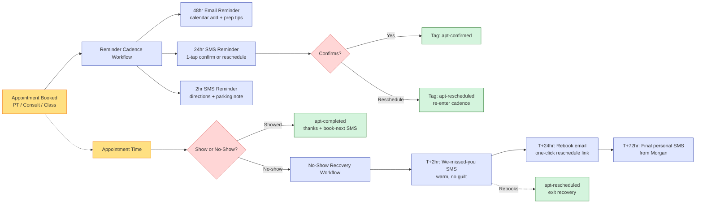

# #03 — Appointment No-Show Recovery

> **The Problem:** A no-show on a PT slot is a triple loss — paid trainer time gone, member feels guilty, capacity-limited class blocked someone else. Most studios run at 15–20% no-show rates and have no recovery system. Both numbers are fixable.

---

## Who This Hurts

**P3 — The Booked Lead / Booked Member.** Someone with a PT session, intro consult, or capacity-limited class on the calendar. They had every intention of showing up — and then a meeting ran late, the kid got sick, the rain started, the willpower dipped.

If we don't reach out gracefully after the no-show:

- They feel awkward about rebooking ("I bailed last time, they probably hate me").
- They drift from the trainer they were building rapport with.
- They quietly accept that fitness isn't a priority right now — and a few weeks later, they cancel.

The trainer also loses. A no-show on a 60-minute PT slot is **60 minutes of a $35–$50/hr trainer paid to wait**. Five no-shows a week is a part-time trainer's whole salary vanishing.

**P7 — The Studio Owner** sees the financial side: missed revenue, paid labor with no return, and a quiet erosion of member-trainer relationships. None of which shows up cleanly in any single report.

---

## Cost of Inaction

Conservative math for a studio with **200 PT slots/month** plus capacity-limited group classes:

| Loss source | Conservative estimate | Monthly impact |
|---|---|---|
| **PT no-shows** at 18% on 200 slots | 36 slots wasted | At $85/slot lost revenue + paid trainer time: **~$3,060/month** |
| **Class no-shows on capacity-limited classes** | ~12 blocked seats / month that another member would have taken | Indirect frustration cost — members who wanted a seat couldn't get one |
| **Member churn linked to "fell off the wagon"** | 2–3 cancellations/month traceable to 2+ recent no-shows | At Basic LTV of $1,100, **~$2,400 in lost LTV per quarter** |
| **Trainer goodwill** | Trainers covering empty slots disengage | Hard to quantify, real impact on retention of trainers and members |

**Total addressable loss: ~$5,000/month** in direct + indirect cost for a mid-size studio. Recovery system targets ~70% of this.

---

## What We Built

A two-part system: **proactive reminders** that drop no-show rate, and **automated recovery** that re-engages no-shows within hours.

**Three components:**

1. **Reminder Cadence Workflow** — fires on every appointment booking. Sends 48hr email + 24hr SMS + 2hr SMS. 24hr SMS lets the member confirm or reschedule in one tap.
2. **No-Show Detection** — triggered by appointment status changing to "no-show" in GHL Calendar (manual flip by trainer, or automatic 15-min-after-start rule).
3. **No-Show Recovery Workflow** — runs T+2hr (we-missed-you SMS), T+24hr (rebook email), T+72hr (final personal SMS from Morgan). One-click rebook link in every message.

---

## Outcome & KPIs

Move these numbers within 60 days of launch:

| KPI | Baseline | Target | How we measure |
|---|---|---|---|
| PT no-show rate | 18% | **<8%** | `apt-noshow` count ÷ total PT appointments, rolling 30-day |
| Class no-show rate | 12% | **<5%** | Same for class appointments |
| Confirmation rate (24hr SMS reply) | n/a (no reminders) | **70%+** | `apt-confirmed` count ÷ total reminders sent |
| Rebook-after-noshow rate | ~25% | **60%+** | Rebooked within 72hr ÷ total no-shows |
| Repeat no-show rate (member with 2+ in 30 days) | ~8% | **<3%** | `apt-noshow-repeat` count ÷ active members |

The owner sees these in the **Appointment Health** widget built in [#10 Owner Reporting](../10-owner-reporting-and-visibility/).

---

## What Changes for the Studio Owner

Before:

- A PT slot empties. Trainer waits 15 minutes, then texts the front desk "no-show again." Front desk shrugs. Member is never contacted. Same member no-shows the next week.
- Class has 4 empty seats out of 12. The 4 members who wanted those seats were on the waitlist. No one tells them a spot opened up.
- The owner finds out about the pattern of no-shows when she reviews the month-end revenue dip — too late.

After:

- Every appointment has 3 reminders going out automatically. No-show rate drops 60%+ from reminders alone.
- The instant a no-show is marked, the member gets a warm SMS in 2 hours. About half rebook within 72 hours — automatically, no front-desk effort.
- Repeat no-shows (2+ in 30 days) get auto-tagged `apt-noshow-repeat` and surface in the owner's Monday digest. She makes one personal call. That single call saves the member 30% of the time.
- Trainers stop venting about no-shows because there are far fewer, and the ones that happen have a system handling them.

---

## Build It

Full step-by-step build in **[build.md](build.md)** — calendar configuration, both workflows, every message.

Production copy for every asset:

- **[assets/emails.md](assets/emails.md)** — 48hr reminder + post-noshow rebook email
- **[assets/sms.md](assets/sms.md)** — 5 SMS templates (24hr reminder, 2hr reminder, 2hr post-noshow, 72hr final, rebook-confirmation)
- **[assets/workflow.md](assets/workflow.md)** — both workflows specified, with mermaid diagrams

---

## How This Connects to Other Systems

This system **receives** from any calendar event:
- Trial members booking their first PT session ([#02 Trial Conversion](../02-trial-to-paid-conversion/))
- New members booking onboarding consult ([#04 New Member Onboarding](../04-new-member-onboarding/))
- Active members booking ongoing PT or nutrition

It **feeds**:
- [#05 Retention](../05-retention-and-churn-prevention/) — `noshow_count_90d` is a factor in the engagement score; 2+ no-shows flag a member as at-risk.
- [#10 Owner Reporting](../10-owner-reporting-and-visibility/) — no-show rate by appointment type, by trainer, by member tier.

It **also coordinates with**:
- [#04 Onboarding](../04-new-member-onboarding/) — if a new member no-shows their Day-7 first PT session, the onboarding workflow needs to know (impacts the Day-14 milestone branching).

Full integration map: [../../integration/master-automation-graph.md](../../integration/master-automation-graph.md)
