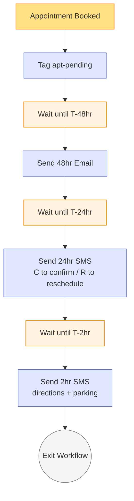
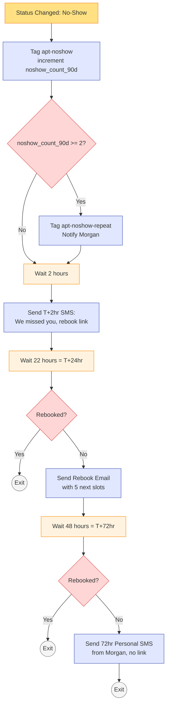

# #03 — Workflow Spec: Reminder Cadence + No-Show Recovery

> Two primary workflows (Reminder + Recovery) and two companion workflows (Reply Handler + Post-Show Thank You). The Reminder workflow runs on appointment booking; the Recovery workflow runs on appointment status change to No-Show.

---

## Workflow 1 — Appointment Reminder Cadence

### Header

| Property | Value |
|---|---|
| **Workflow Name** | `03 — Appointment Reminder Cadence` |
| **Folder** | `03 - Appointments` |
| **Status** | Published / On |
| **Re-entry** | Allowed (each new appointment = new run) |
| **Quiet hours respected** | Yes (8 AM – 9 PM contact-local) — except final 2hr reminder |

### Trigger

**Type:** Appointment Booked

**Filters:**
- Calendar is one of: `Personal Training — 60min`, `Intro Consult — Free`, `Nutrition Starter Consult`, or any `Group Class — *`
- Appointment status is `Booked` or `Confirmed`
- Contact does NOT have tag `do-not-marketing` (transactional reminders are usually exempt — adjust per studio policy)

### Actions

#### Action 1 — Initial state

| Property | Value |
|---|---|
| **Add Tag** | `apt-pending` |

#### Action 2 — Wait until T-48hr

| Property | Value |
|---|---|
| **Wait Until** | `appointment.start_time - 48 hours` |
| **Quiet hour rule** | If resolved time is 9 PM – 8 AM contact-local, shift to next 8 AM |

#### Action 3 — Send 48hr email

| Property | Value |
|---|---|
| **Skip if** | Appointment status is `Cancelled` |
| **Skip if** | Contact has tag `do-not-email` |
| **Template** | `03 — 48hr Appointment Reminder` |

#### Action 4 — Wait until T-24hr

| Property | Value |
|---|---|
| **Wait Until** | `appointment.start_time - 24 hours` |
| **Quiet hour rule** | If 9 PM – 8 AM, shift to 8 AM |

#### Action 5 — Send 24hr SMS

| Property | Value |
|---|---|
| **Skip if** | Appointment status is `Cancelled` |
| **Skip if** | Contact has tag `do-not-sms` |
| **Template** | `03 — 24hr Confirm SMS` (Message A) |

#### Action 6 — Wait until T-2hr

| Property | Value |
|---|---|
| **Wait Until** | `appointment.start_time - 2 hours` |
| **Quiet hour rule** | None — 2hr reminder fires whenever (catches early morning, late evening appts) |

#### Action 7 — Send 2hr SMS

| Property | Value |
|---|---|
| **Skip if** | Appointment status is `Cancelled` |
| **Skip if** | Contact has tag `apt-rescheduled` for this appointment |
| **Skip if** | Contact has tag `do-not-sms` |
| **Template** | `03 — 2hr Reminder SMS` (Message B) |

#### Action 8 — Exit Workflow

The reminder workflow ends here. The status-change trigger picks up next (Workflow 2 — Recovery if no-show, or the Thank-You companion if showed).

### Visual diagram — Reminder Cadence



---

## Workflow 2 — No-Show Recovery

### Header

| Property | Value |
|---|---|
| **Workflow Name** | `03 — No-Show Recovery` |
| **Folder** | `03 - Appointments` |
| **Status** | Published / On |
| **Re-entry** | Allowed (each new no-show = new run) |
| **Quiet hours respected** | Yes (8 AM – 9 PM contact-local for all marketing-class messages) |

### Trigger

**Type:** Appointment Status Changed

**Filters:**
- New status is `No-Show`
- Calendar is one of: PT, Consult, Nutrition (default — exclude group classes to avoid over-messaging)
- Contact does NOT have tag `apt-noshow` applied within last 30 min (debounce — prevents double-fire)

### Actions

#### Action 1 — Stamp & count

| Sub-action | Property | Value |
|---|---|---|
| 1a | Add Tag | `apt-noshow` |
| 1b | Update Contact Field | `noshow_count_90d` = `noshow_count_90d + 1` |

#### Action 2 — Repeat-noshow detection

| Property | Value |
|---|---|
| **Action type** | If / Else |
| **Condition** | `noshow_count_90d >= 2` |
| **YES branch** | Add Tag `apt-noshow-repeat`. Send Internal Notification to Morgan. |
| **NO branch** | Continue |

**Internal notification body:**

```
Repeat no-show alert.

Member: {{contact.first_name}} {{contact.last_name}}
Tier: {{contact.membership_tier}}
No-shows in last 90 days: {{contact.noshow_count_90d}}
Last visit: {{contact.last_visit_date}}
Assigned trainer: {{contact.assigned_trainer}}

Recommend: personal call this week. Likely signal of disengagement or life event.

Open contact: {{contact_url}}
```

#### Action 3 — Wait 2 hours

| Property | Value |
|---|---|
| **Wait** | 2 hours |
| **Why** | Sending instantly reads as automated guilt-trip. 2hr buffer reads as human concern. |

#### Action 4 — Send T+2hr SMS

| Property | Value |
|---|---|
| **Skip if** | Contact has `do-not-sms` |
| **Skip if** | Contact rebooked already (tag `apt-rescheduled` post-noshow) |
| **Template** | `03 — Post No-Show — 2hr` (Message C) |

#### Action 5 — Wait 22 hours (= T+24hr)

| Property | Value |
|---|---|
| **Wait** | 22 hours |

#### Action 6 — Send T+24hr email (if not rebooked)

| Property | Value |
|---|---|
| **If/Else** | Contact has `apt-rescheduled`? |
| **YES** | Exit workflow |
| **NO** | Send Email `03 — Rebook Email` |
| **Skip if** | Contact has `do-not-email` |

#### Action 7 — Wait 48 hours (= T+72hr total)

| Property | Value |
|---|---|
| **Wait** | 48 hours |

#### Action 8 — Send T+72hr personal SMS (if not rebooked)

| Property | Value |
|---|---|
| **If/Else** | Contact has `apt-rescheduled`? |
| **YES** | Exit workflow |
| **NO** | Send SMS `03 — Post No-Show — 72hr Final` (Message D) |
| **Quiet hour rule** | Send between 10 AM – 4 PM contact-local. |

#### Action 9 — Exit Workflow

### Visual diagram — No-Show Recovery



---

## Companion Workflow A — Appointment Reply Handler

### Header

| Property | Value |
|---|---|
| **Workflow Name** | `03 — Appointment Reply Handler` |
| **Folder** | `03 - Appointments` |
| **Trigger** | Inbound SMS Received |
| **Filter** | Contact has any of: `apt-pending`, `apt-noshow` |

### Actions

#### Action 1 — Parse reply

**If/Else chain on inbound message body:**

| Match | Action | Auto-reply |
|---|---|---|
| "C" / "Confirm" / "yes" / "y" / "confirmed" (case-insensitive) | Add tag `apt-confirmed`, remove `apt-pending` | "Confirmed, {{first_name}}! See you {{appointment.start_time_short}} ☀️" |
| "R" / "Reschedule" / "move" / "change time" | Add tag `apt-needs-reschedule` | Send template `03 — Rebook Confirmation` (Message E) |
| "cancel" / "can't make it" / "X" | Mark appointment Cancelled (via internal action or front-desk notification) | "Got it — cancelled. Reply BOOK when you're ready for the next one." |
| Day/time text (e.g., "thursday 5pm") | Add tag `apt-front-desk-action` | Internal notification to front desk. No auto-reply. |
| General question | Add tag `apt-needs-response` | Internal notification to Morgan. No auto-reply. |
| "STOP" | GHL auto-handles. Add tag `do-not-sms`. | (system message) |

---

## Companion Workflow B — Post-Show Thank You

### Header

| Property | Value |
|---|---|
| **Workflow Name** | `03 — Post-Appointment Thank You` |
| **Folder** | `03 - Appointments` |
| **Trigger** | Appointment Status Changed → `Showed` |
| **Filter** | Calendar is `Personal Training — 60min` OR `Intro Consult — Free` |

### Actions

| Sub-action | Property | Value |
|---|---|---|
| 1 | Add Tag | `apt-completed` |
| 2 | Update Contact Field (PT only) | `last_pt_session_date` = today; `total_pt_sessions` += 1 |
| 3 | Wait | 1 hour |
| 4 | Send SMS | Template `03 — Post-Appointment Thank You` (Message F from sms.md) |
| 5 | Exit | |

**SMS body (already in sms.md as Message F):**

> Hey {{first_name}}, great work today 👏 {{contact.assigned_trainer}} said you crushed it. Want to lock in next week? {{custom_values.business.booking_url}}

---

## Edge Cases & Handling

| Scenario | Workflow behavior |
|---|---|
| Member cancels appointment before T-24hr | Status flips to Cancelled. Action 3 / 5 / 7 all check status and skip remaining reminders. |
| Member reschedules — does old workflow run end? | Yes — the new appointment booking creates a new workflow run. The old run's actions check status and skip if status != Booked/Confirmed. |
| Member no-shows but trainer forgets to mark | If "auto mark no-show" calendar setting is enabled (15 min after start), it fires automatically. Otherwise, trainer-manual flip is required. Best practice: enable auto. |
| Two no-shows in 30 minutes (e.g., back-to-back appointments) | Each no-show triggers Workflow 2 separately. The debounce filter (no `apt-noshow` tag in last 30 min) prevents the second trigger. Result: only the first no-show fires the recovery. The second updates `noshow_count_90d` only. **Adjust if your studio wants both to fire independently.** |
| Member rebooks via the T+2hr SMS link | New appointment is booked → reminder workflow fires for new appt. Recovery workflow's next check (Action 6 or 8) sees `apt-rescheduled` and exits. |
| Member has `do-not-sms` | All SMS actions skip. Recovery still sends the T+24hr email. T+72hr personal SMS skipped — no human-touch attempt. (Recommend: front-desk personal call as fallback for these contacts.) |
| Member is mid-vacation (`member-paused`) | Reminders skip — no appointments should be on the calendar anyway. Add filter to trigger: NOT `member-paused`. |
| Trainer is the no-show (not the member) | Different workflow. This is a trainer-management issue, not member-recovery. Out of scope. Build a separate "Trainer Late/No-Show Alert" workflow for that. |

---

## Monitoring & Smart Lists

Build these:

| Smart List | Filter | Owner uses for |
|---|---|---|
| **Appointments This Week — Unconfirmed** | `apt-pending` AND start within next 7 days AND NOT `apt-confirmed` | Front desk picks these up day-of for personal call |
| **Recent No-Shows (last 7 days)** | `apt-noshow` applied in last 7 days | Owner reviews weekly |
| **Repeat No-Show Members (rolling 90d)** | `apt-noshow-repeat` AND `noshow_count_90d >= 2` | High-priority intervention list |
| **No-Shows Not Yet Rebooked** | `apt-noshow` AND NOT `apt-rescheduled` AND no-show in last 7 days | Recovery effectiveness measure |
| **High No-Show Members by Tier** | Group `noshow_count_90d` by `membership_tier` | Trend analysis |

Feeds [#10 Owner Reporting](../../10-owner-reporting-and-visibility/).

---

## What Lives Outside This Workflow

This workflow system owns the appointment touch flow. Adjacent systems:

- **[#05 Retention](../../05-retention-and-churn-prevention/)** — consumes `noshow_count_90d` and `apt-noshow-repeat` tag in its engagement scoring.
- **[#04 Onboarding](../../04-new-member-onboarding/)** — checks for no-show on the Day-7 first-class. Branches Day-14 messaging.
- **[#10 Reporting](../../10-owner-reporting-and-visibility/)** — shows no-show rate by trainer, by class, by tier.
- **Trainer compensation / scheduling** — out of scope, but the no-show data is the input for any trainer-side reporting the studio builds later.
