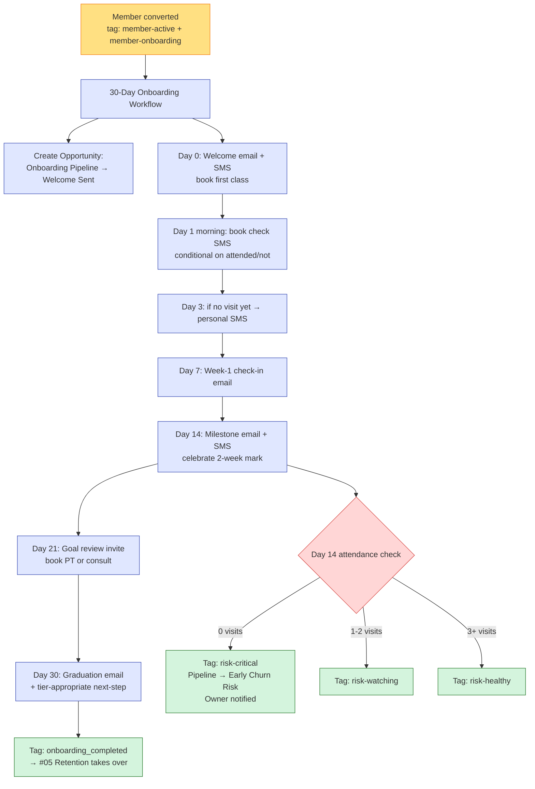

# #04 — New Member Onboarding

> **The Problem:** The first 30 days predict 90-day retention. A new member who attends in week 1, week 2, and week 3 is dramatically more likely to still be paying at month 6. Most studios sign them up, give a tour, then go silent. By day 60, half are quietly gone.

---

## Who This Hurts

**P4 — The New Member, Day 0-30.** Just paid. Excited. Also: uncertain. Doesn't know which class is the "real" one for them, which trainer to ask, whether the studio noticed they signed up beyond the credit card charge.

If we don't actively prove value in the first 30 days:

- Week 1: didn't come yet. "I'll start Monday."
- Week 2: came once. "I'll get into a rhythm next week."
- Week 3: hasn't been back since week 1. Starting to feel guilt about the auto-renewal.
- Week 4: cancellation request, or worse — silent ghost membership where they pay for months without coming, then quietly cancel.

The studio loses a paying member they spent acquisition dollars to win. The member loses the version of themselves they signed up to become.

**P7 — The Studio Owner.** Onboarding is the cheapest retention win in the building. A member onboarded well stays 14+ months. A member onboarded poorly stays 2-3 months. Same acquisition cost, 5× the LTV difference.

---

## Cost of Inaction

Conservative math for a studio acquiring **15 new members/month**:

| Scenario | Day-30 retention | Day-90 retention | Avg tenure | LTV per new member |
|---|---|---|---|---|
| **No onboarding (status quo)** | 70% | 55% | 6 months | $79 × 6 = $474 |
| **Full 30-day onboarding** | 90% | 80% | 14 months | $79 × 14 = $1,106 |
| **Delta per member** | — | — | +8 months | **+$632 LTV per new member** |

At 15 new members/month, that's **+$9,480/month in incremental LTV** added to the system. Annualized: **+$113,000/year** of LTV that would otherwise leak.

For the studio's bottom line, onboarding is the second-highest-ROI workflow in this build (right behind trial conversion, which it directly enables).

---

## What We Built

A 30-day onboarding pipeline + automated check-in sequence that personalizes by goal, monitors attendance, and surfaces at-risk members for owner intervention.

**Four components:**

1. **30-Day Onboarding Workflow** — fires the moment `member-active` + `member-onboarding` are applied (handoff from [#02 Trial Conversion](../02-trial-to-paid-conversion/) or direct new-member signup). Six emails + five SMS across days 0, 1, 3, 7, 14, 21, 30.
2. **Onboarding Pipeline** — opportunity created in the **Onboarding** pipeline at "Welcome Sent" stage. Moves through stages as milestones hit. Owner watches this pipeline daily.
3. **Early Churn Risk Branch** — at Day 14, attendance is checked. Zero-visit members get tagged `risk-critical`, moved to "Early Churn Risk" stage, and Morgan is notified for a personal save call.
4. **Day-30 Handoff** — successful onboarding fires `onboarding_completed = Yes`, opportunity moves to "Onboarded — Won", and the contact enters [#05 Retention](../05-retention-and-churn-prevention/) at "Healthy" stage.

---

## Outcome & KPIs

Move these within 90 days of launch:

| KPI | Baseline | Target | How we measure |
|---|---|---|---|
| Day-30 retention rate | 70% | **90%+** | Active members at day 30 ÷ new members at day 0, cohort-based |
| Day-90 retention rate | 55% | **80%+** | Same, day 90 |
| First-class-attended within 7 days | 50% | **85%+** | `last_visit_date` <= `membership_start_date + 7 days` |
| New members with 3+ visits by Day 14 | 40% | **70%+** | `total_visits_lifetime` since start >= 3 by day 14 |
| Owner intervention saves (Early Churn Risk → Onboarded) | n/a | **40%+** | Save rate from owner outreach |
| Onboarding email open rate | n/a | **55%+** | GHL native analytics |

The owner sees these in the **Onboarding Health** widget built in [#10 Owner Reporting](../10-owner-reporting-and-visibility/).

---

## What Changes for the Studio Owner

Before:

- New member pays, gets a manual "welcome" email when front desk has time.
- Owner doesn't know if they've come in until she checks the visit log a month later.
- A member who never showed: nobody notices until the credit card declines at month 3.
- Onboarding is one tour and a hug.

After:

- The moment a member converts, the 30-day machine fires.
- Day 0: welcome + book-your-first-class CTA.
- Day 3: if they haven't been in, a personal-tone SMS lands ("I noticed you haven't booked yet — anything I can help with?")
- Day 7: a personalized check-in email referencing their stated goal.
- Day 14: a milestone email celebrating the two-week mark — and a *branch in the system* that flags zero-visit members to the owner with a one-button "send save SMS" prompt.
- Day 21: invitation to book a 30-min goal review with Morgan or their trainer.
- Day 30: graduation email + tier-specific next-step (Basic gets a soft upgrade nudge, Premium gets a "use your PT credit," VIP gets a recovery suite reminder).

The owner spends 5 minutes a day on the Onboarding pipeline kanban. Anything in "Early Churn Risk" gets a personal call. That single call saves the member 40% of the time.

---

## Build It

Full step-by-step build in **[build.md](build.md)** — workflow, pipeline configuration, every email and SMS.

Production copy for every asset:

- **[assets/emails.md](assets/emails.md)** — 6 emails across the 30-day series
- **[assets/sms.md](assets/sms.md)** — 5 SMS templates with attendance branching
- **[assets/workflow.md](assets/workflow.md)** — full workflow spec with mermaid diagram

---

## How This Connects to Other Systems

This system **receives** from:
- [#02 Trial-to-Paid Conversion](../02-trial-to-paid-conversion/) — every converted trial enters here via the `member-active` + `member-onboarding` tags.
- Direct paid signups (rare — most are post-trial, but the trigger handles both paths).

It **uses** infrastructure from:
- [#03 Appointment No-Show Recovery](../03-appointment-no-show-recovery/) — onboarding sequence books PT sessions and intro consults that are themselves protected by the reminder + no-show recovery system.

It **feeds**:
- [#05 Retention](../05-retention-and-churn-prevention/) — successful onboarding hands the member to retention at "Healthy" stage. Failed onboarding hands them at "Critical" — retention takes the save attempt over.
- [#06 Upsell & Cross-Sell](../06-upsell-and-cross-sell/) — the Day-21 goal review is the natural moment to mention nutrition coaching or PT package upgrades (especially for Basic members showing high engagement).
- [#10 Owner Reporting](../10-owner-reporting-and-visibility/) — Day-30 retention rate is one of the seven owner-dashboard numbers.

Full integration map: [../../integration/master-automation-graph.md](../../integration/master-automation-graph.md)
