# #04 — Workflow Spec: 30-Day New Member Onboarding

> Complete workflow specification. Every trigger, action, wait, and condition. This is the longest workflow in the build — 30 days, 11 messages, 3-way branching at Day 14.

---

## Workflow Header

| Property | Value |
|---|---|
| **Workflow Name** | `04 — New Member Onboarding — 30 Day` |
| **Folder** | `04 - Onboarding` |
| **Status** | Published / On |
| **Re-entry** | Disabled (one contact = one run; would need explicit tag removal to re-enter) |
| **Quiet hours respected** | Yes (8 AM – 9 PM contact-local) for all sends |

---

## Trigger

**Type:** Tag Added

**Filters:**
- Tag is `member-onboarding`
- Contact has `member-active`
- Contact does NOT have `campaign-onboarding` (prevents re-entry)

---

## Actions (in order)

### Action 1 — Day 0 Setup

| Sub-action | Property | Value |
|---|---|---|
| 1a | Add Tag | `campaign-onboarding` |
| 1b | Update Contact Field | `membership_status` = `Active` |
| 1c | Create Opportunity | Pipeline `Onboarding`, Stage `Welcome Sent (Day 0)`, Value = `monthly_rate × 12` |
| 1d | Send Email | Template `04 — Day 0 — Welcome to the Studio` |

(No Day 0 SMS — the conversion-confirmation SMS from #02 already fired within the hour.)

---

### Action 2 — Wait Until Day 1, 10 AM Contact-Local

| Property | Value |
|---|---|
| **Wait Until** | `membership_start_date + 1 day` at 10:00 AM contact-local |

---

### Action 3 — Day 1 Personal SMS

| Property | Value |
|---|---|
| **Skip if** | Contact has `do-not-sms` |
| **Template** | `04 — Day 1 — Personal Welcome SMS` (Message A from sms.md) |

---

### Action 4 — Wait Until Day 3, 11 AM Contact-Local

| Property | Value |
|---|---|
| **Wait Until** | `membership_start_date + 3 days` at 11:00 AM contact-local |

---

### Action 5 — Day 3 Visit Check (Branched)

| Property | Value |
|---|---|
| **Action type** | If / Else |
| **Condition** | `last_visit_date` >= `membership_start_date` AND `total_visits_lifetime` > [count at start] |
| **YES branch** | Add Tag `onboarding-attended-week1`. Continue. |
| **NO branch** | Send SMS `04 — Day 3 — No Visit Yet (gentle)` (Message B). Add Tag `onboarding-needs-nudge`. |

---

### Action 6 — Wait Until Day 7, 9 AM Contact-Local

| Property | Value |
|---|---|
| **Wait Until** | `membership_start_date + 7 days` at 9:00 AM contact-local |

---

### Action 7 — Day 7 Week-1 Check-In Email

| Sub-action | Property | Value |
|---|---|---|
| 7a | Update Opportunity Stage | `Week 1 Check-In` |
| 7b | Send Email | `04 — Day 7 — Week 1 Check-In` (template uses internal If/Else for "attended" vs "not attended" copy) |

---

### Action 8 — Wait Until Day 8, 6 PM Contact-Local → Tier-Conditional PT Nudge

| Sub-action | Property | Value |
|---|---|---|
| 8a | Wait Until | `membership_start_date + 8 days` at 6:00 PM contact-local |
| 8b | If/Else | `membership_tier` IN (`Premium`, `VIP`) AND `last_pt_session_date` is empty? |
| 8b-YES | Send SMS | `04 — Day 8 — PT Booking Nudge` (Message C) |
| 8b-NO | Skip | |

---

### Action 9 — Wait Until Day 14, 8 AM Contact-Local

| Property | Value |
|---|---|
| **Wait Until** | `membership_start_date + 14 days` at 8:00 AM contact-local |

---

### Action 10 — Day 14 Three-Way Attendance Branch (the critical decision point)

| Property | Value |
|---|---|
| **Action type** | If / Else (3 branches) |
| **Branch A condition** | `visits_last_30_days >= 3` |
| **Branch B condition** | `visits_last_30_days` 1-2 |
| **Branch C condition** | `visits_last_30_days == 0` |

#### Branch A — Healthy (3+ visits)

| Sub-action | Property | Value |
|---|---|---|
| 10a-1 | Add Tag | `risk-healthy` |
| 10a-2 | Update Opportunity Stage | `Two-Week Milestone` |
| 10a-3 | Send Email | `04 — Day 14 — Two-Week Milestone` (healthy variant) |
| 10a-4 | Send SMS | `04 — Day 14 — Milestone Celebrate` (Message D) |

#### Branch B — Watching (1-2 visits)

| Sub-action | Property | Value |
|---|---|---|
| 10b-1 | Add Tag | `risk-watching` |
| 10b-2 | Update Opportunity Stage | `Two-Week Milestone` (still on track) |
| 10b-3 | Send Email | `04 — Day 14 — Two-Week Milestone` (watching variant — encouraging more frequency) |

(No SMS on watching branch — let the email do the work without doubling up.)

#### Branch C — Early Churn Risk (0 visits)

| Sub-action | Property | Value |
|---|---|---|
| 10c-1 | Add Tag | `risk-critical` |
| 10c-2 | Update Opportunity Stage | `Early Churn Risk` |
| 10c-3 | Send Email | `04 — Day 14 — At-Risk (zero visits)` |
| 10c-4 | Send Internal Notification | To Morgan: "CRITICAL: {{contact.first_name}} has zero visits — recommend personal call this week." |

**Internal notification body:**

```
EARLY CHURN RISK — Day 14, Zero Visits

Member: {{contact.first_name}} {{contact.last_name}}
Tier: {{contact.membership_tier}} ({{contact.monthly_rate}}/mo)
Joined: {{contact.membership_start_date}} ({{contact.days_as_member}} days ago)
Goal: {{contact.fitness_goal_primary}}
Total visits: 0

Day 14 at-risk email already sent. Recommend: personal call or DM this week. Member options offered include pause and cancel-without-drama — be ready for either.

Open contact: {{contact_url}}
Quick send save SMS: add tag `owner-save-sms`
```

---

### Action 11 — Wait Until Day 17 → Escalation Check

| Sub-action | Property | Value |
|---|---|---|
| 11a | Wait Until | `membership_start_date + 17 days` at 2:00 PM contact-local |
| 11b | If/Else | `risk-critical` AND still `total_visits_lifetime == 0` since signup? |
| 11b-YES | Send SMS | `04 — Day 17 — Owner Escalation SMS` (Message H) |
| 11b-NO | Skip | |

---

### Action 12 — Wait Until Day 21, 9 AM Contact-Local

| Property | Value |
|---|---|
| **Wait Until** | `membership_start_date + 21 days` at 9:00 AM contact-local |

---

### Action 13 — Day 21 Goal Review Invite

| Sub-action | Property | Value |
|---|---|---|
| 13a | Update Opportunity Stage | `Goal Review (Day 21)` |
| 13b | Send Email | `04 — Day 21 — Goal Review Invite` |
| 13c | Wait | 6 hours |
| 13d | Send SMS | `04 — Day 21 — Goal Review Reminder` (Message E) |

---

### Action 14 — Wait Until Day 25 → Goal Review Booked Check

| Sub-action | Property | Value |
|---|---|---|
| 14a | Wait Until | `membership_start_date + 25 days` at noon contact-local |
| 14b | If/Else | Has the contact booked any appointment on the Goal Review calendar between days 21-30? |
| 14b-YES | Skip | |
| 14b-NO | Send SMS | `04 — Day 25 — Goal Review Final Nudge` (Message F) |

---

### Action 15 — Wait Until Day 30, 10 AM Contact-Local

| Property | Value |
|---|---|
| **Wait Until** | `membership_start_date + 30 days` at 10:00 AM contact-local |

---

### Action 16 — Day 30 Graduation

| Sub-action | Property | Value |
|---|---|---|
| 16a | Send Email | `04 — Day 30 — Graduation` |
| 16b | Wait | 1 hour |
| 16c | Send SMS | `04 — Day 30 — Graduation` (Message G) |
| 16d | Update Contact Field | `onboarding_completed` = `Yes` |
| 16e | Update Contact Field | `onboarding_completed_date` = `{{today}}` |
| 16f | Update Contact Field | `days_as_member` = 30 |
| 16g | Remove Tag | `member-onboarding` |
| 16h | Remove Tag | `campaign-onboarding` |

---

### Action 17 — Pipeline Outcome Routing (Day 30 → handoff)

| Property | Value |
|---|---|
| **Action type** | If / Else (3 branches) |
| **Branch A condition** | `risk-healthy` (3+ visits) |
| **Branch B condition** | `risk-watching` (1-2 visits) |
| **Branch C condition** | `risk-critical` (0 visits) |

#### Branch A — Onboarded Successfully

| Sub-action | Property | Value |
|---|---|---|
| 17a-1 | Update Onboarding Opp | Stage `Onboarded (Day 30)`, Status `Won` |
| 17a-2 | Create Retention Opp | Pipeline `Retention`, Stage `Healthy`, Value = `monthly_rate × 12` |

#### Branch B — Onboarded but Watching

| Sub-action | Property | Value |
|---|---|---|
| 17b-1 | Update Onboarding Opp | Stage `Onboarded (Day 30)`, Status `Won` |
| 17b-2 | Create Retention Opp | Pipeline `Retention`, Stage `Watching`, Value = `monthly_rate × 12` |

#### Branch C — Failed Onboarding (still paying)

| Sub-action | Property | Value |
|---|---|---|
| 17c-1 | Update Onboarding Opp | Stage stays at `Early Churn Risk`, Status `Open` |
| 17c-2 | Create Retention Opp | Pipeline `Retention`, Stage `Critical`, Value = `monthly_rate × 6` (conservative LTV — high cancellation risk) |

---

### Action 18 — Hand Off to #05 Retention

| Sub-action | Property | Value |
|---|---|---|
| 18a | Add to Workflow | `05 — Retention & Churn Prevention` |
| 18b | Exit Workflow | |

---

## Visual Workflow Diagram

```mermaid
graph TD
    T[Tag Added: member-onboarding] --> A1[Day 0: Setup + Welcome Email<br/>Create Onboarding Opp]
    A1 --> W1[Wait until Day 1, 10 AM]
    W1 --> A3[Day 1: Personal SMS from Morgan]
    A3 --> W2[Wait until Day 3, 11 AM]
    W2 --> A5{Has visited?}
    A5 -->|Yes| A5y[Tag: onboarding-attended-week1]
    A5 -->|No| A5n[SMS: No visit yet gentle nudge<br/>Tag: needs-nudge]
    A5y --> W3
    A5n --> W3[Wait until Day 7, 9 AM]
    W3 --> A7[Day 7: Week-1 Check-In Email<br/>Opp → Week 1 Check-In]
    A7 --> W4[Wait until Day 8, 6 PM]
    W4 --> A8{Premium/VIP no PT?}
    A8 -->|Yes| A8y[SMS: PT booking nudge]
    A8 -->|No| W5
    A8y --> W5[Wait until Day 14, 8 AM]
    W5 --> A10{Visits in 14 days?}
    A10 -->|3+ Healthy| BA[Tag risk-healthy<br/>Email + SMS Milestone<br/>Opp → Two-Week Milestone]
    A10 -->|1-2 Watching| BB[Tag risk-watching<br/>Email Milestone variant<br/>Opp → Two-Week Milestone]
    A10 -->|0 Critical| BC[Tag risk-critical<br/>Email At-Risk<br/>Opp → Early Churn Risk<br/>Notify Morgan]
    BA --> W6
    BB --> W6
    BC --> W6[Wait until Day 17]
    W6 --> A11{Still 0 visits + critical?}
    A11 -->|Yes| A11y[SMS: Owner escalation from Morgan]
    A11 -->|No| W7
    A11y --> W7[Wait until Day 21, 9 AM]
    W7 --> A13[Day 21: Goal Review Email + SMS<br/>Opp → Goal Review]
    A13 --> W8[Wait until Day 25]
    W8 --> A14{Goal review booked?}
    A14 -->|Yes| W9
    A14 -->|No| A14n[SMS: Final goal review nudge]
    A14n --> W9[Wait until Day 30, 10 AM]
    W9 --> A16[Day 30: Graduation Email + SMS<br/>Set onboarding_completed=Yes<br/>Remove member-onboarding tag]
    A16 --> A17{Outcome?}
    A17 -->|3+ visits| OA[Opp → Onboarded Won<br/>Create Retention Opp at Healthy]
    A17 -->|1-2 visits| OB[Opp → Onboarded Won<br/>Create Retention Opp at Watching]
    A17 -->|0 visits| OC[Opp stays at Early Churn Risk<br/>Create Retention Opp at Critical]
    OA --> H[Enroll in #05 Retention]
    OB --> H
    OC --> H
    H --> EX((Exit Workflow))

    classDef trigger fill:#FFE082,stroke:#F57F17
    classDef action fill:#E0E7FF,stroke:#3F51B5
    classDef wait fill:#FFF3E0,stroke:#FB8C00
    classDef cond fill:#FFD6D6,stroke:#D9534F
    classDef branchH fill:#C8E6C9,stroke:#2E7D32
    classDef branchW fill:#FFE0B2,stroke:#EF6C00
    classDef branchC fill:#FFCDD2,stroke:#C62828
    classDef exit fill:#F5F5F5,stroke:#757575

    class T trigger
    class A1,A3,A5y,A5n,A7,A8y,A11y,A13,A14n,A16,H action
    class W1,W2,W3,W4,W5,W6,W7,W8,W9 wait
    class A5,A8,A10,A11,A14,A17 cond
    class BA,OA branchH
    class BB,OB branchW
    class BC,OC branchC
    class EX exit
```



---

## Companion Workflows

This main workflow relies on two supporting workflows.

### Companion 1: `04 — Visit Counter Update`

Updates engagement fields every time a member checks in.

| Property | Value |
|---|---|
| **Trigger** | Appointment Status Changed → `Showed` |
| **Filter** | Contact has tag `member-active` |

**Actions:**
1. Update `last_visit_date` = today
2. Update `total_visits_lifetime` += 1
3. Recompute `visits_last_30_days` (count Showed appointments in last 30 days for this contact)
4. Update `last_class_attended` = `{{appointment.calendar_name}} on {{today_short}}`

### Companion 2: `04 — Onboarding Save SMS (Owner-Triggered)`

Lets Morgan fire a tailored save SMS from the contact card by adding a tag.

| Property | Value |
|---|---|
| **Trigger** | Tag Added → `owner-save-sms` |
| **Filter** | Contact has `member-onboarding` AND `risk-critical` |

**Actions:**
1. Send SMS `04 — Owner Save SMS` (Message I from sms.md)
2. Remove tag `owner-save-sms` (so it can be re-fired)
3. Add tag `onboarding-save-attempted`
4. Exit

---

## Edge Cases & Handling

| Scenario | Workflow behavior |
|---|---|
| Member cancels on Day 5 | Cancel workflow (out of scope here) flips `membership_status` to `Cancelled`, adds `member-cancelled`. Onboarding workflow's next gate checks `member-active` and exits if missing. Add a global filter on every wait-then-send step: "Contact has tag `member-active`". |
| Member pauses on Day 10 | Tag `member-paused` applied. Pause workflow (out of scope) handles. Onboarding workflow's gates should also check NOT `member-paused` and pause sends. Resume when un-paused (separate logic). |
| Member misses Day 7 check-in email (inbox filter) | Email still sent. SMS Day 8 PT nudge (if Premium/VIP) is independent. Day 14 branching uses field data, not email engagement, so works either way. |
| Member's visits_last_30_days is stale (Companion 1 not built) | Day 14 branch reads 0 for everyone → false At-Risk routing → over-triggering. **Critical:** build Companion 1 before publishing main workflow. |
| Member's `assigned_trainer` is "Unassigned" | Templates use fallback "one of our trainers." Build a separate small workflow to auto-assign trainer on Day 1 if unassigned (round-robin from available trainers). |
| Member already has open opportunity in Onboarding pipeline | Action 1c will create a duplicate. Add filter: "Skip if open opportunity exists in Onboarding." |
| Member converts on multiple tiers in 30 days (rare — tier upgrade) | Tier change fires its own workflow (#06 Upsell). Onboarding sequence continues based on original join. Day 30 graduation uses *current* tier for the next-step section. |
| Member texts "STOP" on Day 4 | Tag `do-not-sms` applied. All future SMS skip. Email sequence continues. Day 14 branch still evaluates correctly. Personal owner-save SMS won't fire (suppression). Recommend: flag for Morgan personal email outreach as fallback. |
| Member already member-active before tag added (re-enrollment of an old member) | Trigger filter "Contact does NOT have `campaign-onboarding`" prevents. To intentionally re-enroll, manually remove `campaign-onboarding` first. |
| Workflow build error mid-sequence (e.g., merge field not found) | GHL workflow will halt at that step. Build smart list "Onboarding — Workflow Failures" to surface stuck members (members with `campaign-onboarding` tag but no recent activity in workflow history). Owner reviews weekly. |

---

## Monitoring & Smart Lists

Build these:

| Smart List | Filter | Owner uses for |
|---|---|---|
| **New Members in Onboarding (Active)** | `campaign-onboarding` AND `member-active` | Daily glance — total count, ideally trending up |
| **Onboarding At-Risk (Day 14+)** | `risk-critical` AND `campaign-onboarding` AND `days_as_member >= 14` | Personal intervention queue |
| **Onboarding Save Attempted but Not Recovered** | `onboarding-save-attempted` AND `risk-critical` AND no visit in last 7 days | Last-touch list — likely cancellations to expect |
| **Onboarding Graduated This Month** | `onboarding_completed = Yes` AND `onboarding_completed_date` in current month | Monthly KPI |
| **Premium/VIP Without PT Booked (Day 14+)** | `tier-premium` OR `tier-vip`, `campaign-onboarding`, `days_as_member >= 14`, `last_pt_session_date` empty | Trainer outreach list |

These feed [#10 Owner Reporting](../../10-owner-reporting-and-visibility/).

---

## What Lives Outside This Workflow

This workflow owns the 30-day window. Adjacent systems own:

- **Trial → Member transition** → [#02 Trial-to-Paid Conversion](../../02-trial-to-paid-conversion/) applies the `member-onboarding` tag that triggers this workflow.
- **Visit tracking** → Companion 1 above, fed by [#03 Appointment](../../03-appointment-no-show-recovery/) status changes.
- **Trainer assignment** → Small auto-assign workflow (build separately).
- **Cancellation / pause during onboarding** → Member-state management workflows (out of scope here).
- **Post-30-day retention** → [#05 Retention & Churn Prevention](../../05-retention-and-churn-prevention/) receives the handoff.
- **Day-30 review ask** → Soft mention in graduation email. Full review system in [#07 Reviews](../../07-reviews-and-reputation/).
- **Upsell on high-engagement Basic members** → [#06 Upsell](../../06-upsell-and-cross-sell/) picks up Basic members with 12+ visits in their first 30 days.

This workflow is one of the busiest in the build — five branching decisions, two companion workflows, three pipelines touched. Build it last among the first four problems and test thoroughly before publishing.
