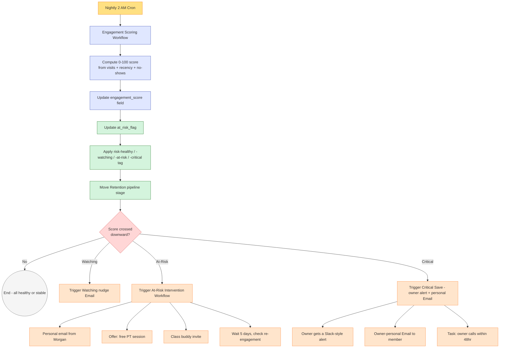

# #05 — Retention & Churn Prevention

> **The Problem:** When a member cancels, it's almost never a sudden decision. They went silent **4–8 weeks before** the cancel email. The studio just didn't see it — because nobody was watching attendance like a heartbeat monitor.

---

## Who This Hurts

**P5 — The Active Member, 90+ days.** She made it past onboarding. She's on auto-pay. From the studio's side she looks "fine" — the credit card hits every month and the kanban shows her happily in the "Active" column. She is the studio's economic engine.

But the active member has **four quiet pains** that all end the same way:

1. **Life got in the way.** A new project at work, a sick kid, a knee that's been twingy. She missed two weeks, felt awkward coming back, then missed two more.
2. **The routine got stale.** She's been doing the same Tuesday/Thursday HIIT for nine months. Nobody noticed she might love yoga. Nobody invited her to try something new.
3. **A small grievance stuck.** The new front-desk person never learned her name. She doesn't want to make a thing of it, so she just stops coming.
4. **The math started to bug her.** She's been paying $79/mo for a year. She's at the gym 6 times this month. That's $13 a visit and she's mostly fine with it. She's at the gym 1 time *next* month. That's $79 a visit and she is *not* fine with it.

In every case the *behavior* (declining attendance) leads the *decision* (cancel) by weeks. If anyone is watching the behavior, the save is possible. If nobody is watching, the cancel email arrives like weather — sudden and uncontested.

The save window is narrow: **once a member has internally decided to leave, you have maybe 14 days** before they'll go through with it. Watching attendance and reaching out *before* that decision is locked in is the entire game.

---

## Cost of Inaction

Conservative math for a studio with **250 active members** and a typical churn rate of **5%/month**:

| Scenario | Monthly Churn | LTV Lost / Mo | Annual LTV Lost |
|---|---|---|---|
| **No retention system** (5% churn) | 12.5 members | ~$13,750 | ~$165,000 |
| **With early-warning + save sequence** (3.5% churn) | 8.75 members | ~$9,625 | ~$115,500 |
| **Delta saved** | 3.75 members/mo | **~$4,125/month** | **~$49,500/year** |

That assumes a Basic-tier loss at $79 × ~14mo average LTV. For a 250-member studio with a mix of tiers (~$120 average), the delta saved is **~$6,250/month**.

And that's just the *avoided* loss. Saves also generate **referral lift** (a saved member often becomes a vocal advocate — see [#08 Referral Engine](../08-referral-engine/)) and **upsell readiness** (a member who just survived a near-cancel is unusually open to a reconnect call, see [#06 Upsell & Cross-Sell](../06-upsell-and-cross-sell/)).

---

## What We Built

A two-workflow system. The first one is **always-on**, computing an engagement score for every active member every night. The second one is **triggered** — it fires the moment a member crosses a risk threshold downward.

**The two components:**

1. **Engagement Scoring Workflow (nightly)** — computes a 0–100 score per member based on `visits_last_30_days`, days since `last_visit_date`, `noshow_count_90d`, and whether they've replied to recent marketing touches. Writes to `engagement_score`, updates `at_risk_flag`, swaps the `risk-*` tag, and moves the member's Retention pipeline opportunity. If the score crossed a threshold *downward* in the last 24 hours, it fires the intervention workflow.

2. **At-Risk Intervention Workflow (triggered)** — listens for `at_risk_flag` field changes. Based on the new level (Watching, At-Risk, Critical), runs the appropriate save sequence: soft Email check-in for Watching; personal email + free PT offer for At-Risk; owner-personal Email + a task to call within 48hr for Critical. Saves are tracked in the Retention pipeline's "Save In Progress" stage.

The Engagement Scoring formula is precisely defined in [build.md](build.md). The intervention copy is in [assets/emails.md](assets/emails.md) and [assets](assets). The full workflow specs are in [assets/workflow.md](assets/workflow.md).

---

## Outcome & KPIs

Move these numbers within 90 days of launch:

| KPI | Baseline | Target | How we measure |
|---|---|---|---|
| Monthly churn rate | 5%+ | **3.5% or lower** | Cancellations / active member count, monthly |
| At-risk save rate | 0% (no system) | **30–40%** | (Saved / (Saved + Lost-Cancelled)) from Retention pipeline |
| Early-warning lead time | 0 days (warned at cancel) | **21+ days before cancel** | Days between `risk-at-risk` tag application and `member-cancelled` |
| Owner intervention coverage | Ad hoc | **100% of Critical-stage members contacted in 48hr** | Task completion rate on owner call tasks |
| Re-engagement after Watching Email | Untracked | **35%+ of Watching members visit within 14 days** | `visits_last_30_days` delta post-Email |

The owner sees these in the **Retention Health** widget on the [#10 Owner Reporting](../10-owner-reporting-and-visibility/) dashboard.

---

## What Changes for the Studio Owner

Before:

- Owner finds out a member cancelled when the cancel email lands. No warning, no save chance. She emails them back: "So sorry to see you go — what could we have done?" Half the time they don't reply. The other half it's a polite "I just got busy" that doesn't help anyone.
- Owner can name maybe 30 of the 250 active members by attendance pattern — the rest are a blur. The ones in the blur are the ones most likely to disappear.
- The owner has a vague sense that "Tuesday's been quiet lately" but no data to act on. By the time three quiet weeks become a cancel cluster, the damage is done.

After:

- Owner opens GHL Monday morning. The Retention pipeline shows **3 Critical**, **7 At-Risk**, **18 Watching**. She knows exactly who to text personally before her first coffee.
- A member who hasn't been in for 12 days gets a Morgan-from-Sunrise Email that says "I noticed you've been quiet — everything good?" Half the time they reply with a real reason. Sometimes the reply is "I'm coming Tuesday, just busy." Sometimes it's "I tweaked my back, can I pause?" The save is *one human reply away* — and the system surfaces the moment to have it.
- Owner gets a weekly digest: "**4 saves this week** (Sarah, Marcus, Diane, Raj). **2 losses** (one moved, one cost). Net retention: +97%." She knows whether her intervention is working.
- The owner spends her relationship time on the **20 members who actually need her this month**, not the 230 who are happily on autopilot.

---

## Build It

Full step-by-step build in **[build.md](build.md)** — every workflow step, the engagement scoring formula, exact GHL clicks.

Production copy for every asset:

- **[assets/emails.md](assets/emails.md)** — At-Risk personal email from Morgan, win-them-back free PT offer, soft Watching check-in
- **[assets](assets)** — Watching nudge, At-Risk warm hello, Critical-stage owner-personal Email
- **[assets/workflow.md](assets/workflow.md)** — both workflow specs (Engagement Scoring + At-Risk Intervention) with mermaid diagrams

---

## How This Connects to Other Systems

This system **inherits members from** [#04 New Member Onboarding](../04-new-member-onboarding/) — every member who completes Day 30 onboarding enters Retention's "Healthy" stage with a starting score of 100.

It **forks into** [#06 Upsell & Cross-Sell](../06-upsell-and-cross-sell/) — saved members are flagged as upsell-ready 30 days post-save, since the relationship rebuild is the perfect upsell moment.

It **hands off losses to** [#09 Win-Back Lapsed Members](../09-win-back-lapsed-members/) — when a Critical-stage save fails and the member cancels, the contact is immediately routed into the day-30 win-back sequence.

It **feeds data to** [#10 Owner Reporting](../10-owner-reporting-and-visibility/) — the engagement score distribution and save-rate KPIs land on the owner dashboard.

It **cooperates with** [#03 Appointment No-Show Recovery](../03-appointment-no-show-recovery/) — no-show counts feed the engagement score; repeated no-shows are an at-risk leading indicator.

Full integration map: [../../integration/master-automation-graph.md](../../integration/master-automation-graph.md)
