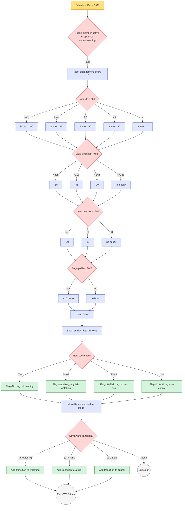
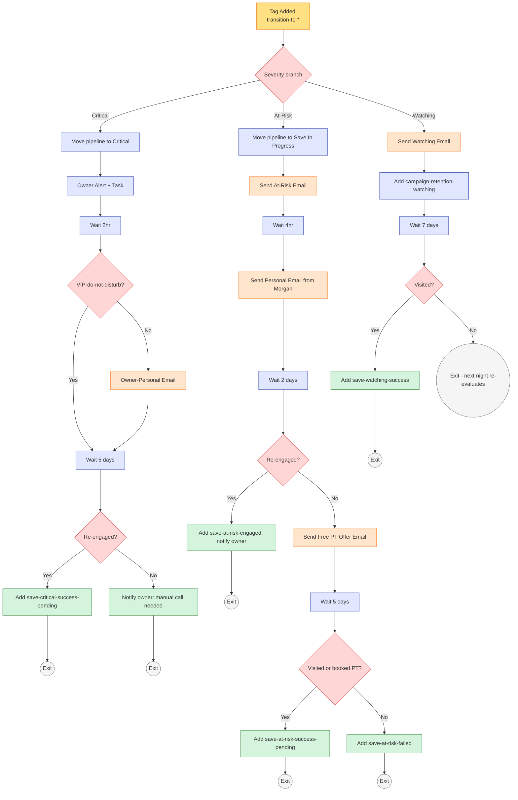

# #05 — Workflow Spec: Retention & Churn Prevention

> Two workflows make up the retention engine: **Workflow A** runs nightly and computes the engagement score; **Workflow B** is triggered by risk transitions and runs the intervention sequence. A third tiny helper (Workflow C) detects save successes and moves the pipeline. This file is the canonical reference for all three.

---

## Workflow A — Engagement Scoring (Nightly)

### Header

| Property | Value |
|---|---|
| **Workflow Name** | `05a — Engagement Scoring (Nightly)` |
| **Folder** | `05 - Retention` |
| **Status** | Published / On |
| **Re-entry** | **Enabled** — re-runs on the same contact every night |
| **Quiet hours respected** | N/A (no member-facing messages in this workflow) |

### Trigger

**Type:** Schedule (Time-Based / Cron)

**Schedule:** Daily at 2:00 AM `{{custom_values.business.timezone}}` (America/Chicago)

**Filters:**
- Contact has tag `member-active`
- Contact does NOT have tag `member-paused`
- Contact does NOT have tag `member-onboarding`
- Contact does NOT have tag `member-cancelled`

### Actions (in order)

#### Action 1 — Reset Engagement Score

| Property | Value |
|---|---|
| **Action type** | Update Contact Field |
| **Field** | `engagement_score` |
| **Value** | `0` |

#### Action 2 — Visit Frequency Scoring (If/Else)

| Branch | Condition | Set `engagement_score` to |
|---|---|---|
| 2a | `visits_last_30_days` ≥ 12 | `100` |
| 2b | `visits_last_30_days` between 8–11 | `85` |
| 2c | `visits_last_30_days` between 4–7 | `60` |
| 2d | `visits_last_30_days` between 1–3 | `30` |
| 2e | `visits_last_30_days` = 0 | `0` |

Use a chained Else-If structure so exactly one branch fires per contact.

#### Action 3 — Recency Decay (If/Else)

Subtract from current `engagement_score` based on days since `last_visit_date`. Use mutually exclusive Else-If — never double-decay.

| Branch | Condition | Adjustment |
|---|---|---|
| 3a | Days since `last_visit_date` > 30 | `engagement_score = engagement_score - 50` |
| 3b | Days since `last_visit_date` > 21 (and not > 30) | `engagement_score = engagement_score - 35` |
| 3c | Days since `last_visit_date` > 14 (and not > 21) | `engagement_score = engagement_score - 20` |
| 3d | Else (≤ 14 days) | No change |

> **GHL compatibility note:** If your plan doesn't support `field = field - 20`-style math, expand each branch into the full computed value per visit-frequency band. The expansion is mechanical but produces a tall If/Else tree. See **Appendix A** below for the expanded version.

#### Action 4 — No-Show Decay (If/Else)

| Branch | Condition | Adjustment |
|---|---|---|
| 4a | `noshow_count_90d` ≥ 5 | `engagement_score = engagement_score - 30` |
| 4b | `noshow_count_90d` between 3–4 | `engagement_score = engagement_score - 15` |
| 4c | Else | No change |

#### Action 5 — Engagement Boost (If/Else)

| Branch | Condition | Adjustment |
|---|---|---|
| 5a | Contact has tag `email-engaged-30d` OR `sms-engaged-30d` | `engagement_score = engagement_score + 10` |
| 5b | Else | No change |

#### Action 6 — Floor and Ceiling

| Branch | Condition | Adjustment |
|---|---|---|
| 6a | `engagement_score` > 100 | Set to `100` |
| 6b | `engagement_score` < 0 | Set to `0` |

#### Action 7 — Stash Previous Risk Flag

| Property | Value |
|---|---|
| **Action type** | Update Contact Field |
| **Field** | `at_risk_flag_previous` |
| **Value** | `{{contact.at_risk_flag}}` |

#### Action 8 — Set New Risk Flag and Tag

| Branch | Condition (new `engagement_score`) | Set `at_risk_flag` | Add Tag | Remove Tags |
|---|---|---|---|---|
| 8a | ≥ 70 | `No` | `risk-healthy` | `risk-watching`, `risk-at-risk`, `risk-critical` |
| 8b | 50–69 | `Watching` | `risk-watching` | `risk-healthy`, `risk-at-risk`, `risk-critical` |
| 8c | 30–49 | `At-Risk` | `risk-at-risk` | `risk-healthy`, `risk-watching`, `risk-critical` |
| 8d | < 30 | `Critical` | `risk-critical` | `risk-healthy`, `risk-watching`, `risk-at-risk` |

#### Action 9 — Move Retention Pipeline Stage

| Property | Value |
|---|---|
| **Action type** | If/Else then Move/Create Opportunity |
| **Branch 9a** | If existing Open Retention opportunity exists → Move to stage matching new flag |
| **Branch 9b** | If no Retention opportunity → Create one |

**Create opportunity defaults:**
- Pipeline: Retention
- Stage: matches new `at_risk_flag` (Healthy / Watching / At-Risk / Critical)
- Opportunity Name: `{{contact.first_name}} {{contact.last_name}} — Retention`
- Value: `{{contact.monthly_rate}} × 12`
- Status: Open
- Owner: Studio Owner

#### Action 10 — Detect Downward Transition

| Branch | Condition | Action |
|---|---|---|
| 10a | `at_risk_flag_previous` = `No` AND new = `Watching` | Add tag `transition-to-watching` |
| 10b | `at_risk_flag_previous` ≠ `At-Risk` AND new = `At-Risk` | Add tag `transition-to-at-risk` |
| 10c | `at_risk_flag_previous` ≠ `Critical` AND new = `Critical` | Add tag `transition-to-critical` |
| 10d | Else (no downward transition, or recovering) | Skip — exit workflow cleanly |

The `transition-to-*` tags are the trigger fuel for Workflow B.

#### Action 11 — Exit

End of nightly scoring run. Workflow B picks up from the tag transition.

---

## Workflow A Visual Diagram



---

## Workflow A — Edge Cases

| Scenario | Behavior |
|---|---|
| Contact is `member-paused` | Trigger filter blocks. Workflow does not run. |
| Contact is in onboarding (`member-onboarding`) | Filter blocks. #04 owns scoring during onboarding. |
| Contact's `last_visit_date` is null | Treat as 999 days ago → max recency decay applied. |
| Contact's `visits_last_30_days` is null | Treat as 0. Will combine with recency decay → Critical. **Backfill required before launch.** |
| Two transitions in same night (rare — score swings 80 → 40) | Only one `transition-to-*` tag fires — the destination tag, not intermediate. |
| Same contact re-enters next night with no change | No transition tag added. Workflow exits cleanly. Pipeline opportunity stays in current stage. |

---

## Workflow A — Monitoring Smart Lists

Build these in **Contacts > Smart Lists** for owner visibility:

| List | Filter | Use |
|---|---|---|
| `05 — Scored Last 24hr` | `engagement_score` updated in last 24hr | Confirm nightly run hit everyone |
| `05 — Score = 0 Anomalies` | `engagement_score` = 0 AND `member-active` AND `last_visit_date` within 14d | Detects data-quality issues |
| `05 — Critical Right Now` | tag `risk-critical` | Owner's daily glance |

---

## Workflow B — At-Risk Intervention (Triggered)

### Header

| Property | Value |
|---|---|
| **Workflow Name** | `05b — At-Risk Intervention` |
| **Folder** | `05 - Retention` |
| **Status** | Published / On |
| **Re-entry** | **Disabled** — but trigger-tag mechanism allows the same contact to run again on a *new* downward transition |
| **Quiet hours respected** | Yes — Email sends limited to 9 AM – 6 PM contact-local |

### Trigger

**Type:** Tag Added

**Tags (any):** `transition-to-watching`, `transition-to-at-risk`, `transition-to-critical`

**Filters:**
- Contact has tag `member-active`
- (No suppression filter at trigger level — branches handle suppression individually)

### Actions

#### Action 1 — Severity Branch (If/Else)

| Branch | Condition | Goes to |
|---|---|---|
| 1a | Has tag `transition-to-critical` | Branch C (Critical) |
| 1b | Has tag `transition-to-at-risk` AND not Critical | Branch B (At-Risk) |
| 1c | Has tag `transition-to-watching` AND not At-Risk or Critical | Branch A (Watching) |

Severity wins — if a contact somehow has both `transition-to-watching` AND `transition-to-at-risk`, Branch B handles them.

---

### Branch A — Watching (lightweight)

| Step | Action | Property |
|---|---|---|
| A.1 | Send Email | Template: `05 — Watching Soft Check-In`. Skip if `do-not-email` OR `sms_opt_in` ≠ Yes. |
| A.2 | (Fallback) Send Email | Only IF `do-not-email`. Template: `05 — Watching Soft Check-In` email version. Skip if `do-not-email`. |
| A.3 | Add Tag | `campaign-retention-watching` |
| A.4 | Remove Tag | `transition-to-watching` |
| A.5 | Wait | 7 days |
| A.6 | If/Else | `last_visit_date` within last 7 days? |
| A.6 YES | Add Tag | `save-watching-success`. Exit. |
| A.6 NO | Exit (next nightly run will likely re-trigger as At-Risk) |

---

### Branch B — At-Risk (active intervention)

| Step | Action | Property |
|---|---|---|
| B.1 | Move Pipeline | Retention → **Save In Progress** stage |
| B.2 | Send Email | Template: `05 — At-Risk Warm Hello`. Skip if `do-not-email` OR `sms_opt_in` ≠ Yes. |
| B.3 | Wait | 4 hours, respecting 9 AM – 6 PM contact-local |
| B.4 | Send Email | Template: `05 — At-Risk Personal from Morgan`. Skip if `do-not-email` OR `email_opt_in` ≠ Yes. |
| B.5 | Wait | 2 days |
| B.6 | If/Else | Has `retention-reply-received` tag OR `last_visit_date` within 48 hours? |
| B.6 YES | Add Tag `save-at-risk-engaged`. Notify Owner: "Good news — {{contact.first_name}} re-engaged." Jump to B.10. |
| B.6 NO | Continue to B.7 |
| B.7 | Send Email | Template: `05 — Win-Them-Back Free PT Offer`. Skip if `do-not-email`. |
| B.8 | Wait | 5 days |
| B.9 | If/Else | `last_visit_date` within last 7 days OR booked PT session in last 7 days? |
| B.9 YES | Add Tag `save-at-risk-success-pending`. Pipeline stays at Save In Progress. Workflow C picks up when nightly run moves to Healthy. |
| B.9 NO | Add Tag `save-at-risk-failed`. Pipeline stays at At-Risk. Member continues under nightly monitoring. |
| B.10 | Remove Tag | `transition-to-at-risk` |
| B.11 | Exit |

---

### Branch C — Critical (owner-personal)

| Step | Action | Property |
|---|---|---|
| C.1 | Move Pipeline | Retention → **Critical** stage |
| C.2 | Send Internal Notification | Channel: Email. To: `{{custom_values.business.owner_email}}`. Subject: `URGENT — {{contact.first_name}} {{contact.last_name}} is Critical retention risk`. Body: includes contact phone, last visit, total months, monthly rate, recent attendance summary, link to contact. CTA: "Call within 48 hours." |
| C.3 | Create Task | Title: `Call {{contact.first_name}} {{contact.last_name}} — Critical retention`. Assigned to: Owner. Due: 48 hours from now. Description: includes phone number and last visit. |
| C.4 | Wait | 2 hours (let owner see alert first) |
| C.5 | If/Else | Has tag `vip-do-not-disturb`? |
| C.5 YES | Skip C.6 (owner handles 100%). Jump to C.7. |
| C.5 NO | Continue to C.6. |
| C.6 | Send Email | **From: Owner's personal number** (not the general Email number). Template: `05 — Critical Owner-Personal Email`. Skip if `do-not-email`. |
| C.7 | Wait | 5 days |
| C.8 | If/Else | Has `retention-reply-received` tag OR `last_visit_date` within 5 days? |
| C.8 YES | Add Tag `save-critical-success-pending`. Notify Owner: "Saved — {{contact.first_name}} re-engaged after Critical." |
| C.8 NO | Notify Owner: "{{contact.first_name}} did not respond to Critical sequence. Manual call strongly recommended." |
| C.9 | Remove Tag | `transition-to-critical` |
| C.10 | Exit |

---

## Workflow B Visual Diagram



---

## Workflow B — Edge Cases

| Scenario | Behavior |
|---|---|
| Contact transitions Watching → At-Risk before A.5 wait completes | Branch A's wait continues. Meanwhile Branch B fires from new transition tag. Member gets both Watching Email and At-Risk Email. **Acceptable** but spacing matters — the 4-hour wait in B.3 protects against same-minute double-send. If concerned, add a "frequency cap" check at B.2: skip Email if any retention Email sent in last 48 hours. |
| Contact transitions At-Risk → Critical mid-sequence | Branch B is in progress. New transition-to-critical tag triggers Branch C in parallel. **This is the intended escalation behavior** — Critical gets owner intervention even if B is still running. |
| Contact replies during waits | `retention-reply-received` tag applied by inbound-email handler. B.6 / C.8 If/Else checks pick it up. |
| Contact cancels mid-sequence | `member-cancelled` tag added. Workflow 05d fires (separate workflow) and moves contact to Lost-Cancelled. Workflow B continues but its messages will mostly be no-ops since the contact already cancelled. Add a top-level filter: "Skip remaining steps if `member-cancelled`." |
| `vip-do-not-disturb` contact hits At-Risk | Branch B's automated emails may still feel intrusive. **Modification:** B.2 and B.7 should check the VIP flag and skip messaging — only owner notification in B.6's YES branch fires. |
| Owner doesn't complete the Critical task in 48hr | Task overdue alert auto-fires (GHL native). The auto-Email in C.6 already went out, so the member has had contact. Owner gets a follow-up alert in 7 days as a reminder. |

---

## Workflow C — Save Success Detector (helper)

### Header

| Property | Value |
|---|---|
| **Workflow Name** | `05c — Save Success Detector` |
| **Folder** | `05 - Retention` |
| **Status** | Published / On |

### Trigger

**Type:** Tag Added → `risk-healthy`

**Filter:** Contact has tag `save-at-risk-success-pending` OR `save-critical-success-pending`

### Actions

| # | Action | Detail |
|---|---|---|
| 1 | Move Retention opportunity | To **Saved** stage. Mark Won. Value = `monthly_rate × 12`. |
| 2 | Notify owner | Email template `05 — Save Win Celebration` |
| 3 | Remove tags | `save-at-risk-success-pending`, `save-critical-success-pending`, `campaign-retention-watching` |
| 4 | Add tag | `member-saved` (permanent badge) |
| 5 | (Optional) Send Email | Template `05 — Save Confirmed Thank You`. Toggle off if studio prefers no acknowledgment. |
| 6 | Wait | 30 days |
| 7 | Add tag | `save-mature-30d` — opens upsell readiness in [#06](../../06-upsell-and-cross-sell/) |
| 8 | Exit |

---

## Workflow D — Save Failure → Cancel Handoff

### Header

| Property | Value |
|---|---|
| **Workflow Name** | `05d — Save Failure → Cancel Handoff` |
| **Folder** | `05 - Retention` |
| **Status** | Published / On |

### Trigger

**Type:** Tag Added → `member-cancelled`

**Filter:** Contact has tag `save-at-risk-failed` OR `save-critical-success-pending` OR `risk-at-risk` OR `risk-critical`

### Actions

| # | Action | Detail |
|---|---|---|
| 1 | Move Retention opportunity | To **Lost-Cancelled** stage. Mark Lost. |
| 2 | Remove tags | `risk-at-risk`, `risk-critical`, `save-*-success-pending` |
| 3 | Notify owner | "Lost — {{contact.first_name}} cancelled despite save attempt. Reason: {{contact.cancel_reason}}. Routing to win-back." |
| 4 | Add to Workflow | `09a — Win-Back D30` (defined in [#09](../../09-win-back-lapsed-members/)) |
| 5 | Exit |

---

## Appendix A — Engagement Score Math, Expanded for Plans Without Field Arithmetic

If your GHL plan can't do `field = field - 20`, every band must compute the final value explicitly. This produces a wider If/Else tree (visits × decay × noshow × boost = up to 60 leaf combos). For brevity, here's a representative slice:

```
IF visits_last_30_days >= 12:
    base = 100
    IF days_since_last_visit > 30: score = 50
    ELIF days_since_last_visit > 21: score = 65
    ELIF days_since_last_visit > 14: score = 80
    ELSE: score = 100
    IF noshow_count_90d >= 5: score -= 30
    ELIF noshow_count_90d >= 3: score -= 15
    IF email_engaged_30d OR sms_engaged_30d: score += 10
    Clamp 0-100

IF visits_last_30_days 8-11:
    base = 85
    ...(same pattern)

IF visits_last_30_days 4-7:
    base = 60
    ...

IF visits_last_30_days 1-3:
    base = 30
    ...

IF visits_last_30_days == 0:
    base = 0
    ...
```

Use a script action (if available) instead of nested If/Else when possible — much cleaner, but requires the Workflow Premium tier.

---

## What Lives Outside These Workflows

The retention engine intentionally only owns scoring + intervention. Adjacent systems own:

- **Attendance data ingestion** → [#03 Appointment No-Show Recovery](../../03-appointment-no-show-recovery/) populates `last_visit_date`, `visits_last_30_days`, `noshow_count_90d`
- **Onboarding scoring** → [#04 New Member Onboarding](../../04-new-member-onboarding/) owns scoring for days 0–30; the retention engine takes over at day 31
- **Upsell readiness after save** → [#06 Upsell & Cross-Sell](../../06-upsell-and-cross-sell/) picks up `save-mature-30d` tag
- **Win-back after cancel** → [#09 Win-Back Lapsed Members](../../09-win-back-lapsed-members/) picks up handoff from Workflow D
- **Retention KPIs visualization** → [#10 Owner Reporting](../../10-owner-reporting-and-visibility/) consumes scoring + save data
