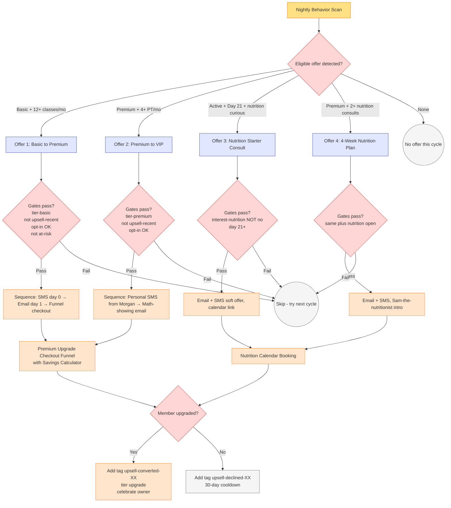

# #06 — Upsell & Cross-Sell

> **The Problem:** Your Basic members are paying $79/month. A handful of them are *already behaving like Premium members* — attending 12+ classes a month, asking trainers about PT, occasionally buying nutrition. They'd happily pay $149. But nobody's asking them — because the owner is busy and the front desk doesn't know which members to ask.

---

## Who This Hurts

**P5 — The Active Member, 90+ days.** The same persona [#05 Retention](../05-retention-and-churn-prevention/) protects from leaving. But here we look at the *opposite* edge of the same population: members who are over-using their tier.

Three sub-patterns:

1. **The Basic Power-User.** Pays $79. Attends 14 classes in a month. Has asked at least one trainer about "what's the deal with that nutrition consult thing." If you offered Premium for $149 — which gets her 2 PT sessions and a nutrition consult — she'd say yes the same week, because she's already mentally there. Nobody offered.
2. **The Premium PT-Heavy Member.** Pays $149. Uses her 2 PT sessions plus regularly drops in for extra at $85 each. Three months in a row, she's spent $149 + ($85 × 3) = $404. VIP is $249 unlimited PT. She is *paying a $155/month tax* for not being on VIP, and doesn't know.
3. **The New Member with Nutrition Curiosity.** Pays $79 Basic. Has been here 21 days. Casually mentioned to a trainer that she "should probably eat better." She's exactly the person who'd buy a nutrition starter consult or the 4-week plan — if the offer landed at the right moment.

In every case, the friction isn't *want* — the member already wants more. The friction is **the awkward in-person ask**. Studios that rely on trainers to upsell in person get two failure modes: (1) trainers are bad at sales and the pitch lands sideways; (2) trainers are too good at sales and members feel pressured. Neither builds trust.

A well-timed, well-targeted automated nudge — sent at the right behavior moment — bypasses both failure modes. It feels like service ("we noticed you're going hard — want a tier that fits?") instead of selling.

---

## Cost of Inaction

Conservative math for a studio with **200 Basic + 50 Premium** members:

| Scenario | Members eligible | Conversion rate | Monthly revenue lift |
|---|---|---|---|
| **Basic → Premium upgrade** (power-users, 15% of Basic eligible) | 30 | 25% upgrade if offered = 7.5/mo | 7.5 × $70 = **$525/mo** |
| **Premium → VIP upgrade** (PT-heavy, 20% of Premium eligible) | 10 | 30% upgrade = 3/mo | 3 × $100 = **$300/mo** |
| **Basic → Nutrition Starter** (curiosity-signaled, 25% of Basic) | 50 | 15% conversion = 7.5/mo | 7.5 × $50 = **$375/mo** |
| **Premium → 4-Week Plan** (high-intent, 10% Premium) | 5 | 30% conversion = 1.5/mo | 1.5 × $199 = **$300/mo** |
| **Combined monthly lift** | — | — | **~$1,500/month** |

Annualized: **~$18,000/year of incremental MRR + one-time revenue** from a 250-member studio. And the upsold member's **LTV roughly doubles** — a Basic at $79 × 14mo = $1,106 becomes a Premium at $149 × 18mo (longer LTV at higher tier) = $2,682. That's a structural lift, not a one-time win.

For a 500-member studio: **~$3,000/month** of incremental revenue.

---

## What We Built

A behavior-triggered upsell engine with **four offer scenarios**, each gated by behavior + tier + interest + opt-out checks. The system watches what members actually do, and surfaces the right offer at the right moment — never two offers at once, never to the wrong member.

**The four upsell offers:**

| # | Offer | Trigger Behavior | Target Tier | Lift |
|---|---|---|---|---|
| 1 | **Basic → Premium** | Attended 12+ classes in last 30 days, currently on Basic | $79 → $149 (+$70/mo) | +88% MRR per upgrade |
| 2 | **Premium → VIP** | Booked 4+ PT sessions in last 30 days, currently on Premium | $149 → $249 (+$100/mo) | +67% MRR per upgrade |
| 3 | **Active → Nutrition Starter** | Day 21+ as member, `nutrition_interest` ≠ No | $50 one-time | One-time + lead for #4 |
| 4 | **Active → 4-Week Nutrition Plan** | Booked 2+ nutrition consults | $199 one-time | One-time, high margin |

**Gating logic (applied to every offer):**

- ✅ Correct tier (don't offer Premium to a VIP)
- ✅ `interest-*` flag confirms the offer matches signaled interest (or absence-of-no)
- ✅ NOT in active retention sequence (don't upsell a member who's at-risk; #05 says "give them space")
- ✅ NOT recently offered the same upsell (30-day cooldown on declines)
- ✅ Opt-in flags clear (`sms_opt_in`, `email_opt_in`)
- ✅ NOT `do-not-market`

Full sequence logic in [build.md](build.md). Copy in [assets/emails.md](assets/emails.md) and [assets/sms.md](assets/sms.md). Premium upgrade checkout funnel — with a real savings-calculator widget — in [assets/funnel.md](assets/funnel.md).

---

## Outcome & KPIs

Move these numbers within 60 days of launch:

| KPI | Baseline | Target | How we measure |
|---|---|---|---|
| Basic → Premium upgrade rate (per offer sent) | 0% (no system) | **25%+** | Upgrades ÷ offers sent |
| Premium → VIP upgrade rate (per offer sent) | 0% | **30%+** | Same |
| Nutrition starter consult attach rate | <5% organic | **15%+** | Consults booked ÷ offers sent |
| Incremental monthly MRR from upsells | $0 | **$1,200–$1,800** | Sum of monthly upgrades × upgrade delta |
| Member-level LTV (Basic → Premium upgrader) | $1,100 | **$2,500+** | Track via 12mo cohort |
| Negative response rate ("unsubscribe me") | Unknown | **<2% per send** | Unsubscribes ÷ sends |

The owner sees these in the **Revenue Lift** widget on the [#10 Owner Reporting](../10-owner-reporting-and-visibility/) dashboard.

---

## What Changes for the Studio Owner

Before:

- Trainers occasionally remembered to mention Premium to power-using Basic members. Hit rate: maybe one upgrade a month, awkwardly delivered, leaving the member faintly uncomfortable.
- Members who would buy nutrition consults didn't, because nobody asked. The nutritionist's calendar was 40% empty most weeks.
- The owner had no idea which members were Premium-ready or VIP-ready. The data was in attendance logs that nobody read.
- Upsell felt like *something to feel weird about* — the studio's vibe was warm, and asking for more money felt incongruous.

After:

- Every Friday, the system identifies Basic members who attended 12+ classes that week. Saturday morning, they get a Morgan-style SMS: "Sarah, you've been crushing it — 14 classes this month. Want to see what Premium would look like for you?" Half of them tap. A quarter convert.
- VIP-ready Premium members get a personalized email showing them the *actual math* — "you've spent $404/mo on average for 3 months. VIP is $249 unlimited. You'd save $155/mo." Most upgrade within 7 days.
- The nutritionist's calendar fills. The owner gets a "you upsold $XYZ this month" digest. Upsell becomes a number, not an awkward conversation.
- The vibe stays warm — because the offers are **specific, well-timed, and earned**. The system never pushes; it surfaces what the member would have asked for if the asking weren't socially weird.

---

## Build It

Full step-by-step build in **[build.md](build.md)** — every workflow, every gate, exact GHL clicks.

Production copy for every asset:

- **[assets/emails.md](assets/emails.md)** — 4 upsell emails (Basic→Premium with attendance proof, Premium→VIP with savings math, nutrition starter, 4-week plan)
- **[assets/sms.md](assets/sms.md)** — 4 timed nudge SMS variants
- **[assets/funnel.md](assets/funnel.md)** — Premium upgrade checkout funnel with savings calculator
- **[assets/workflow.md](assets/workflow.md)** — Behavior-Triggered Upsell Workflow with all 4 branches, gates, and conversion tracking

---

## How This Connects to Other Systems

This system **depends on** [#04 New Member Onboarding](../04-new-member-onboarding/) for the day-21 nutrition starter trigger — the day counter starts at onboarding completion.

It **respects** [#05 Retention & Churn Prevention](../05-retention-and-churn-prevention/) — members in any `risk-*` tag except `risk-healthy` are excluded from upsell offers. And members who were recently saved (tag `save-mature-30d`) are *promoted* into the upsell pool at the right moment.

It **flows into** [#10 Owner Reporting](../10-owner-reporting-and-visibility/) — every conversion is logged with offer type, lift value, and time-to-convert.

It **complements** [#08 Referral Engine](../08-referral-engine/) — upgraded members are 2x more likely to refer, and the system signals upsell-converted members to receive a "now refer a friend" follow-up.

Full integration map: [../../integration/master-automation-graph.md](../../integration/master-automation-graph.md)
