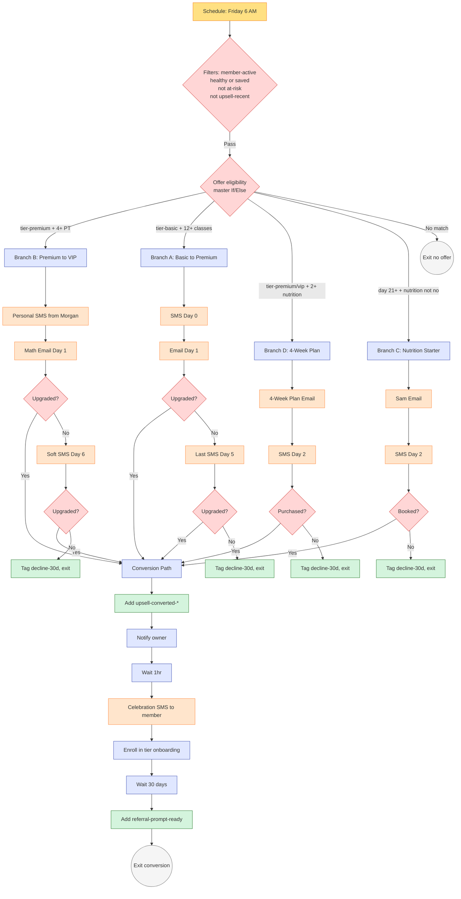

# #06 — Workflow Spec: Behavior-Triggered Upsell

> Complete spec for the upsell engine. Single primary workflow with four branches (one per offer), plus a tag-cleanup helper. Every offer is gated by tier + behavior + interest + opt-out + recent-decline checks. First match per cycle wins.

---

## Workflow Header

| Property | Value |
|---|---|
| **Workflow Name** | `06 — Behavior-Triggered Upsell` |
| **Folder** | `06 - Upsell` |
| **Status** | Published / On |
| **Re-entry** | **Enabled** — re-runs weekly, may re-evaluate same contact |
| **Quiet hours respected** | Yes — SMS limited to 9 AM – 7 PM contact-local, weekdays preferred |

---

## Trigger

**Type:** Schedule (Time-Based / Cron)

**Schedule:** Weekly, **Friday at 6:00 AM `{{custom_values.business.timezone}}`**

**Filters (all must pass):**

- Contact has tag `member-active`
- Contact does NOT have tag `member-paused`
- Contact does NOT have tag `member-cancelled`
- Contact does NOT have tag `do-not-market`
- Contact does NOT have tag `risk-at-risk`
- Contact does NOT have tag `risk-critical`
- Contact does NOT have tag `upsell-recent` (30-day cooldown after any upsell sequence)
- Contact has tag `risk-healthy` OR `save-mature-30d` (only healthy or recently-saved members)

**Why these filters:** Upsells go only to members who are happy and stable. At-risk members get retention attention from [#05](../../05-retention-and-churn-prevention/) — pushing an upsell during retention conversation backfires.

---

## Actions

### Action 1 — Offer Selection (Master If/Else, priority order)

The workflow evaluates each offer in revenue-impact order. First match wins per cycle.

```
IF tier-premium AND pt_sessions_30d >= 4 AND NOT upsell-declined-premium-vip-30d
  → Branch B (Premium → VIP)
ELSE IF tier-basic AND visits_last_30_days >= 12 AND NOT upsell-declined-basic-premium-30d
  → Branch A (Basic → Premium)
ELSE IF (tier-premium OR tier-vip) AND total_nutrition_consults_lifetime >= 2
        AND nutrition_interest IN ("Yes - High", "Yes - Curious")
        AND NOT upsell-declined-nutrition-plan-30d
  → Branch D (4-Week Nutrition Plan)
ELSE IF days_as_member >= 21 AND nutrition_interest != "No"
        AND NOT upsell-declined-nutrition-starter-30d
  → Branch C (Nutrition Starter Consult)
ELSE
  → Exit (no offer this cycle)
```

**Computed inputs:**

- `pt_sessions_30d`: Count of completed PT appointments in last 30 days. See helper computation below.
- `total_nutrition_consults_lifetime`: Track via a custom field updated on each nutrition appointment completion.
- `visits_last_30_days`: Maintained by [#03 attendance pipeline](../../03-appointment-no-show-recovery/), rolling 30-day count.

---

### Helper — Computing `pt_sessions_30d`

GHL Workflow conditions need this as a known value. Options:

**Option A (preferred, if your GHL plan supports appointment-count queries):**
- Use "Has booked X appointments in calendar Y in last Z days" workflow condition

**Option B (proxy):**
- `last_pt_session_date` within last 7 days AND `total_pt_sessions` ≥ 8 → assume heavy PT user
- Less precise but works without appointment-query conditions

**Option C (nightly snapshot):**
- A separate nightly workflow updates a `pt_sessions_30d_snapshot` field by counting matching appointments
- Most reliable; requires the snapshot workflow

This build defaults to Option A, falling back to Option C if needed. Option B is the temporary stopgap.

---

### Branch A — Basic → Premium

| Step | Action | Detail |
|---|---|---|
| A.1 | Add Tag | `campaign-upsell-basic-premium` |
| A.2 | Add Tag | `upsell-recent` |
| A.3 | Update Field | `upsell_offer_active` = `Basic to Premium` |
| A.4 | Update Field | `upsell_offer_started_at` = `{{now}}` |
| A.5 | Send SMS | Template `06 — Basic to Premium Nudge` from [sms.md](sms.md). From: general sender. Skip if `do-not-sms` OR `sms_opt_in` ≠ Yes. |
| A.6 | Wait | 1 day, respecting 9 AM – 7 PM contact-local |
| A.7 | Send Email | Template `06 — Basic to Premium Pitch` from [emails.md](emails.md). Skip if `do-not-email` OR `email_opt_in` ≠ Yes. |
| A.8 | Wait | 4 days |
| A.9 | If/Else | Did contact upgrade? (tag `tier-premium` applied in last 5 days OR purchase event for SKU `MEM-PREMIUM`) |
| A.9 YES | → Conversion Path |
| A.9 NO | Continue |
| A.10 | Send SMS | Template `06 — Basic to Premium Last Nudge`. Skip per opt-out rules. |
| A.11 | Wait | 3 days |
| A.12 | If/Else | Did contact upgrade? |
| A.12 YES | → Conversion Path |
| A.12 NO | Add tag `upsell-declined-basic-premium-30d`. Remove tag `campaign-upsell-basic-premium`. Exit. |

---

### Branch B — Premium → VIP

| Step | Action | Detail |
|---|---|---|
| B.1 | Add Tag | `campaign-upsell-premium-vip` |
| B.2 | Add Tag | `upsell-recent` |
| B.3 | Update Field | `upsell_offer_active` = `Premium to VIP` |
| B.4 | Update Field | `upsell_offer_started_at` = `{{now}}` |
| B.5 | Send SMS | Template `06 — Premium to VIP Personal SMS` from [sms.md](sms.md). **From: Morgan's personal cell number** (not general sender). Skip if `do-not-sms`. |
| B.6 | Wait | 1 day |
| B.7 | Send Email | Template `06 — Premium to VIP Math Email` from [emails.md](emails.md). Skip per opt-out. |
| B.8 | Wait | 5 days |
| B.9 | If/Else | Did contact upgrade to VIP? |
| B.9 YES | → Conversion Path |
| B.9 NO | Continue |
| B.10 | Send SMS | Template `06 — Premium to VIP Soft Follow-Up`. From: Morgan's number (same thread). |
| B.11 | Wait | 4 days |
| B.12 | If/Else | Did contact upgrade? |
| B.12 YES | → Conversion Path |
| B.12 NO | Add tag `upsell-declined-premium-vip-30d`. Remove `campaign-upsell-premium-vip`. Exit. |

---

### Branch C — Nutrition Starter Consult

| Step | Action | Detail |
|---|---|---|
| C.1 | Add Tag | `campaign-upsell-nutrition-starter` |
| C.2 | Add Tag | `upsell-recent` |
| C.3 | Update Field | `upsell_offer_active` = `Nutrition Starter` |
| C.4 | Send Email | Template `06 — Nutrition Starter Offer` from [emails.md](emails.md). From: Sam. Skip per opt-out. |
| C.5 | Wait | 2 days |
| C.6 | Send SMS | Template `06 — Nutrition Starter SMS Nudge`. From: general sender. Skip per opt-out. |
| C.7 | Wait | 5 days |
| C.8 | If/Else | Did contact book a nutrition consult (calendar = "Nutrition Starter" or purchase SKU `NUT-STARTER`)? |
| C.8 YES | → Conversion Path |
| C.8 NO | Add tag `upsell-declined-nutrition-starter-30d`. Remove `campaign-upsell-nutrition-starter`. Exit. |

---

### Branch D — 4-Week Custom Nutrition Plan

| Step | Action | Detail |
|---|---|---|
| D.1 | Add Tag | `campaign-upsell-nutrition-plan` |
| D.2 | Add Tag | `upsell-recent` |
| D.3 | Update Field | `upsell_offer_active` = `4-Week Plan` |
| D.4 | Send Email | Template `06 — 4-Week Plan Offer` from [emails.md](emails.md). From: Sam. |
| D.5 | Wait | 2 days |
| D.6 | Send SMS | Template `06 — 4-Week Plan SMS Nudge`. |
| D.7 | Wait | 5 days |
| D.8 | If/Else | Purchase of SKU `NUT-PLAN-4WK`? |
| D.8 YES | → Conversion Path |
| D.8 NO | Add tag `upsell-declined-nutrition-plan-30d`. Remove `campaign-upsell-nutrition-plan`. Exit. |

---

### Conversion Path (shared by all branches)

| Step | Action | Detail |
|---|---|---|
| CV.1 | Add Tag | `upsell-converted-{{upsell_offer_active}}` (e.g., `upsell-converted-basic-premium`) |
| CV.2 | Update Field | `last_upsell_conversion_date` = today |
| CV.3 | Update Field | `total_upsell_conversions` = `total_upsell_conversions + 1` |
| CV.4 | Update Field | `upsell_offer_active` = `(blank)` |
| CV.5 | Remove Tag | `campaign-upsell-*` (clear active campaign tag) |
| CV.6 | Notify Owner | Internal email. Subject: `Upsell Win — {{contact.first_name}} {{contact.last_name}} converted on {{upsell_offer_active}}`. Body includes member name, offer type, new MRR, lifetime conversion count. |
| CV.7 | Wait | 1 hour (gives the new tier/product time to provision in Stripe, gives the member breathing room) |
| CV.8 | Send SMS | Template `06 — Upgrade Celebration` (variant matching offer type) from [sms.md](sms.md). Owner-warm tone. |
| CV.9 | Enroll in Workflow | Tier-specific onboarding: Premium Member Onboarding / VIP Member Onboarding / Nutrition Customer Onboarding (these are out of scope for this file but referenced). |
| CV.10 | Wait | 30 days |
| CV.11 | Add Tag | `referral-prompt-ready` (consumed by [#08 Referral Engine](../../08-referral-engine/)) |
| CV.12 | Exit |

---

## Visual Workflow Diagram



---

## Edge Cases & Handling

| Scenario | Workflow behavior |
|---|---|
| Member converts mid-sequence (e.g., upgrades to Premium during the wait between A.7 and A.9) | A.9's If/Else detects the upgrade and routes to Conversion Path. Subsequent steps skipped. |
| Member transitions to `risk-at-risk` mid-sequence | No mid-sequence eject — the workflow doesn't re-check the trigger filters between steps. Acceptable since the contact won't re-trigger until at-risk clears. Add a safety check at each Wait step: "If contact has `risk-at-risk` or `risk-critical`, exit cleanly." |
| Member cancels mid-sequence | `member-cancelled` tag added. Add safety check: "If contact has `member-cancelled`, exit immediately." |
| Member is in two campaigns simultaneously | Should not happen — `upsell-recent` blocks re-entry. But if it does (e.g., manual workflow add), the second sequence collides with the first. Solve via re-entry disabled + tag check at each step. |
| Premium → VIP SMS fails because Morgan's number isn't provisioned | SMS action errors. Workflow continues to email step. Owner should set up Morgan's number as a sending identity in GHL before launch. |
| Purchase event missed by the workflow (race condition) | Conversion path doesn't fire automatically. Manual fix: owner sees the purchase in Payments, manually tags `upsell-converted-*` to trigger the celebration SMS and downstream. |
| Member books nutrition consult without using the offered link | C.8 still detects via calendar event. Conversion path fires correctly. |
| Member with `vip-do-not-disturb` tag | Most upsell sequences are too intrusive for this segment. Add to trigger filter: NOT `vip-do-not-disturb`. Owner handles upsells manually for these members. |
| Wait step extending past quiet hours | GHL respects send-window settings — if Wait completes at 11 PM, SMS queues for 9 AM next morning. |

---

## Monitoring & Smart Lists

Build these in **Contacts > Smart Lists**:

| List | Filter | Purpose |
|---|---|---|
| `06 — In Upsell Sequence` | Has tag matching `campaign-upsell-*` | Active campaigns this week |
| `06 — Recent Wins (30d)` | Has tag matching `upsell-converted-*`, conversion in last 30d | Owner KPI glance |
| `06 — Eligible Premium-Ready` | `tier-basic` AND `visits_last_30_days` ≥ 12 AND NOT `upsell-declined-basic-premium-30d` AND NOT `upsell-recent` | Forecast next Friday's batch |
| `06 — Eligible VIP-Ready` | `tier-premium` AND `pt_sessions_30d` ≥ 4 AND NOT `upsell-declined-premium-vip-30d` AND NOT `upsell-recent` | Forecast |
| `06 — Recent Declines` | Has tag matching `upsell-declined-*-30d`, applied in last 7 days | Watch decline trends |

---

## Decline Tag Cleanup (sub-workflow)

### Header

| Property | Value |
|---|---|
| **Workflow Name** | `06 — Decline Tag Cleanup` |
| **Folder** | `06 - Upsell` |
| **Status** | Published / On |

### Trigger

**Type:** Tag Added (one trigger per decline tag — set up 4 separate triggers or use dynamic if available):

- `upsell-declined-basic-premium-30d`
- `upsell-declined-premium-vip-30d`
- `upsell-declined-nutrition-starter-30d`
- `upsell-declined-nutrition-plan-30d`

### Actions

| Step | Action | Detail |
|---|---|---|
| 1 | Wait | 30 days |
| 2 | Remove Tag | The specific decline tag that triggered this workflow |
| 3 | If/Else | Does contact still have any other `upsell-declined-*-30d` tag? |
| 3 YES | Skip step 4 |
| 3 NO | Continue |
| 4 | Remove Tag | `upsell-recent` (contact is again eligible for offer evaluation) |
| 5 | Exit |

---

## Reply Handler (parallel inbound workflow)

### Header

| Property | Value |
|---|---|
| **Workflow Name** | `06 — Inbound Reply Handler` |
| **Folder** | `06 - Upsell` |

### Trigger

**Type:** Inbound SMS OR Inbound Email

**Filter:** Contact has any tag matching `campaign-upsell-*`

### Actions

| Step | Action | Detail |
|---|---|---|
| 1 | If/Else | Reply content (keyword detection) |
| 1a | Contains "yes", "interested", "tell me more" | Add `upsell-interest-confirmed`. Notify owner: "Member confirmed interest — engage personally." Pause active campaign workflow. |
| 1b | Contains "no", "not now", "not interested", "later" | Add `upsell-decline-explicit`. Add appropriate `upsell-declined-*-30d` tag matching active campaign. Exit campaign workflow. |
| 1c | Contains "stop", "unsubscribe", "remove" | Add `do-not-market`. Per SMS opt-out rules, `do-not-sms` may also be added by GHL. Halt all marketing. Notify owner. |
| 1d | Any other reply | Notify owner / staff in Conversations. Pause campaign workflow pending personal handling. |
| 2 | Exit |

---

## What Lives Outside This Workflow

The upsell engine intentionally only owns offer selection + sequencing + conversion tracking. Adjacent systems own:

- **Attendance + PT data ingestion** → [#03 Appointment No-Show Recovery](../../03-appointment-no-show-recovery/)
- **Onboarding fields populated** → [#04 New Member Onboarding](../../04-new-member-onboarding/)
- **Risk filter inputs** → [#05 Retention](../../05-retention-and-churn-prevention/)
- **Premium / VIP tier onboarding** → Out of scope, separate "Premium Member Onboarding" workflow
- **Nutrition customer onboarding** → Out of scope, separate "Nutrition Customer Onboarding" workflow
- **Conversion celebration follow-up beyond 30 days** → [#08 Referral Engine](../../08-referral-engine/) picks up via `referral-prompt-ready` tag
- **Revenue lift reporting** → [#10 Owner Reporting](../../10-owner-reporting-and-visibility/)
