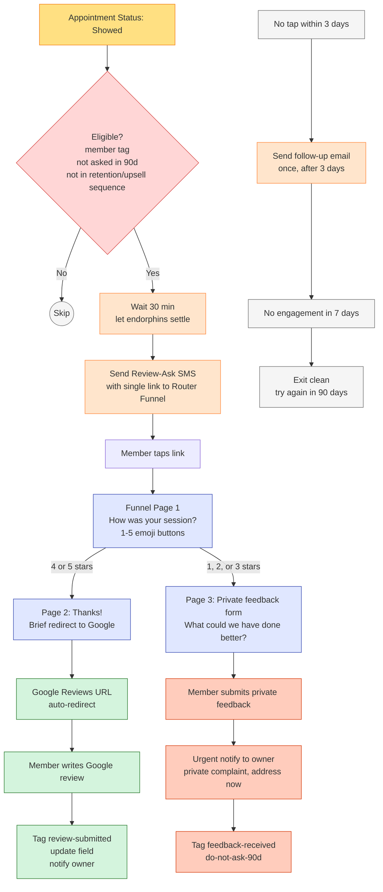

# #07 — Reviews & Reputation

> **The Problem:** 73% of people check Google reviews before walking into a wellness studio. Your studio is great — but a competitor with 200 reviews and a 4.7 rating outranks you with 25 reviews and a 4.6. The owner *knows* members love the studio. The reviews just don't reflect it, because nobody's asking — and when they do ask, the wrong people sometimes show up to leave a 2-star review.

---

## Who This Hurts

**P5 — The Active Member, 90+ days** (the silent advocate). She's been here a year, loves the place, recommends it to friends in person. Has never left a Google review because nobody ever asked her at the right moment, and "leaving a review" is one of those things she keeps meaning to do.

**P7 — The Studio Owner.** Watches a competitor's Google ranking climb past hers despite delivering — in her honest opinion — worse service. Knows reviews are the bottleneck but doesn't have time to manually chase every member.

**P1 — The Cold Lead** (downstream). Sees 25 mediocre-quality reviews and 6 lukewarm ones (because they were asked at the wrong moment, when a class felt off). Picks the competitor with 200 reviews and 4.7 stars. The lead never converts — and the studio never knows the review count was the deciding factor.

The compounding pain: **bad reviews are louder than good ones**. One angry 1-star ("the front desk was rude") drowns out ten enthusiastic 5-stars. Asking for reviews at the wrong moment — to a frustrated member, after a class that ran late, on a day the AC was broken — *invites* the 1-star and tanks the average.

The mechanism this problem solves: **ask for reviews only at peak emotional moments, and route low-scorers to private feedback (not public reviews) before they ever see Google**.

---

## Cost of Inaction

Conservative math comparing a 4.3-rating / 25-review studio to a 4.7-rating / 200-review studio in the same market:

| Metric | Low-review studio | High-review studio | Delta |
|---|---|---|---|
| Google Maps ranking position | #4-7 in local pack | **#1-2 in local pack** | 3-6 positions higher |
| Click-through rate from Google search | ~3% | **~7%** | +133% |
| Trust score on landing page | "Eh, low review count, what's wrong with them?" | "Established, trusted, lots of people happy" | Significant conversion lift |
| Cold leads / month (from Google search) | 12 | **30+** | +18 leads/mo |
| Trial-to-paid conversion rate | 30% | **38%** | Higher trust → higher commit |
| New paid members / month from Google | 3.6 | **11.4** | +7.8 / month |
| Annualized LTV impact (at $1,100/member) | $4K/mo | **$12.5K/mo** | **+$8,500/mo** |

For a 250-member studio currently underserved on reviews, **+$8,500/month** in incremental new-member LTV is the realistic ceiling. Even capturing 30% of that = $2,500/month of new revenue from a single system: ask better, ask more, route smart.

There's also the **negative-review-avoidance value**: the private-feedback router catches ~80% of complaints before they hit Google, which on average prevents 2-3 negative public reviews per year — each of which would drag the average rating down for 6-12 months.

---

## What We Built

A two-part system. **(1) A smart review router funnel** that catches every review request, asks "how was it?" first, then branches: high scores go to Google; low scores go to private feedback. **(2) A post-class workflow** that triggers the review ask at the **peak emotional moment** — right after a class or PT session the member showed up for and presumably enjoyed.

**The five components:**

1. **Post-class trigger** — fires when an appointment's status is set to "Showed" for a member, with eligibility gates (not asked in 90 days, not in retention/upsell sequence, opt-in clear).

2. **Review-ask SMS** — sent 30 minutes after class/PT completion (endorphin window). One link, owner-personal voice, single CTA.

3. **The Smart Review Router Funnel** — the critical mechanic. Page 1: "How was it?" with 1-5 emoji buttons. Branches:
   - **4 or 5 selected** → Page 2: "Thanks! Mind sharing on Google?" then auto-redirect to the studio's Google review URL.
   - **1, 2, or 3 selected** → Page 3: Private feedback form. "What could we have done better?" Submit goes only to the owner — never to public review channels.

4. **Email follow-up** — sent once, 3 days later, if the SMS link wasn't tapped. Last attempt before giving up for 90 days.

5. **Owner alerts** — high-priority notification on any low-score private feedback, with a 48-hour task to follow up personally. The complaint is caught before it would have hit Google.

Full mechanic in [build.md](build.md). Funnel copy in [assets/funnel.md](assets/funnel.md). SMS and emails in [assets/sms.md](assets/sms.md) / [assets/emails.md](assets/emails.md). Form spec in [assets/forms.md](assets/forms.md). Workflow spec in [assets/workflow.md](assets/workflow.md).

---

## Outcome & KPIs

Move these numbers within 90 days of launch:

| KPI | Baseline | Target | How we measure |
|---|---|---|---|
| New Google reviews / month | 1–3 | **15–25** | Count of new reviews on Google Business profile |
| Average Google rating | 4.3 | **4.7+** | Google Business profile rating |
| Review-ask SMS click-through rate | N/A (no system) | **35%+** | Funnel page visits ÷ SMS sent |
| % high-score routes (4 or 5) | N/A | **80%+** | Page 2 visits ÷ total Page 1 selections |
| % low-score routes (1-3) caught privately | N/A (would have hit Google) | **100% of low scores caught privately** | Page 3 submissions counted |
| Owner response time to private complaint | Days/weeks | **<48 hours** | Owner task completion time |
| Negative Google reviews / quarter | 1–3 | **0–1** | Count of 1-3 star Google reviews per quarter |

The owner sees these in the **Reputation Health** widget on the [#10 Owner Reporting](../10-owner-reporting-and-visibility/) dashboard.

---

## What Changes for the Studio Owner

Before:

- Owner asks members in person for reviews after good interactions. Hit rate maybe 1 in 20. Some weeks she forgets entirely.
- A frustrated member after a chaotic Saturday morning class is *also* asked for a review (the apologetic "we'd love your feedback" email) and leaves a 2-star public Google review. Owner watches the average rating slip and can't undo it.
- Front desk hands out a "leave us a review!" card with a QR code. Most cards end up in the bottom of a gym bag. The few that get used are random — some happy, some not.
- Owner has no idea who *would* leave a great review if asked at the right moment, because there's no system tracking peak engagement moments.

After:

- Every member who shows up to class or PT gets a single, well-timed SMS asking how it went. The link goes to a router. Happy members route to Google; unhappy members route to the owner's inbox privately.
- The Google review count climbs steadily — 15-25 new reviews/month, mostly 5-star, because the only people landing on Google are the people who tapped 4 or 5.
- Private complaints reach the owner within minutes. She can apologize, fix the issue, sometimes save the member — before any of it would have hit public review channels.
- The owner has a real signal: **the ratio of high-score (4-5) routes to low-score (1-3) routes is her studio's actual NPS.** Tracked weekly, she can see trends.

---

## Build It

Full step-by-step build in **[build.md](build.md)** — funnel pages, form, workflow, exact GHL clicks.

Production copy for every asset:

- **[assets/funnel.md](assets/funnel.md)** — Smart Review Router funnel, page-by-page
- **[assets/forms.md](assets/forms.md)** — Private feedback form spec for the low-score route
- **[assets/sms.md](assets/sms.md)** — post-class and post-PT review-ask SMS, plus the high-score thank-you
- **[assets/emails.md](assets/emails.md)** — follow-up review request email for SMS non-responders
- **[assets/workflow.md](assets/workflow.md)** — Post-Class Review Ask Workflow spec with mermaid diagram

---

## How This Connects to Other Systems

This system **listens to** [#03 Appointment No-Show Recovery](../03-appointment-no-show-recovery/) — every appointment marked "Showed" is a candidate trigger. (No-shows obviously don't get review asks.)

It **respects** [#05 Retention & Churn Prevention](../05-retention-and-churn-prevention/) — members in `risk-at-risk` or `risk-critical` are excluded from review asks. Asking a member who's about to cancel for a review is a great way to get a 1-star.

It **coordinates with** [#06 Upsell & Cross-Sell](../06-upsell-and-cross-sell/) — members in an active upsell campaign get the review ask paused. One outreach at a time, always.

It **complements** [#08 Referral Engine](../08-referral-engine/) — a member who just left a 5-star review is the perfect candidate for a referral prompt 7 days later.

It **alerts** [#10 Owner Reporting](../10-owner-reporting-and-visibility/) — review submission rate and average rating land on the owner dashboard.

Full integration map: [../../integration/master-automation-graph.md](../../integration/master-automation-graph.md)
