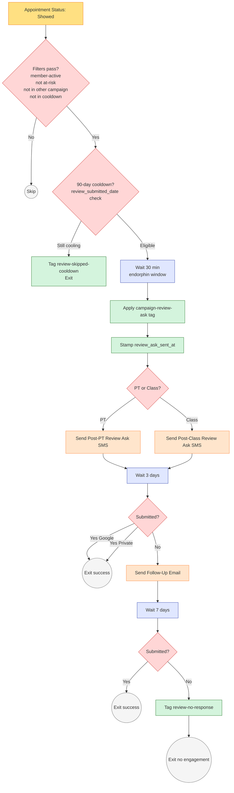
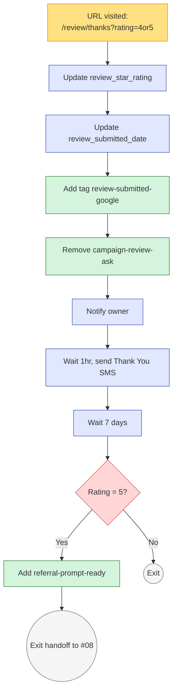
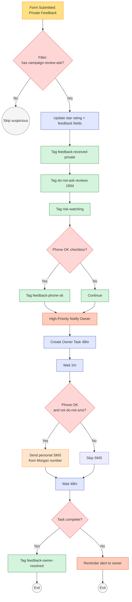

# #07 — Workflow Spec: Reviews & Reputation

> Three workflows make up the reputation engine: **Workflow A** triggers the review ask after a member shows up to class/PT; **Workflow B** handles high-score (Google-bound) submissions; **Workflow C** handles low-score (private feedback) submissions. Plus a small cooldown cleanup helper.

---

## Workflow A — Post-Class Review Ask

### Header

| Property | Value |
|---|---|
| **Workflow Name** | `07 — Post-Class Review Ask` |
| **Folder** | `07 - Reviews` |
| **Status** | Published / On |
| **Re-entry** | Tag-based — blocked within 90 days via `campaign-review-ask` tag |
| **Quiet hours respected** | Yes — SMS limited to 10 AM – 7 PM contact-local |

### Trigger

**Type:** Appointment Status Changed

**Filters (all must pass):**

- New status equals `Showed` (or `Completed` — match GHL terminology)
- Contact has tag `member-active`
- Contact does NOT have tag `risk-at-risk`
- Contact does NOT have tag `risk-critical`
- Contact does NOT have tag `do-not-ask-reviews`
- Contact does NOT have tag `campaign-review-ask` (90-day cooldown enforcement)
- Contact does NOT have any tag matching `campaign-upsell-*` (no collision with active upsell sequence)
- Contact does NOT have any tag matching `campaign-winback-*` (no collision with win-back)
- Contact does NOT have any tag matching `transition-to-*` (no collision with at-risk intervention)

**Why these filters:** Asking for reviews requires the member to be (a) currently engaged, (b) not in any other active automated conversation, (c) not at-risk (an at-risk member's review will almost certainly be negative or skipped).

### Actions

#### Action 1 — Verify 90-Day Cooldown via Field

| Property | Value |
|---|---|
| **Action type** | If/Else |
| **Condition** | `review_submitted_date` is null OR more than 90 days ago |
| **YES** | Continue |
| **NO** | Add tag `review-skipped-cooldown`. Exit. |

This is belt-and-suspenders — the trigger's tag filter should already block, but the field check protects against tag-data drift.

#### Action 2 — Wait 30 Minutes

| Property | Value |
|---|---|
| **Action type** | Wait |
| **Duration** | 30 minutes |

The endorphin window. Sending immediately after class feels mechanical; 30 minutes later, the member has cooled down, showered, maybe gotten in the car — that's the right moment to remember the workout fondly.

#### Action 3 — Apply Cooldown Tag

| Property | Value |
|---|---|
| **Action type** | Add Tag |
| **Tag** | `campaign-review-ask` |

This locks the 90-day cooldown. Even if the SMS fails to send or the member doesn't respond, they won't be re-asked for 90 days.

#### Action 4 — Stamp the Ask Time

| Property | Value |
|---|---|
| **Action type** | Update Contact Field |
| **Field** | `review_ask_sent_at` |
| **Value** | `{{now}}` |

#### Action 5 — Branch by Appointment Type

| Property | Value |
|---|---|
| **Action type** | If/Else |
| **Condition** | Appointment calendar = "PT" |
| **YES** | Use template `07 — Post-PT Review Ask` |
| **NO** | Use template `07 — Post-Class Review Ask` |

#### Action 6 — Send Review-Ask SMS

| Property | Value |
|---|---|
| **Action type** | Send SMS |
| **From** | `{{custom_values.business.sms_number}}` |
| **To** | `{{contact.phone}}` |
| **Template** | Matched in Action 5 from [sms.md](sms.md) |
| **Skip if** | Contact has tag `do-not-sms` OR `sms_opt_in` ≠ Yes |

#### Action 7 — Wait 3 Days, Check Response

| Property | Value |
|---|---|
| **Action 7a** | Wait — 3 days |
| **Action 7b** | If/Else: Has contact tag `review-submitted-google` OR `feedback-received-private`? |
| **YES** | Exit (success in some form) |
| **NO** | Continue to Action 8 |

#### Action 8 — Send Follow-Up Email

| Property | Value |
|---|---|
| **Action type** | Send Email |
| **From Name** | `{{custom_values.team.owner_first}} from {{custom_values.business.short_name}}` |
| **From Email** | `{{custom_values.business.email}}` |
| **Reply-To** | `{{custom_values.business.owner_email}}` |
| **Template** | `07 — Review Follow-Up Email` from [emails.md](emails.md) |
| **Skip if** | Contact has tag `do-not-email` OR `email_opt_in` ≠ Yes |

#### Action 9 — Wait 7 Days, Final Check

| Property | Value |
|---|---|
| **Action 9a** | Wait — 7 days |
| **Action 9b** | If/Else: submitted in any form? |
| **YES** | Exit |
| **NO** | Add tag `review-no-response`. Exit. |

#### Action 10 — Exit

The `campaign-review-ask` tag will auto-clear after 90 days via Workflow E, opening the next eligibility window.

---

## Workflow A Visual Diagram



---

## Workflow A — Edge Cases

| Scenario | Behavior |
|---|---|
| Member has multiple "Showed" appointments same day | First one triggers; second is blocked by `campaign-review-ask` tag applied in Action 3. |
| Member's appointment is corrected from "No-Show" to "Showed" days later | Trigger fires based on status change to "Showed" — even if late. Workflow runs as normal but the 30-min endorphin window has long passed. Acceptable; the SMS still goes out and works reasonably. To avoid: add a filter "Appointment ended within last 4 hours" if your GHL supports it. |
| Member transitions to `risk-at-risk` between Action 6 (SMS) and Action 8 (email) | The follow-up email still fires (no mid-sequence eject). Acceptable — the email is sent from Morgan and is conversational; harms little. Add a check at Action 8: "Skip if `risk-at-risk` or `risk-critical`." |
| Member's `assigned_trainer` is null for Post-PT SMS | Template should have fallback: "Hope today's session crushed it. How'd it feel?" Implement via {{contact.assigned_trainer | default: "today's session"}} merge field. |
| Member already submitted feedback before SMS lands (e.g., they walked in and complained at front desk, owner manually tagged) | Action 7b detects existing tag and exits. No follow-up email. |
| Member taps SMS link but doesn't complete the rating (closes Page 1) | No tag applied. Member is "in cooldown" via `campaign-review-ask` for 90 days but no record of their actual rating. Acceptable trade-off. |

---

## Workflow A — Monitoring Smart Lists

| List | Filter | Use |
|---|---|---|
| `07 — Review Asks Sent Last 7d` | `review_ask_sent_at` within 7 days | Daily review of outbound volume |
| `07 — Awaiting Response` | Tag `campaign-review-ask` AND no `review-submitted-google` AND no `feedback-received-private` AND `review_ask_sent_at` > 24hr ago | Members in the response window |
| `07 — Skipped Due to Cooldown` | Tag `review-skipped-cooldown` in last 7d | Detect over-asking patterns |

---

## Workflow B — High-Score Detection Handler

### Header

| Property | Value |
|---|---|
| **Workflow Name** | `07b — High-Score Submission Handler` |
| **Folder** | `07 - Reviews` |
| **Status** | Published / On |

### Trigger

**Type:** URL Visited

**URL pattern:** `/review/thanks` (the high-score Page 2 of the funnel)

**Filter:** URL contains `rating=4` OR `rating=5`

**Alternative trigger (if GHL doesn't support URL-visited triggers):** A hidden form on Page 2 that auto-submits on page load, with the rating and contact_id as fields.

### Actions

| # | Action | Detail |
|---|---|---|
| 1 | Update Field | `review_star_rating` = value from URL param `rating` (4 or 5) |
| 2 | Update Field | `review_submitted_date` = today |
| 3 | Add Tag | `review-submitted-google` |
| 4 | Remove Tag | `campaign-review-ask` (workflow done; this also opens immediate re-eligibility — but `review_submitted_date` check still enforces 90 days) |
| 5 | Notify Owner | Internal notification — email. Subject: `Review Win — {{contact.first_name}} just tapped {{rating}} stars`. Body: includes member name, rating, time, contact link. |
| 6 | (Optional) Send SMS | Template `07 — High-Score Thank You` from [sms.md](sms.md). 1 hour delay before send. Skip if `do-not-sms`. |
| 7 | Wait | 7 days |
| 8 | If/Else | Member rating was 5? |
| 8 YES | Add Tag `referral-prompt-ready` — feeds [#08 Referral Engine](../../08-referral-engine/) |
| 8 NO | Skip the referral tag (4-star members are good but not "send-them-to-a-referral-ask" good) |
| 9 | Exit |

---

## Workflow B Visual Diagram



---

## Workflow C — Low-Score Submission Handler

### Header

| Property | Value |
|---|---|
| **Workflow Name** | `07c — Low-Score Submission Handler` |
| **Folder** | `07 - Reviews` |
| **Status** | Published / On |

### Trigger

**Type:** Form Submitted

**Form:** `Review — Private Feedback (Low Score)` (defined in [forms.md](forms.md))

**Filter:** Contact has tag `campaign-review-ask` (sanity check — only handle submissions that came from a legitimate workflow ask)

### Actions

| # | Action | Detail |
|---|---|---|
| 1 | Update Field | `review_star_rating` = value from form hidden field (1, 2, or 3) |
| 2 | Update Field | `review_submitted_date` = today |
| 3 | Update Field | `feedback_submitted_date` = today |
| 4 | Update Field | `private_feedback_text` = form field 1 value |
| 5 | Update Field | `private_feedback_urgent` = form field 2 value (if provided) |
| 6 | Add Tag | `feedback-received-private` |
| 7 | Remove Tag | `campaign-review-ask` (workflow done) |
| 8 | Add Tag | `do-not-ask-reviews` (180-day cooldown — twice as long as the standard 90-day) |
| 9 | Add Tag | `risk-watching` (surfaces to retention monitoring per [#05](../../05-retention-and-churn-prevention/)) |
| 10 | If/Else | Form field 3 (phone OK checkbox) = checked? |
| 10 YES | Add tag `feedback-phone-ok`. Owner gets specific note in alert: "Member said OK to phone call." |
| 11 | Notify Owner | **HIGH PRIORITY** email. Subject: `URGENT: {{contact.first_name}} {{contact.last_name}} left a {{rating}}-star private feedback`. Body template below. |
| 12 | Create Task | Assigned to: Owner. Title: `Follow up with {{contact.first_name}} {{contact.last_name}} — private feedback`. Due: 48 hours from now. Description: includes full feedback text. |
| 13 | Wait | 1 hour (gives owner first-look window) |
| 14 | If/Else | `feedback_phone_ok` ≠ Yes AND no `do-not-sms`? |
| 14 YES | Send SMS from Morgan's personal number — template `07 — Private Feedback Owner SMS` from [sms.md](sms.md) |
| 14 NO | Skip auto-SMS (owner will call directly if `feedback_phone_ok` = Yes, or skip if `do-not-sms`) |
| 15 | Wait | 48 hours |
| 16 | If/Else | Owner has completed the task? |
| 16 YES | Add tag `feedback-owner-resolved`. Exit. |
| 16 NO | Send second alert to owner: "REMINDER: {{contact.first_name}}'s private feedback still needs follow-up. Task is overdue." |
| 17 | Exit |

### Owner Notification Body Template (Action 11)

```
URGENT — private low-score feedback just submitted.

Member: {{contact.first_name}} {{contact.last_name}}
Phone: {{contact.phone}}
Email: {{contact.email}}
Rating: {{contact.review_star_rating}} stars
Member since: {{contact.membership_start_date}}
Tier: {{contact.membership_tier}}
Last visit: {{contact.last_visit_date}}

WHAT THEY SAID:
{{contact.private_feedback_text}}

ANYTHING URGENT TO FIX:
{{contact.private_feedback_urgent}}

PHONE CALL OK? {{contact.feedback_phone_ok}}
PREFERRED CONTACT: {{contact.preferred_channel}}

ACTION: Please follow up within 48 hours.

Open contact: {{contact_url}}
```

---

## Workflow C Visual Diagram



---

## Workflow C — Edge Cases

| Scenario | Behavior |
|---|---|
| Member submits form without the `campaign-review-ask` tag (manually visits funnel) | Trigger filter blocks. Owner does NOT get an alert. Acceptable — these submissions are rare and likely spam. Add manual review path if it becomes common. |
| Owner ignores the task for 48hr | Reminder alert fires. Task remains open. Owner should still follow up — the contact is still tagged `feedback-received-private` indefinitely as a "needs attention" flag. |
| Member submits private feedback then writes a public Google review anyway | Both tags applied (`feedback-received-private` and `review-submitted-google`). Owner gets both alerts. Owner addresses the underlying issue regardless. |
| `vip-do-not-disturb` member submits low-score feedback | Auto-SMS in Action 14 should be skipped — owner handles 100% via personal call or email. Add filter check at Action 14. |
| `feedback_phone_ok` = Yes but `do-not-sms` is also set | Owner is notified to *call directly* (preferred channel beats SMS). No SMS attempted. |
| Member submits with rating=4 or 5 (URL tampering) | Form validation should reject. If it gets through, Workflow C treats it as low-score regardless — the form was filled, the member had a complaint, treat it seriously. |

---

## Workflow D — Cooldown Cleanup (helper)

### Header

| Property | Value |
|---|---|
| **Workflow Name** | `07d — Review Ask Cooldown Cleanup` |
| **Folder** | `07 - Reviews` |
| **Status** | Published / On |

### Trigger

**Type:** Tag Added → `campaign-review-ask`

### Actions

| # | Action | Detail |
|---|---|---|
| 1 | Wait | 90 days |
| 2 | Remove Tag | `campaign-review-ask` |
| 3 | Remove Tag | `review-skipped-cooldown` (if present) |
| 4 | Exit |

### Sister Workflow — 180-day Cleanup for `do-not-ask-reviews`

| Property | Value |
|---|---|
| **Workflow Name** | `07e — Do-Not-Ask Cleanup (180d)` |
| **Trigger** | Tag Added → `do-not-ask-reviews` |
| **Action** | Wait 180 days → Remove tag → Exit |

This 180-day cooldown protects members who left low-score feedback from being asked again until the underlying issue has had time to be resolved and forgotten.

---

## What Lives Outside These Workflows

The reputation engine intentionally only owns the ask + routing + follow-up. Adjacent systems own:

- **Appointment status updates** → [#03 Appointment No-Show Recovery](../../03-appointment-no-show-recovery/) sets status when members check in/no-show
- **Risk filtering inputs** → [#05 Retention](../../05-retention-and-churn-prevention/) maintains `risk-*` tags nightly
- **Upsell/win-back collision avoidance** → [#06 Upsell](../../06-upsell-and-cross-sell/), [#09 Win-Back](../../09-win-back-lapsed-members/) maintain their own `campaign-*` tags
- **Referral follow-up after 5-star** → [#08 Referral Engine](../../08-referral-engine/) consumes `referral-prompt-ready` tag
- **Reputation KPIs visualization** → [#10 Owner Reporting](../../10-owner-reporting-and-visibility/) consumes review counts and rating data
- **Owner manual follow-up on private complaints** → Lives in owner's actual workflow; the system surfaces the urgency but the resolution is human
