# #08 — Referral Engine

> **The Problem:** Your happiest members already tell their friends about Sunrise. They just *mention* it — they don't *send* anything. Without a tracked link, a real reward, and a credit flow that fires on signup, those friends become leads someone else captures (or never become leads at all).

---

## Who This Hurts

**P5 — The Steady-State Active Member.** Sarah's been with Sunrise nine months. She's at 12 classes a month, lost 14 pounds, and has told three friends "you should come try it." None of them did. Two booked at the competitor down the street. One is still "going to come check it out, soon."

Sarah didn't do anything wrong. **She had no link to send.** She had no reward to offer. She had no way to even mention to her friend, "hey, when you sign up, my name gets you $20 off." Word of mouth happened — it just didn't convert.

And **P1 — The Cold Lead** is on the other end. A referred lead converts at **3–5× the rate** of a cold ad-driven lead, with effectively zero acquisition cost. Every conversation Sarah has with a friend that *doesn't* end with a tap-to-claim link is one of the cheapest, highest-quality leads in the funnel — left on the table.

---

## Cost of Inaction

Conservative math for a studio of **200 active members**:

| Assumption | Value |
|---|---|
| Active members | 200 |
| Annual referrals per member (untracked, conversational only) | 0.4 |
| Total conversational mentions / year | 80 |
| Conversion rate without tracked link + reward | ~5% |
| Conversion rate with tracked link + reward | ~25% |
| Net incremental new members per year | **16** |
| LTV per new member ($79 × 14 mo) | $1,106 |
| **Lost LTV per year from no referral engine** | **~$17,700** |

A studio of 350 members loses **$30K+/year**. And referrer-side: when a member sees a real reward show up (a free PT credit they didn't have to ask for), their *next* referral becomes more confident. The flywheel compounds.

---

## What We Built

A two-sided referral system: a personalized landing page for the referred friend, a unique code for every active member, and two workflows that close the loop automatically — no spreadsheets, no Venmo, no "did you actually send the link to her?"

```mermaid
graph LR
    M[Active Member<br/>Sarah gets member-active tag] --> W1[Workflow 1: Generate Code<br/>Creates SARAH-42<br/>Builds shareable link]
    W1 --> Share[Sarah shares link<br/>via SMS, IG DM, in-person]
    Share --> Land[Referral Landing Funnel<br/>'Sarah sent you $20 off']
    Land --> Form[Referral Form<br/>hidden: referred_by + code]
    Form --> Lead[New Contact<br/>source-referral tag]
    Lead --> Trial[Goes through #02 trial flow]
    Trial --> Convert{Trial converted?}
    Convert -->|Yes| W2[Workflow 2: Credit Reward<br/>PT credit to Sarah<br/>notification to both]
    Convert -->|No| Cold[Standard lead nurture<br/>no penalty to Sarah]
    W2 --> Recog[Quarterly Top-Referrer<br/>Recognition workflow]

    classDef member fill:#FFE5CC,stroke:#FF8C42
    classDef system fill:#E0E7FF,stroke:#3F51B5
    classDef action fill:#D4F4DD,stroke:#2E7D32
    classDef cond fill:#FFD6D6,stroke:#D9534F

    class M,Share member
    class W1,W2,Land,Form,Recog system
    class Lead,Trial,Cold action
    class Convert cond
```

**Four components:**

1. **Referral Landing Funnel** — a personalized page that reads the referrer's first name from the URL and headlines: "*Sarah sent you $20 off your first month at Sunrise.*" The page wraps the standard Sunrise pitch around that personal hook. The embedded form has hidden fields capturing `referred_by_contact_id` and `referral_code_used`, so attribution is bulletproof.
2. **Workflow 1 — Referral Code Generation.** Fires the moment a contact gets `member-active`. Generates a unique code (`FIRSTNAME-XX` where XX is the contact ID's last 2 digits), stores it in `referral_code`, builds the personalized share URL, and stamps it on the member's record. The owner can now message any active member their link in one click.
3. **Workflow 2 — Referral Conversion.** Triggered when a contact with `referred_by_contact_id` populated also gets `trial-converted`. Credits the referrer with a free PT session (increments `pt_credit_balance`), sends both parties a celebratory notification, and updates `referrals_made_count` and `referrals_converted_count` on the referrer.
4. **Quarterly Top-Referrer Recognition.** A scheduled workflow that finds the top 3 referrers by `referrals_converted_count` in the trailing 90 days, tags them `campaign-referral-promoter`, sends a recognition email and a bonus PT session.

---

## Outcome & KPIs

Move these numbers within 90 days of launch:

| KPI | Baseline | Target | How we measure |
|---|---|---|---|
| Active members who have shared their link at least once | 0% | **30%+** | Count of distinct `referral_code` values appearing in `lead_source_detail` of new leads |
| New members per month from referral channel | 0–1 | **3–6** | Smart list: `source-referral` AND `trial-converted` in last 30d |
| Referral lead → paid conversion rate | n/a | **40%+** (vs ~30% ad average) | Conversions ÷ leads with `source-referral` tag |
| % of referrers receiving credit within 24h of friend's conversion | n/a (manual) | **100%, automated** | Audit of `pt_credit_balance` increments vs `trial-converted` events |
| Quarterly top-referrer recognition fired | Never | **End of every quarter** | Workflow execution log |

The owner sees these in the **Referral Engine** widget cluster on the dashboard built in [#10 Owner Reporting](../10-owner-reporting-and-visibility/).

---

## What Changes for the Studio Owner

Before:

- Sarah says "I told Priya about you guys, she said she'd come in." Owner says "great, hope she does!" Priya never comes in.
- No idea which members refer. No idea which referrals convert. No way to thank the right people.
- The owner reads a marketing blog post about referrals, tries a "tell a friend, get $20" Instagram post for two weeks, then abandons it when no one redeems.

After:

- Sarah opens her phone, taps a one-line text Morgan sent her with her personal link, forwards it to Priya. Priya taps the link, sees "Sarah sent you $20 off," signs up.
- The moment Priya converts to paid, Sarah's phone buzzes: "Priya just joined! Your free PT session is on the house — book anytime." No paperwork. No reminders. Just the magic.
- At quarter-end, Morgan personally hands Sarah a Sunrise sweatshirt and a hand-written card, because the system flagged her as top referrer. Sarah posts it on Instagram. The flywheel spins faster.

---

## Build It

Full step-by-step build in **[build.md](build.md)** — funnel pages, form fields, both workflows, the new `pt_credit_balance` field, exact GHL clicks.

Production copy for every asset:

- **[assets/funnel.md](assets/funnel.md)** — referral landing funnel page-by-page with dynamic referrer-name personalization
- **[assets/forms.md](assets/forms.md)** — referral capture form (with hidden referrer fields)
- **[assets/emails.md](assets/emails.md)** — referrer-notification, referee welcome, quarterly top-referrer recognition
- **[assets/sms.md](assets/sms.md)** — member referral-invite SMS, referrer-notification SMS, referee welcome SMS
- **[assets/workflow.md](assets/workflow.md)** — both workflows (Code Generation + Referral Conversion) plus the quarterly recognition

---

## How This Connects to Other Systems

This system **consumes** signals from [#02 Trial-to-Paid Conversion](../02-trial-to-paid-conversion/) — the `trial-converted` tag is what fires the credit workflow.

It **shares the lead-capture form architecture** with [#01 Lead Capture & Instant Response](../01-lead-capture-and-instant-response/) — the referral form is a clone of the lead form with two extra hidden fields. The new lead still flows through the #01 Instant Response Workflow (just with `source-referral` tag pre-set).

It **feeds** [#10 Owner Reporting](../10-owner-reporting-and-visibility/) — the dashboard has a Top Referrers smart list and a "Referrals This Month" widget.

It **complements** [#06 Upsell & Cross-Sell](../06-upsell-and-cross-sell/) — both systems use behavioral triggers on active members; together they convert "you have happy members" into "you have happy members who grow the business."

Full integration map: [../../integration/master-automation-graph.md](../../integration/master-automation-graph.md)
