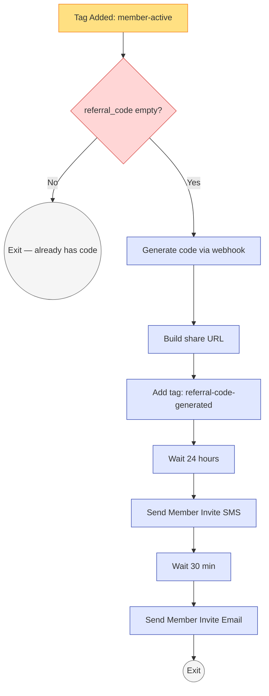
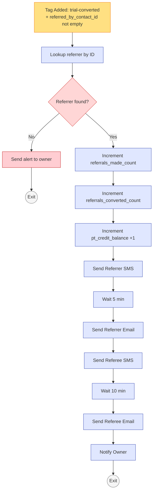
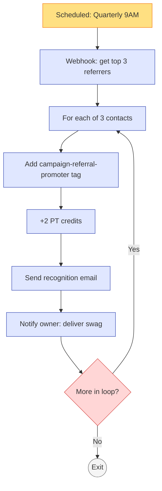

# #08 — Workflow Specs: Referral Engine

> Three workflows make up the referral engine. Each is documented separately. The GHL workflow builder should match these specs 1:1.

---

## Workflow A — Referral Code Generation

### Workflow Header

| Property | Value |
|---|---|
| **Workflow Name** | `08a — Referral Code Generation` |
| **Folder** | `08 - Referral Engine` |
| **Status** | Published / On |
| **Re-entry** | Disabled (one contact = one workflow run) |
| **Quiet hours respected** | Yes (the 24hr-later SMS lands in late-morning local time) |

---

### Trigger

**Type:** Contact Tag Added

**Filters:**
- Tag added is `member-active`
- Custom field `referral_code` is empty
- Contact has email AND phone populated (no incomplete contacts)

**Why these filters:** Empty-code filter prevents re-generation on reactivated members (`member-reactivated`) who already have a working code from their first membership stint.

---

### Actions (in order)

#### Action 1 — Generate Referral Code

| Property | Value |
|---|---|
| **Action type** | Webhook (recommended) — OR — Update Contact Field with template arithmetic (fallback) |
| **Webhook URL** | `https://hooks.sunrisewellness.com/generate-referral-code` (internal endpoint) |
| **Method** | POST |
| **Body** | `{"first_name": "{{contact.first_name}}", "contact_id": "{{contact.id}}"}` |
| **Expected response** | `{"referral_code": "SARAH-42"}` |
| **Mapped to** | Custom field `referral_code` |

**Fallback (simpler GHL-only):**
- **Action:** Update Contact Field
- **Field:** `referral_code`
- **Value:** `{{contact.first_name | upper}}-{{contact.id | last_2}}`

---

#### Action 2 — Build Share URL

| Property | Value |
|---|---|
| **Action type** | Update Contact Field |
| **Field** | `referral_share_url` (new field — Single Line, in Engagement folder) |
| **Value** | `{{custom_values.business.website}}/refer/?ref_name={{contact.first_name | upper}}&ref_id={{contact.id}}&ref_code={{contact.referral_code}}&lead_source=Referral` |

---

#### Action 3 — Add `referral-code-generated` Tag (audit marker)

| Property | Value |
|---|---|
| **Action type** | Add Tag |
| **Tag** | `referral-code-generated` (a new tag — add to taxonomy if not present) |

This tag is purely an audit marker — lets you build a smart list of members who have working codes vs not.

---

#### Action 4 — Wait 24 Hours

| Property | Value |
|---|---|
| **Action type** | Wait |
| **Duration** | 24 hours |
| **Respect contact-local time** | Yes — release between 10 AM and 12 PM contact-local |

---

#### Action 5 — Send Member Referral Invite SMS

| Property | Value |
|---|---|
| **Action type** | Send SMS |
| **From** | `{{custom_values.business.sms_number}}` |
| **To** | `{{contact.phone}}` |
| **Template** | `08 — Member Referral Invite` (from [sms.md](sms.md), message A) |
| **Skip if** | Contact has tag `do-not-sms` OR `sms_opt_in` ≠ "Yes" |

---

#### Action 6 — Wait 30 Minutes

| Property | Value |
|---|---|
| **Action type** | Wait |
| **Duration** | 30 minutes |

---

#### Action 7 — Send Member Referral Invite Email

| Property | Value |
|---|---|
| **Action type** | Send Email |
| **From Name** | `{{custom_values.team.owner_first}} from {{custom_values.business.short_name}}` |
| **From Email** | `{{custom_values.business.email}}` |
| **Reply-To** | `{{custom_values.business.owner_email}}` |
| **Subject** | `{{contact.first_name}}, here's your Sunrise referral link (free PT for you, $20 off for them)` |
| **Template** | `08 — Member Referral Invite` (from [emails.md](emails.md), Email 2) |
| **Skip if** | Contact has tag `do-not-email` OR `email_opt_in` ≠ "Yes" |

---

#### Action 8 — Exit

| Property | Value |
|---|---|
| **Action type** | Exit Workflow |

---

### Visual Workflow Diagram



---

### Edge Cases & Handling

| Scenario | Workflow behavior |
|---|---|
| Member has `do-not-sms` | Action 5 skips. Email still sends. |
| Member has `do-not-email` | Action 7 skips. SMS still sends. |
| Member has both | Workflow runs silently. Code is generated and stored, just not shared. Front desk can hand them the link in person. |
| Webhook for code generation fails | Workflow halts at Action 1. GHL retries once. On second failure: send internal alert "code generation failed for {{contact.first_name}}." Owner manually generates code in contact detail. |
| Member's first name contains special characters (e.g., `José`) | Webhook should sanitize to ASCII (`JOSE-XX`). Fallback approach: store code as-is and let URL encoding handle it. |
| Two members share a first name AND identical last-2-char contact ID | (Extremely rare.) Webhook detects collision and appends a third character. Fallback approach silently produces a duplicate — acceptable up to ~500 members; revisit at scale. |

---

### Monitoring Smart Lists

**"Active Members Without Referral Codes"**:
- Has tag `member-active`
- Custom field `referral_code` is empty
- Joined more than 24h ago

Should always be empty (or near it). If it has > 5 contacts: investigate workflow execution.

**"Members Who Have Shared Their Link"**:
- Custom field `referral_code` is not empty
- Has at least one record in `lead_source_detail` of any other contact matching their `referral_code`

This is the "engagement" metric — % of members who actually share.

---

---

## Workflow B — Referral Conversion Credit

### Workflow Header

| Property | Value |
|---|---|
| **Workflow Name** | `08b — Referral Conversion Credit` |
| **Folder** | `08 - Referral Engine` |
| **Status** | Published / On |
| **Re-entry** | Disabled |
| **Quiet hours respected** | No (transactional celebration — fires immediately on action) |

---

### Trigger

**Type:** Contact Tag Added

**Filters:**
- Tag added is `trial-converted`
- Custom field `referred_by_contact_id` is NOT empty

---

### Actions (in order)

#### Action 1 — Lookup Referrer

| Property | Value |
|---|---|
| **Action type** | Find Contact by ID |
| **Lookup value** | `{{contact.referred_by_contact_id}}` |
| **Store as variable** | `referrer` |
| **On not-found** | Send internal alert "Referral conversion fired but referrer not found: id={{contact.referred_by_contact_id}}" and exit workflow |

---

#### Action 2 — Increment `referrals_made_count` on Referrer

| Property | Value |
|---|---|
| **Action type** | Update Contact Field (on `referrer`) |
| **Field** | `referrals_made_count` |
| **Value** | `{{referrer.referrals_made_count + 1}}` |

If GHL templating doesn't support arithmetic: Webhook to GHL API endpoint `POST /contacts/{id}/custom-fields/referrals_made_count/increment` with body `{"amount": 1}`.

---

#### Action 3 — Increment `referrals_converted_count` on Referrer

| Property | Value |
|---|---|
| **Action type** | Update Contact Field (on `referrer`) |
| **Field** | `referrals_converted_count` |
| **Value** | `{{referrer.referrals_converted_count + 1}}` |

---

#### Action 4 — Increment `pt_credit_balance` on Referrer (the reward)

| Property | Value |
|---|---|
| **Action type** | Update Contact Field (on `referrer`) |
| **Field** | `pt_credit_balance` |
| **Value** | `{{referrer.pt_credit_balance + 1}}` |

---

#### Action 5 — Send Referrer SMS Notification

| Property | Value |
|---|---|
| **Action type** | Send SMS (to `referrer`) |
| **Template** | `08 — Referrer Conversion Notification` (from [sms.md](sms.md), message B) |
| **Skip if** | Referrer has `do-not-sms` |

---

#### Action 6 — Wait 5 Minutes (let SMS land)

| Property | Value |
|---|---|
| **Action type** | Wait |
| **Duration** | 5 minutes |

---

#### Action 7 — Send Referrer Email Notification

| Property | Value |
|---|---|
| **Action type** | Send Email (to `referrer`) |
| **Subject** | `{{referrer.first_name}}, {{contact.first_name}} just joined Sunrise — your free PT session is on us ☀️` |
| **Template** | `08 — Referrer Notification — Conversion` (from [emails.md](emails.md), Email 1) |
| **Skip if** | Referrer has `do-not-email` |

---

#### Action 8 — Send Referee SMS Welcome

| Property | Value |
|---|---|
| **Action type** | Send SMS (to triggering contact / referee) |
| **Template** | `08 — Referee Welcome (post-conversion)` (from [sms.md](sms.md), message C) |
| **Skip if** | Contact has `do-not-sms` |

---

#### Action 9 — Wait 10 Minutes

| Property | Value |
|---|---|
| **Action type** | Wait |
| **Duration** | 10 minutes |

---

#### Action 10 — Send Referee Email Welcome

| Property | Value |
|---|---|
| **Action type** | Send Email (to triggering contact) |
| **Subject** | `{{contact.first_name}}, welcome — and thanks for trusting {{referrer.first_name}}'s recommendation ☀️` |
| **Template** | `08 — Referee Welcome (post-conversion)` (from [emails.md](emails.md), Email 3) |
| **Skip if** | Contact has `do-not-email` |

---

#### Action 11 — Owner Internal Notification

| Property | Value |
|---|---|
| **Action type** | Send Internal Notification |
| **Channel** | Email |
| **To** | `{{custom_values.business.owner_email}}` |
| **Subject** | `Referral converted: {{referrer.first_name}} → {{contact.first_name}}` |
| **Body** | See template below |

**Body template:**

```
A referral just converted to paid.

Referrer: {{referrer.first_name}} {{referrer.last_name}} ({{referrer.email}})
  - Lifetime referrals converted: {{referrer.referrals_converted_count}}
  - PT credit balance now: {{referrer.pt_credit_balance}}

New member: {{contact.first_name}} {{contact.last_name}} ({{contact.email}})
  - Tier: {{contact.membership_tier}}
  - Monthly rate: ${{contact.monthly_rate}}

Reward issued. Notification messages sent to both parties.

Open referrer: {{referrer_url}}
Open new member: {{contact_url}}
```

---

#### Action 12 — Exit

| Property | Value |
|---|---|
| **Action type** | Exit Workflow |

---

### Visual Workflow Diagram



---

### Edge Cases & Handling

| Scenario | Workflow behavior |
|---|---|
| Referrer not found by ID | Alert owner, exit. Owner investigates (possibly a deleted contact or fake referral). |
| Referrer has `member-cancelled` or `member-lapsed` | Reward still issues. Credit lands on a paused account. Front desk handles redemption manually if/when member reactivates. (Decision: don't punish good behavior just because referrer's status changed.) |
| Same referee converts twice (unusual — re-conversion after lapse) | Trigger filter blocks (tag `trial-converted` doesn't re-fire on re-conversion under normal GHL behavior). If it does fire: workflow runs again, referrer gets a second credit. Acceptable — it's a re-conversion they helped cause. |
| Referrer is the same person as referee (self-referral attempt) | Edge case where a contact's own ID is in their own `referred_by_contact_id`. Add a workflow filter: skip if `{{referrer.id}} == {{contact.id}}`. |
| `trial-converted` tag added without `referred_by_contact_id` populated | Trigger filter blocks. Workflow doesn't run. (Non-referred conversions are out of scope here.) |

---

### Monitoring Smart Lists

**"Referrals Awaiting Conversion"**:
- Has tag `source-referral`
- Has tag `trial-active`
- Does NOT have tag `trial-converted`
- Captured > 7 days ago

Owner watches this list — these are friends of members in the trial flow. Personal outreach from owner ("hey, your friend {{referrer.first_name}} loves the studio — want me to set up your day-7 conversion call?") boosts conversion meaningfully.

**"Referral Conversions This Month"**:
- Has tag `source-referral` AND `trial-converted`
- Tag `trial-converted` added in current calendar month

The dashboard headline number.

---

---

## Workflow C — Quarterly Top Referrer Recognition

### Workflow Header

| Property | Value |
|---|---|
| **Workflow Name** | `08c — Quarterly Top Referrer Recognition` |
| **Folder** | `08 - Referral Engine` |
| **Status** | Published / On |
| **Re-entry** | Allowed (runs quarterly, repeat enrollment expected) |
| **Quiet hours respected** | Yes (sends in business hours) |

---

### Trigger

**Type:** Scheduled — Recurring

**Schedule:** Quarterly — Jan 1, Apr 1, Jul 1, Oct 1 at 9 AM owner-local time (`America/Chicago`).

**Pre-trigger query:** Smart-list lookup OR webhook to identify top 3 referrers by `referrals_converted_count` in trailing 90 days.

---

### Actions (in order)

#### Action 1 — Identify Top 3 Referrers

| Property | Value |
|---|---|
| **Action type** | Webhook (recommended) — OR — Manual smart-list curation (fallback) |
| **Webhook URL** | `https://hooks.sunrisewellness.com/top-referrers-trailing-90d` |
| **Method** | GET |
| **Expected response** | `[{"contact_id": "abc", "first_name": "Sarah", "referrals_converted_count": 5}, …]` (array of 3) |

**Manual fallback:** Owner manually reviews "Top Referrers — Trailing 90d" smart list (built in #10) and bulk-enrolls the top 3 into this workflow on the trigger date.

---

#### Action 2 — Loop: For Each Top Referrer

For each of the 3 contacts returned:

##### Action 2a — Add `campaign-referral-promoter` Tag

| Property | Value |
|---|---|
| **Action type** | Add Tag (to looped contact) |
| **Tag** | `campaign-referral-promoter` |

##### Action 2b — Bonus PT Credit (+2)

| Property | Value |
|---|---|
| **Action type** | Update Contact Field |
| **Field** | `pt_credit_balance` |
| **Value** | `{{contact.pt_credit_balance + 2}}` |

##### Action 2c — Send Recognition Email

| Property | Value |
|---|---|
| **Action type** | Send Email |
| **Subject** | `{{contact.first_name}} — you're one of Sunrise's top referrers this quarter ☀️` |
| **Template** | `08 — Quarterly Top Referrer Recognition` (from [emails.md](emails.md), Email 4) |
| **Skip if** | Contact has `do-not-email` |

##### Action 2d — Owner Internal Notification

| Property | Value |
|---|---|
| **Action type** | Send Internal Notification |
| **To** | `{{custom_values.business.owner_email}}` |
| **Subject** | `Top Referrer Action: hand-deliver swag to {{contact.first_name}} {{contact.last_name}}` |
| **Body** | "{{contact.first_name}} {{contact.last_name}} is a top quarterly referrer ({{contact.referrals_converted_count}} conversions trailing 90d). Bring a Sunrise sweatshirt + handwritten card next time they're in the studio. Last visit: {{contact.last_visit_date}}." |

---

#### Action 3 — Exit Loop

After all 3 are processed, exit workflow.

---

### Visual Workflow Diagram



---

### Edge Cases & Handling

| Scenario | Workflow behavior |
|---|---|
| Fewer than 3 referrers in trailing 90d | Loop processes whatever count exists (1, 2, or 0). Owner notification at end summarizes: "Only {{N}} referrers this quarter — consider promoting referral program." |
| Same person wins consecutive quarters | They get recognized again. (Owner may decide to gift different swag the second time — leave to discretion.) |
| Top referrer has `do-not-email` | Tag still applied, credits still added, owner still notified to deliver swag in person — the email is the only skipped step. |
| Top referrer has cancelled membership | Don't recognize — add filter: skip if contact has `member-cancelled` OR `member-lapsed`. |

---

### Monitoring Smart Lists

**"Top Referrers (Quarterly)"** (built in [#10](../../10-owner-reporting-and-visibility/)):
- Has tag `campaign-referral-promoter`
- Tag applied in current quarter

The owner uses this list for the in-person swag delivery and any quarter-specific shoutouts (Instagram, member newsletter).

---

## What Lives Outside These Workflows

The referral engine owns the *attribution + reward* loop. It does not own:

- **Trial nurture of referred leads** — handled by [#02 Trial-to-Paid Conversion](../../02-trial-to-paid-conversion/) (referred leads use the same trial flow as cold leads).
- **Onboarding of converted referees** — handled by [#04 New Member Onboarding](../../04-new-member-onboarding/).
- **Front-desk redemption of PT credits** — manual: front desk checks `pt_credit_balance` field on contact, decrements by 1, books the PT session.
- **Reporting on referral economics** — built in [#10 Owner Reporting](../../10-owner-reporting-and-visibility/) (CAC, referral conversion rate, top-referrer leaderboard).
