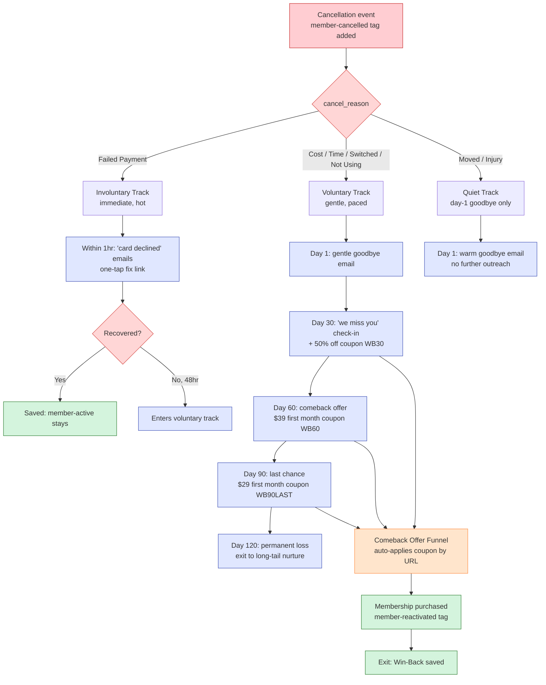

# #09 — Win-Back Lapsed Members

> **The Problem:** A cancelled member is a warm lead. They've already proven they'll pay you, walk through your door, and learn your check-in flow. Most studios treat them like strangers — filing the cancellation and forgetting the name. They convert at **roughly 2× the rate** of cold ad leads, at zero acquisition cost. You're leaving easy revenue on the table every month.

---

## Who This Hurts

**P6 — The Lapsed Member.** Diane was a Basic member for 11 months. Came to yoga twice a week, did one PT consult, made friends with two regulars. Then her schedule shifted, she missed three weeks, felt awkward about coming back, and cancelled "just for now."

She didn't quit Sunrise because she stopped loving it. She quit because she got *behind* and didn't have a graceful way back. Six weeks later she's walking past the studio every morning on her way to work — and she doesn't get a single text. The studio acts like she never existed. So she signs up at a competitor in March because they ran a $29 first-month special.

**P7 — The Studio Owner** loses too. Every cancellation that doesn't reactivate is a $1,100+ LTV loss that almost certainly could have been a save with one well-timed, gentle message. Multiplied across 8–15 cancellations a month, that's $13K–$25K/year in preventable loss.

And then there's the *involuntary* cancellation — the **failed payment**. The member didn't quit; their card just expired. If no one reaches out in the first hour, by week's end they've been re-billed twice with declines, marked as cancelled, and silently lost. That's the dumbest churn in the entire business — and it's also the easiest to fix.

---

## Cost of Inaction

Conservative math for a studio with **240 active members** and **12 cancellations/month** (a healthy 5% monthly churn):

| Source of cancellation | Monthly count | Save rate (with system) | Saves / month | LTV per save | Monthly recovered LTV |
|---|---|---|---|---|---|
| Voluntary (lifestyle, cost) | 8 | 20% | 1.6 | $1,100 | $1,760 |
| Involuntary (failed payment) | 4 | 70% (within 24h intervention) | 2.8 | $1,100 | $3,080 |
| **Total preventable** | **12** | — | **4.4** | — | **~$4,840/mo** |

Without this system: $4,840/mo walks out the door **and is never recovered**. Over 12 months: **$58,000+ in lost LTV** for a single 240-member studio.

The failed-payment intervention alone — sending a "your payment didn't go through, here's a one-tap fix" Email within 60 minutes — typically recovers 60–80% of involuntary cancels. It's the highest-leverage automation in this entire build.

---

## What We Built

A two-track win-back system: a 90-day gentle voluntary-cancel sequence, and an immediate-intervention sequence for failed payments. Plus a checkout funnel that auto-applies the right discount based on which sequence stage triggered the visit.

**Four components:**

1. **Win-Back Sequence Workflow (voluntary)** — runs across 90 days, walks the Retention pipeline through Win-Back D30 → D60 → D90, sends progressively warmer offers (50% off → $39 → $29). Branches on `cancel_reason` so we don't pitch reactivation to "I moved away."
2. **Failed-Payment Intervention (involuntary)** — fires within 1 hour of a payment failure, sends a "quick fix" emails with a one-tap update-card link. Aggressive but warm. If 48 hours pass without recovery, transitions to the voluntary track at D30.
3. **Comeback Offer Funnel** — a checkout page that reads `?wb=30|60|90` from the URL and auto-applies the matching coupon (`WB30`, `WB60`, `WB90LAST`). No code entry, no friction — they click, see "first month $39, already applied," and convert in 30 seconds.
4. **Reactivation Detection** — when a lapsed member completes the checkout, `member-reactivated` tag fires; the Retention pipeline moves to "Reactivated" stage; the workflow exits cleanly; the member enters the standard #04 onboarding flow (treated as a fresh start, not a "welcome back").

---

## Outcome & KPIs

Move these numbers within 120 days of launch:

| KPI | Baseline | Target | How we measure |
|---|---|---|---|
| Failed-payment recovery rate (within 24h) | 5–10% (manual, slow) | **70%+** | `member-active` retained ÷ failed-payment events in 24h window |
| Voluntary cancel → reactivation rate (90d) | 0–3% | **15–25%** | `member-reactivated` ÷ `member-cancelled` (90d cohort) |
| Avg time from failed payment to recovery contact | 24–72 hours | **< 60 minutes** | Time from `cancel_reason = Failed Payment` to first outbound message |
| Saved LTV per quarter | $0 | **$10K+** | Sum of `monthly_rate × 6` for all `member-reactivated` events in quarter |
| % of cancellations correctly routed (voluntary vs involuntary vs quiet) | n/a | **100%** | Audit: workflow path matches `cancel_reason` for sampled cancels |

The owner sees these in the **Win-Back Performance** widget cluster on the dashboard built in [#10 Owner Reporting](../10-owner-reporting-and-visibility/).

---

## What Changes for the Studio Owner

Before:

- Diane cancels via the cancellation form. Front desk processes the request. Nothing happens. Six weeks later Morgan thinks "I should email Diane" — never does.
- Marcus's Visa expires on the 15th. Stripe declines the charge on the 17th. Stripe retries on the 19th, declines again. By the 24th, Marcus is auto-cancelled. He didn't even know. Morgan finds out from the monthly report a week later.
- The studio's "win-back" strategy is a January email blast to "all members who cancelled in the last year" — 1.2% open rate, 0.1% conversion.

After:

- Diane cancels. Day 1: gentle goodbye email from Morgan ("you mattered here — door's always open"). Day 30: warm check-in + 50% off her first month back. She doesn't click. Day 60: stronger offer, $39 first month. She clicks, checks out in 30 seconds, gets the same "you're back!" reception Morgan gives every reactivation. Net win.
- Marcus's card declines. Within 45 minutes he gets a Email: "Hey Marcus, your card on file just declined — one tap to update: [link]. No urgency, you've got 5 days." He fixes it from his phone in the Uber. Membership uninterrupted.
- Morgan opens her Monday digest. "**3 reactivations this week. $3,300 recovered LTV.**" The win-back system is now a line item, not a hope.

---

## Build It

Full step-by-step build in **[build.md](build.md)** — pipeline-stage transitions, the cancel-reason branching, both workflows, the checkout funnel, the coupon wiring.

Production copy for every asset:

- **[assets/funnel.md](assets/funnel.md)** — Comeback Offer Funnel with auto-coupon-by-URL logic
- **[assets/emails.md](assets/emails.md)** — 5 emails (Day-1 goodbye, Day-30 check-in, Day-60 offer, Day-90 last call, Failed-payment intervention)
- **[assets](assets)** — 4 Email (Day-30 light, Day-60 reminder, Day-90 urgency, Failed-payment immediate)
- **[assets/workflow.md](assets/workflow.md)** — both workflows: Win-Back Sequence (voluntary, 90d) + Failed-Payment Intervention (involuntary, 48hr)

---

## How This Connects to Other Systems

This system **consumes** signals from [#05 Retention & Churn Prevention](../05-retention-and-churn-prevention/) — when at-risk interventions fail and a member cancels, #09 picks up. The cancellation event itself is logged by #05; #09 owns what happens *after*.

It **integrates with** GHL Payments (Stripe) for the failed-payment trigger — Stripe webhook fires `invoice.payment_failed`, GHL receives, applies `cancel_reason = Failed Payment`, #09 workflow triggers.

It **hands off to** [#04 New Member Onboarding](../04-new-member-onboarding/) when a member reactivates — they re-enter the onboarding flow as a fresh start (with the `member-reactivated` badge tag preserved).

It **feeds** [#10 Owner Reporting](../10-owner-reporting-and-visibility/) — the Retention pipeline's "Reactivated" and "Permanent Loss" stages are displayed in the dashboard's Win-Back widget.

Full integration map: [../../integration/master-automation-graph.md](../../integration/master-automation-graph.md)
