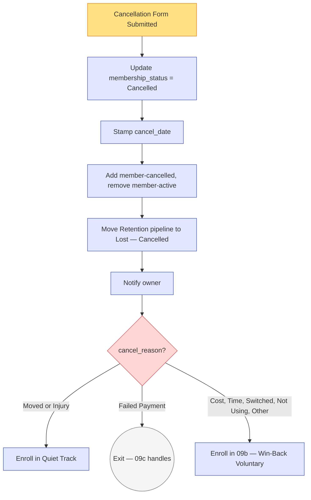
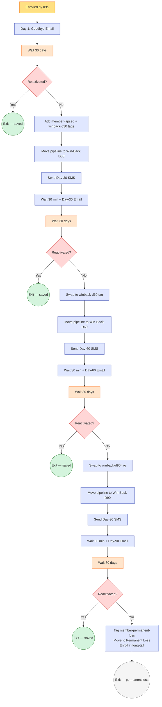
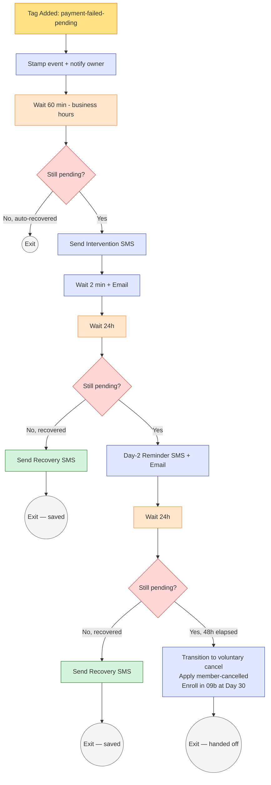
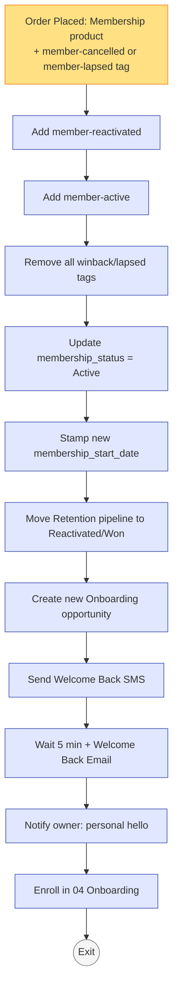

# #09 — Workflow Specs: Win-Back Lapsed Members

> Three workflows make up the win-back system. Each is documented separately. The GHL workflow builder should match these specs 1:1.

---

## Workflow A — Cancellation Handler (Router)

A thin workflow that fires on cancellation, records the event, and routes to the right downstream workflow based on `cancel_reason`.

### Workflow Header

| Property | Value |
|---|---|
| **Workflow Name** | `09a — Cancellation Handler` |
| **Folder** | `09 - Win-Back` |
| **Status** | Published / On |
| **Re-entry** | Disabled |
| **Quiet hours respected** | No (transactional event handling) |

### Trigger

**Type:** Form Submitted

**Filter:** Form is `Membership Cancellation Request`

### Actions

| # | Action | Property |
|---|---|---|
| 1 | Update Contact Field | `membership_status` = `Cancelled` |
| 2 | Update Contact Field | `membership_cancel_date` = `{{now}}` |
| 3 | Add Tag | `member-cancelled` |
| 4 | Remove Tag | `member-active` |
| 5 | Move Pipeline Stage | Retention pipeline → "Lost — Cancelled" |
| 6 | Send Internal Notification | To owner: "Member cancelled: {{contact.first_name}} {{contact.last_name}}, reason: {{contact.cancel_reason}}. Notes: {{contact.cancel_notes}}" |
| 7 | If/Else Branch on `cancel_reason` | See below |

**Branch logic (Action 7):**

```
IF cancel_reason equals "Moved" OR "Injury"
  → Enroll in: Quiet Track (Day-1 goodbye email only, no further outreach)
ELSE IF cancel_reason equals "Failed Payment"
  → Exit (Failed-Payment Intervention Workflow 09c handles this case separately)
ELSE
  → Enroll in: 09b — Win-Back Sequence (Voluntary)
```

### Visual Diagram



---

---

## Workflow B — Win-Back Sequence (Voluntary)

The 90-day reactivation campaign. The centerpiece of the win-back system.

### Workflow Header

| Property | Value |
|---|---|
| **Workflow Name** | `09b — Win-Back Sequence (Voluntary)` |
| **Folder** | `09 - Win-Back` |
| **Status** | Published / On |
| **Re-entry** | Disabled (one cancel = one win-back run) |
| **Quiet hours respected** | Yes (SMS lands in business hours) |

### Trigger

**Type:** Workflow Enrollment (called by `09a`) — OR — Contact Tag Added: `member-cancelled`

**Filters:**
- `cancel_reason` is NOT `Moved`
- `cancel_reason` is NOT `Injury`
- `cancel_reason` is NOT `Failed Payment` (those route to 09c instead)
- Contact does NOT have `do-not-market` tag

### Actions (in order)

#### Action 1 — Day 1: Send Gentle Goodbye Email

| Property | Value |
|---|---|
| **Action type** | Send Email |
| **Template** | `09 — Day-1 Gentle Goodbye` (from [emails.md](emails.md), Email 1) |
| **Wait before** | None |
| **Skip if** | `do-not-email` |

No SMS on Day 1 — voluntary cancels get a quiet day-1, not a notification cascade.

---

#### Action 2 — Wait 30 Days

| Property | Value |
|---|---|
| **Action type** | Wait |
| **Duration** | 30 days |
| **Respect contact-local time** | Yes — release at 10 AM contact-local |

---

#### Action 3 — Branch Check: Has Member Reactivated?

| Property | Value |
|---|---|
| **Action type** | If/Else |
| **Condition** | Contact has tag `member-reactivated` |
| **YES branch** | Exit Workflow |
| **NO branch** | Continue to Action 4 |

---

#### Action 4 — Day 30: Apply Stage Tags

| # | Action | Value |
|---|---|---|
| 4a | Add Tag | `member-lapsed` |
| 4b | Add Tag | `campaign-winback-d30` |
| 4c | Move Pipeline Stage | Retention pipeline → "Win-Back D30" |

---

#### Action 5 — Day 30: Send Light Check-In SMS

| Property | Value |
|---|---|
| **Action type** | Send SMS |
| **Template** | `09 — Day-30 Light Check-In` (from [sms.md](sms.md), SMS A) |
| **Skip if** | `do-not-sms` |

---

#### Action 6 — Wait 30 Minutes, Send Day-30 Email

| Property | Value |
|---|---|
| **Action 6a** | Wait — 30 minutes |
| **Action 6b** | Send Email — `09 — Day-30 We Miss You` (Email 2) |
| **Skip if** | `do-not-email` |

---

#### Action 7 — Wait 30 Days (to Day 60)

| Property | Value |
|---|---|
| **Action type** | Wait |
| **Duration** | 30 days |
| **Respect contact-local time** | Yes |

---

#### Action 8 — Day 60: Branch Check

| Property | Value |
|---|---|
| **Action type** | If/Else |
| **Condition** | `member-reactivated` tag present |
| **YES** | Exit Workflow |
| **NO** | Continue |

---

#### Action 9 — Day 60: Update Tags + Pipeline

| # | Action | Value |
|---|---|---|
| 9a | Remove Tag | `campaign-winback-d30` |
| 9b | Add Tag | `campaign-winback-d60` |
| 9c | Move Pipeline Stage | Retention → "Win-Back D60" |

---

#### Action 10 — Day 60: Send Comeback Offer SMS

| Property | Value |
|---|---|
| **Action type** | Send SMS |
| **Template** | `09 — Day-60 Comeback Offer` (SMS B) |

---

#### Action 11 — Wait 30 Min, Send Day-60 Email

| Property | Value |
|---|---|
| **Action 11a** | Wait — 30 minutes |
| **Action 11b** | Send Email — `09 — Day-60 Comeback Offer` (Email 3) |

---

#### Action 12 — Wait 30 Days (to Day 90)

| Property | Value |
|---|---|
| **Action type** | Wait |
| **Duration** | 30 days |
| **Respect contact-local time** | Yes |

---

#### Action 13 — Day 90: Branch Check

| Property | Value |
|---|---|
| **Action type** | If/Else |
| **Condition** | `member-reactivated` tag present |
| **YES** | Exit Workflow |
| **NO** | Continue |

---

#### Action 14 — Day 90: Update Tags + Pipeline

| # | Action | Value |
|---|---|---|
| 14a | Remove Tag | `campaign-winback-d60` |
| 14b | Add Tag | `campaign-winback-d90` |
| 14c | Move Pipeline Stage | Retention → "Win-Back D90" |

---

#### Action 15 — Day 90: Send Last-Call SMS

| Property | Value |
|---|---|
| **Action type** | Send SMS |
| **Template** | `09 — Day-90 Last Call` (SMS C) |

---

#### Action 16 — Wait 30 Min, Send Day-90 Email

| Property | Value |
|---|---|
| **Action 16a** | Wait — 30 minutes |
| **Action 16b** | Send Email — `09 — Day-90 Last Call` (Email 4) |

---

#### Action 17 — Wait 30 Days (to Day 120, final)

| Property | Value |
|---|---|
| **Action type** | Wait |
| **Duration** | 30 days |

---

#### Action 18 — Day 120: Final Branch Check & Permanent Loss

| Property | Value |
|---|---|
| **Action type** | If/Else |
| **Condition** | `member-reactivated` tag present |
| **YES** | Exit Workflow |
| **NO** | Continue |

**NO branch actions:**
- Remove Tag: `campaign-winback-d90`
- Add Tag: `member-permanent-loss`
- Move Pipeline Stage: Retention → "Permanent Loss"
- Enroll in: `Lead Nurture — Quarterly Long-Tail` (separate workflow, out of scope here)
- Exit Workflow

---

### Visual Workflow Diagram



---

### Edge Cases & Handling

| Scenario | Workflow behavior |
|---|---|
| Member reactivates at Day 15 (mid-wait) | Workflow `09d` applies `member-reactivated`. Next branch check (Day 30) catches it, exits cleanly. The Day-30 messages don't fire. |
| Member has `do-not-sms` only | SMS actions skip. Email actions fire normally. Sequence continues. |
| Member has `do-not-email` only | Email actions skip. SMS actions fire. Sequence continues. |
| Member has both `do-not-sms` AND `do-not-email` | All message actions skip. Workflow runs silently — tags + pipeline transitions still happen. (Owner can manually outreach if they choose.) |
| Member tags `do-not-market` mid-sequence | Trigger filter blocks future enrollment but doesn't auto-exit a running workflow. Add an explicit check before each send: if `do-not-market`, skip the send. |
| Member dies / GDPR delete | Contact deletion removes them from the workflow. No special handling needed. |
| Member cancels twice within 30 days (manual re-cancellation) | Trigger blocks re-entry (workflow re-entry disabled). The original sequence continues. |
| Studio paused operations (e.g., COVID) | Disable the entire workflow temporarily. When re-enabled, in-progress contacts resume from their wait blocks (GHL preserves wait state). |

---

### Monitoring Smart Lists

**"Win-Back D30 — Active"**:
- Has tag `campaign-winback-d30`
- Tag added in last 30 days
- Does NOT have `member-reactivated`

The owner watches this list during personal-outreach windows — a quick "hey, just saw you in my customer list — anything I can do?" text from Morgan often saves a winback-d30 member.

**"Win-Back D60 — Open Offer"**:
- Has tag `campaign-winback-d60`
- Tag added in last 30 days

The "best opportunity" segment — these members have the strongest offer in their inbox right now.

**"Permanent Loss This Quarter"**:
- Has tag `member-permanent-loss`
- Tag added in current quarter

Reviewed at quarterly business review — failed-to-reactivate volume is a leading indicator of underlying retention problems.

---

---

## Workflow C — Failed-Payment Intervention

The highest-leverage workflow in the system. Fires within 1 hour of a payment failure.

### Workflow Header

| Property | Value |
|---|---|
| **Workflow Name** | `09c — Failed-Payment Intervention` |
| **Folder** | `09 - Win-Back` |
| **Status** | Published / On |
| **Re-entry** | Allowed (a member can have multiple failed-payment events over time) |
| **Quiet hours respected** | Yes — delay messages to 8 AM if event fires overnight |

### Trigger

**Type:** Contact Tag Added: `payment-failed-pending`

This tag is applied by the Stripe webhook handler (configured in `09 build.md` Step 1.2).

### Actions (in order)

#### Action 1 — Stamp Event

| # | Action | Value |
|---|---|---|
| 1a | Update Contact Field | `cancel_reason` = `Failed Payment` |
| 1b | Update Contact Field | `payment_failed_at` (new field — Date & Time, Engagement folder) = `{{now}}` |
| 1c | Send Internal Notification | Owner: "Failed payment: {{contact.first_name}} {{contact.last_name}}, attempting recovery." |

---

#### Action 2 — Wait Up To 60 Minutes (within business hours)

| Property | Value |
|---|---|
| **Action type** | Wait |
| **Duration** | 60 minutes — but respect 8 AM – 9 PM contact-local |
| **Behavior** | If current time outside window, hold until 8 AM contact-local |

The 60-min wait is to avoid spamming a member if Stripe issues a transient decline that auto-retries within minutes.

---

#### Action 3 — Check If Already Recovered

| Property | Value |
|---|---|
| **Action type** | If/Else |
| **Condition** | Contact still has tag `payment-failed-pending` |
| **YES (still failed)** | Continue to Action 4 |
| **NO (auto-recovered by Stripe retry)** | Exit Workflow |

---

#### Action 4 — Send Intervention SMS

| Property | Value |
|---|---|
| **Action type** | Send SMS |
| **Template** | `09 — Failed Payment Intervention` (from [sms.md](sms.md), SMS D) |
| **Skip if** | `do-not-sms` |

---

#### Action 5 — Send Intervention Email (within minutes of SMS)

| Property | Value |
|---|---|
| **Action 5a** | Wait — 2 minutes |
| **Action 5b** | Send Email — `09 — Failed Payment Intervention` (Email 5) |
| **Skip if** | `do-not-email` |

**Critical fallback:** If BOTH `do-not-sms` AND `do-not-email`, send internal alert to owner: "URGENT: {{contact.first_name}} {{contact.last_name}} failed payment but both channels suppressed. Call manually: {{contact.phone}}."

---

#### Action 6 — Wait 24 Hours, Check Recovery

| Property | Value |
|---|---|
| **Action 6a** | Wait — 24 hours |
| **Action 6b** | If/Else: `payment-failed-pending` tag still present? |
| **YES (not recovered)** | Continue to Action 7 |
| **NO (recovered)** | Continue to Action 6c |
| **Action 6c** | Add Tag `payment-recovered`, send SMS "{{contact.first_name}} — fixed! Card updated, you're good to go ☀️ Thanks for sorting that out fast.", exit workflow |

---

#### Action 7 — Day 2 Reminder

| # | Action | Value |
|---|---|---|
| 7a | Send SMS | "{{contact.first_name}}, quick heads up — your card's still declining. One more tap to fix: {{contact.payment_update_url}} (after 48h we'll pause your account, but it's recoverable)" |
| 7b | Wait — 2 minutes |
| 7c | Send Email | Longer-form version of same message — see Email 5 variant |

---

#### Action 8 — Wait 24 Hours, Final Check

| Property | Value |
|---|---|
| **Action 8a** | Wait — 24 hours (total 48 hours since failure) |
| **Action 8b** | If/Else: `payment-failed-pending` still present? |
| **YES** | Continue to Action 9 (transition to voluntary cancel) |
| **NO** | Add `payment-recovered`, send recovery SMS, exit |

---

#### Action 9 — Transition to Voluntary Cancel Path

After 48 hours of failed recovery, treat as a voluntary cancel:

| # | Action | Value |
|---|---|---|
| 9a | Add Tag | `member-cancelled` |
| 9b | Remove Tag | `member-active` |
| 9c | Update Contact Field | `membership_status` = `Cancelled` |
| 9d | Update Contact Field | `membership_cancel_date` = `{{now}}` |
| 9e | Move Pipeline Stage | Retention → "Lost — Cancelled" |
| 9f | Send Internal Notification | Owner: "Failed-payment recovery attempt timed out: {{contact.first_name}} {{contact.last_name}}. Transitioning to win-back voluntary track at Day 30." |
| 9g | Enroll in Workflow | `09b — Win-Back Sequence (Voluntary)` at **Day 30 entry point** (skips Days 1–29) |
| 9h | Exit | |

**Note on the Day-30 entry point:** In GHL, this may require a sub-workflow or a flag field (e.g., `winback_skip_day_1`) that `09b` checks at the start. Implementation detail — make sure failed-payment members don't get the "sorry to see you go" Day-1 email; they need the "we miss you, here's an offer" Day-30 instead.

---

### Visual Workflow Diagram



---

### Edge Cases & Handling

| Scenario | Workflow behavior |
|---|---|
| Stripe auto-retries successfully within 60 min | Webhook removes `payment-failed-pending`. Action 3 sees the missing tag, exits without sending intervention SMS. (Member never knows there was a failure.) |
| Member updates card via the link, payment succeeds | Same as above — webhook clears the tag, branch checks at 24h and 48h catch it, recovery SMS sent. |
| Stripe webhook misses the recovery (rare bug) | Member fixed the card but tag wasn't removed. Action 9 fires incorrectly — member gets "you've been cancelled" treatment despite paying. Mitigation: at Action 9, double-check via Stripe API "is this subscription active?" before applying `member-cancelled`. |
| Failed payment is a fraud alert (member's bank declined unfamiliar transaction) | The member usually receives a text from their bank simultaneously. Our SMS + their bank alert combine to a clean recovery. Most common scenario. |
| Member has `vip-do-not-disturb` | Send the email but skip the SMS. Owner calls personally instead. |
| Member's `payment_update_url` merge field is empty | Fallback to generic URL `{{custom_values.business.website}}/billing/update`. Add to test plan: verify URL is populated for every active member at workflow trigger time. |

---

### Monitoring Smart Lists

**"Failed Payments — Pending Recovery"**:
- Has tag `payment-failed-pending`

Should always be a short list. If it has > 5 contacts: investigate Stripe webhook or workflow execution.

**"Failed Payments — Recovered This Week"**:
- Has tag `payment-recovered`
- Tag added in last 7 days

The headline number — failed-payment recovery is the highest-leverage save in the entire studio.

**"Failed Payments — Lost to Cancellation"**:
- Was tagged `payment-failed-pending` in last 60 days
- Now has `member-cancelled` with `cancel_reason` = `Failed Payment`

These are the recoveries we *didn't* save. Owner reviews monthly — sometimes the root cause is fixable (UX of the card-update flow, message timing, etc.).

---

---

## Workflow D — Reactivation Detection

Detects when a lapsed member completes the comeback checkout and updates all the right state.

### Workflow Header

| Property | Value |
|---|---|
| **Workflow Name** | `09d — Reactivation Detection` |
| **Folder** | `09 - Win-Back` |
| **Status** | Published / On |
| **Re-entry** | Allowed (a single member could lapse and reactivate multiple times) |
| **Quiet hours respected** | No (celebration moment fires immediately) |

### Trigger

**Type:** Order Placed (Stripe payment succeeded for a Membership product)

**Filter:** Contact has tag `member-cancelled` OR `member-lapsed`

### Actions

| # | Action | Value |
|---|---|---|
| 1 | Add Tag | `member-reactivated` (permanent badge) |
| 2 | Add Tag | `member-active` |
| 3 | Remove Tags | `member-cancelled`, `member-lapsed`, `campaign-winback-d30`, `campaign-winback-d60`, `campaign-winback-d90`, `member-permanent-loss` |
| 4 | Update Contact Field | `membership_status` = `Active` |
| 5 | Update Contact Field | `membership_start_date` = `{{now}}` (fresh start) |
| 6 | Move Pipeline Stage | Retention → "Reactivated" (Won) |
| 7 | Create Opportunity | Onboarding pipeline → "Welcome Sent (Day 0)" |
| 8 | Send SMS | `09 — Reactivation Welcome` (from [sms.md](sms.md), bonus section) |
| 9 | Wait 5 min, Send Email | `09 — Welcome Back (Reactivation)` (Email 6) |
| 10 | Send Internal Notification | Owner: "REACTIVATION: {{contact.first_name}} {{contact.last_name}} just came back. Tier: {{contact.membership_tier}}. Save them a personal hello next time they're in." |
| 11 | Enroll in Workflow | `04 — New Member Onboarding` (treated as fresh) |
| 12 | Exit | |

### Visual Diagram



### Edge Cases & Handling

| Scenario | Workflow behavior |
|---|---|
| Member upgrades tier on reactivation (was Basic, returns as Premium) | Action 4 updates `membership_tier` correctly based on which product was purchased. Workflow doesn't care which tier. |
| Member reactivates without ever going through win-back messages (just walked in and signed up at the desk) | Trigger fires the same. `campaign-winback-*` tag removals are no-ops. Welcome-back messages still send. |
| Multiple membership products in a single order | (Rare — usually one tier.) Workflow fires once per order, not per line item. |
| Reactivation order is for a non-membership product (PT pack) | Trigger filter on Membership-product category prevents false positives. Confirm the filter is correctly scoped to the three Membership SKUs. |

---

## What Lives Outside These Workflows

The win-back system owns the *cancellation-through-reactivation* arc. It does not own:

- **The cancellation form itself** — that's a foundation form, configured in #09 build.md Step 1 but technically reusable across the system.
- **Stripe payment processing** — that's a platform integration (GHL Payments).
- **Reactivated members' onboarding flow** — handed off to [#04 New Member Onboarding](../../04-new-member-onboarding/).
- **Long-tail nurture for permanent-loss members** — separate quarterly workflow, out of scope here.
- **Reporting on win-back economics** — built in [#10 Owner Reporting](../../10-owner-reporting-and-visibility/) (reactivation rate, recovered LTV, failed-payment recovery rate).
