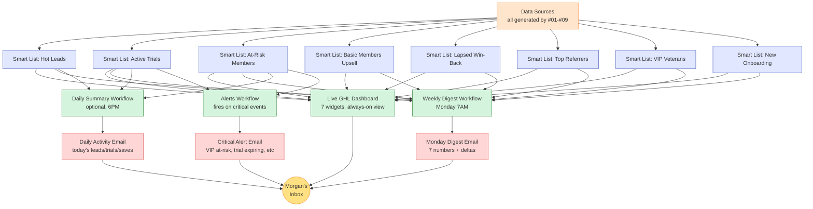

# #10 — Owner Reporting & Visibility

> **The Problem:** When I ask you about your MRR trajectory, your trial conversion rate, your at-risk member count — do you have a number, or do you have to go look? Owners running on gut feel overspend on ads by 25–40%, miss churn warnings until they're irreversible, and burn time pulling reports that should land in their inbox.

---

## Who This Hurts

**P7 — The Studio Owner.** Morgan opens her laptop on a Monday morning. The week ahead has three trainer schedules to confirm, two new lead replies to handle, one cancellation to process, and a vendor invoice to pay. The *last* thing she has time for is opening four browser tabs to manually calculate "how was last week?"

So she doesn't. She runs on a gut sense of "things feel busy" or "feel slow." When the numbers eventually catch up (the month-end Stripe report shows a 3-member dip; the ad-spend dashboard shows Instagram cost-per-lead doubled), she's reacting to a problem that started 30 days ago.

A studio without a Monday-morning dashboard is a studio flying with a blindfold. Every other system in this build — lead capture, trial conversion, retention, referrals, win-back — generates data. If nobody sees the data, nobody can act on it.

---

## Cost of Inaction

Conservative math for a studio-owner who runs on gut feel vs one with a real dashboard:

| Decision area | Cost of operating blind | Annual impact |
|---|---|---|
| **Ad spend allocation** (no source attribution data) | Overspend on underperforming channels by ~25% | $4,000–$8,000/year wasted |
| **At-risk member intervention** (no early-warning list) | Save rate drops from 35% to <10% — most saves require a 4-week-warning window | $6,000–$15,000/year in lost saves |
| **Trial-conversion coaching** (no daily list of trials needing attention) | Trials slip out of conversion window unnoticed | $2,400+/year in lost conversions |
| **Cancellation root-cause analysis** (no `cancel_reason` aggregation) | Repeat the same fixable mistakes (e.g., billing UX) | Hard to quantify; conservatively $3,000+/year |
| **Owner time spent pulling reports** | 4–6 hours/week manually compiling numbers | 200+ hours/year of owner time |
| **Total annual cost of operating blind** | — | **$15K–$26K + 200 hours** |

The dashboard pays for itself in the first month it surfaces a single at-risk save the owner would have missed.

---

## What We Built

A four-layer reporting system: a live in-GHL dashboard, a Monday-morning email digest, an optional daily evening summary, and an alerts workflow that fires only on critical events.

**Four components:**

1. **Live GHL Dashboard** — a single dashboard in GHL displaying the **seven numbers that matter** (built as Dashboard Widgets pulling from 8 underlying smart lists). The owner sees it whenever she logs into GHL — no extra reports needed.
2. **Weekly Digest Workflow** — runs every Monday at 7 AM, builds a beautifully formatted HTML email with the same 7 numbers, week-over-week deltas (with up/down arrows and color coding), and 1–3 specific action items for the week. Lands in Morgan's inbox before the first coffee.
3. **Daily Summary Workflow (optional)** — runs at 6 PM each day, sends a short "today's activity" email: leads in, trials booked, members saved. For owners who want daily visibility. Toggleable.
4. **Alerts Workflow** — fires only on critical events: trial day-6 with no booking, VIP member flagged at-risk, 3+ at-risk members in a 7-day window, failed payment not recovered, high-value cancellation. Owner gets a focused alert, not noise.

---

## The Seven Numbers (the headline KPIs)

| # | KPI | Source | Why It Matters |
|---|---|---|---|
| 1 | **New Leads This Week** | "Hot Leads" smart list, last 7d | Top of funnel — predicts everything downstream |
| 2 | **Active Trials** | "Active Trials" smart list | Most pressure-sensitive number — these convert this week or never |
| 3 | **Trial → Paid Rate (30d rolling)** | `trial-converted` ÷ `trial-active` last 30d | Health of the conversion flow (#02) |
| 4 | **Active Members Count** | All contacts with `member-active` | The business — single most important number |
| 5 | **Current MRR** | Sum of `monthly_rate` for all active members | Revenue trajectory |
| 6 | **At-Risk Members** | "At-Risk" smart list (risk-at-risk + risk-critical) | The save opportunity — owner-intervention list |
| 7 | **Net New This Month** | New `member-active` − `member-cancelled` in calendar month | The simplest growth number |

Every other KPI in the studio (referral count, win-back saves, no-show rate, review count) is in supporting widgets — but these seven are the ones the owner looks at first.

---

## Outcome & KPIs (yes, this system has KPIs too)

Move these numbers within 30 days of launch:

| KPI | Baseline | Target | How we measure |
|---|---|---|---|
| Owner views the dashboard | 0–1 times/week | **Daily (5+ times/week)** | GHL admin login analytics |
| Owner opens the Monday digest | n/a | **100% (always)** | Email open tracking |
| Owner takes one action from each digest | n/a | **80%+ of digests** | Manual: does Morgan reach out to a flagged at-risk member that week? |
| Time spent compiling reports manually | 4–6 hr/week | **< 30 min/week** | Self-reported |
| Critical alerts that result in a save action | n/a | **70%+** | Alert sent → save outcome tracked in 14 days |

The dashboard *itself* is the KPI — if the owner stops looking at it, the reporting system has failed regardless of how pretty it is.

---

## What Changes for the Studio Owner

Before:

- Monday: Morgan opens her laptop, dives into trainer schedules. Doesn't look at numbers. Numbers feel "fine."
- Wednesday: A trial member's 7-day window closes without conversion. Morgan finds out 3 weeks later when Stripe doesn't bill them.
- Friday: Two members cancel. Morgan doesn't know why. Doesn't know that both had stopped attending classes 4 weeks ago.
- End of month: Morgan pulls Stripe reports, manually counts members, compares to a notebook from last month. Sees MRR dropped $400. Has no idea why.

After:

- Monday 7:15 AM: Morgan opens her phone in the kitchen. Email: "**Sunrise — Week of Nov 4**. New leads: 31 (+8 vs last week). Active trials: 12 (needs attention: Lin, James). At-Risk: 6 (Diane has been flagged 14 days — call her today). MRR: $24,180 (+$240 net new)."
- Tuesday: Morgan texts Diane: "Hey, just thinking of you. The 7 AM yoga has missed you. Coffee on me this week?" Diane comes in Wednesday. Save.
- Friday: Trial-day-6 alert fires for Lin (no booking yet). Morgan calls personally. Lin books for Sunday. Converts on Monday.
- End of month: Morgan looks at the dashboard MRR trend line. Up $1,200. She can attribute every dollar — and she made every save herself.

The dashboard doesn't replace Morgan's judgment. It surfaces the *moments* where her judgment matters most.

---

## Build It

Full step-by-step build in **[build.md](build.md)** — every smart list, every dashboard widget, every workflow, every alert trigger.

Production assets:

- **[assets/dashboard-spec.md](assets/dashboard-spec.md)** — every widget spec: name, source smart list, calculation, display style, mockup layout
- **[assets/emails.md](assets/emails.md)** — Monday digest email template (the centerpiece), daily summary email, alert email templates
- **[assets/workflow.md](assets/workflow.md)** — Weekly Digest workflow, Daily Summary workflow, Alerts workflow

No funnel, no SMS, no forms — this system is owner-facing only.

---

## How This Connects to Other Systems

This system **consumes** signals from every other problem:

- [#01 Lead Capture](../01-lead-capture-and-instant-response/) feeds "New Leads This Week"
- [#02 Trial Conversion](../02-trial-to-paid-conversion/) feeds "Active Trials" + "Trial → Paid Rate"
- [#03 No-Show Recovery](../03-appointment-no-show-recovery/) feeds the No-Show widget
- [#04 Onboarding](../04-new-member-onboarding/) feeds "New Members in Onboarding"
- [#05 Retention](../05-retention-and-churn-prevention/) feeds "At-Risk Members"
- [#06 Upsell](../06-upsell-and-cross-sell/) feeds "Basic Members (Upsell Targets)"
- [#07 Reviews](../07-reviews-and-reputation/) feeds review-count widget
- [#08 Referrals](../08-referral-engine/) feeds "Top Referrers" + referral-conversion count
- [#09 Win-Back](../09-win-back-lapsed-members/) feeds "Lapsed Members" + "Reactivations This Month"

**Build this LAST.** Every other system needs to be live and producing data before the dashboard can show meaningful numbers. Build sequence: #01 → #02 → #03 → #04 → #05 → #06 → #07 → #08 → #09 → **#10**.

Full integration map: [../../integration/master-automation-graph.md](../../integration/master-automation-graph.md)
