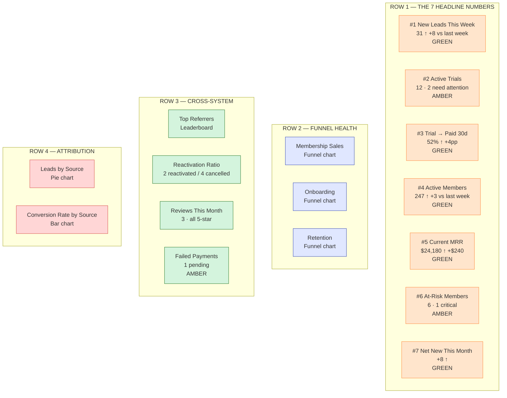

# #10 — Dashboard Spec: Sunrise Owner Headlines

> Full specification for every dashboard widget. Mockup layout included. Use this as the build-target document — every widget here maps to a configuration in the GHL Dashboard builder.

---

## Dashboard Settings

- **Name:** `Sunrise — Owner Headlines`
- **Default for user:** Yes — set as landing page on owner login
- **Refresh:** Auto-refresh every 15 minutes (live KPIs feel fresh without burning API calls)
- **Layout:** 4-column responsive grid on desktop, single-column stack on mobile/tablet
- **Brand color palette:**
  - Primary: Coral `#FF6B4A`
  - Healthy: Green `#2E7D32`
  - Warning: Amber `#F4B860`
  - Critical: Red `#C62828`
  - Background: Cream `#FFF8F0`
  - Text: Deep Slate `#2D3142`

---

## Mockup — Layout at a Glance

---

## Row 1 — The Seven Headline KPIs

### Widget 1 — New Leads This Week

| Property | Value |
|---|---|
| **Widget Type** | KPI Card with trend arrow |
| **Smart List Source** | `All Hot Leads` |
| **Calculation** | `count()` of contacts in smart list |
| **Comparison** | Current 7-day window vs previous 7-day window |
| **Display** | Large number (48px) + trend arrow (↑ green / ↓ red / → gray) + delta value |
| **Color logic** | Green if delta ≥ +5; Amber if -5 to +5; Red if delta ≤ -5 |
| **Example display** | "**31** ↑ +8 vs last week" |
| **Click-through** | Opens the `All Hot Leads` smart list |

---

### Widget 2 — Active Trials

| Property | Value |
|---|---|
| **Widget Type** | KPI Card with sub-text |
| **Smart List Source** | `Active Trials Needing Attention` |
| **Calculation** | `count()` of total; sub-count of contacts with `lead_captured_at` > 5 days AND no `trial-attended-1` tag |
| **Display** | Large number + sub-text "X need attention this week" |
| **Color logic** | Amber if sub-count ≥ 1; Red if ≥ 3 |
| **Example display** | "**12** · 2 need attention" |
| **Click-through** | Opens smart list filtered to "needs attention" only |

---

### Widget 3 — Trial → Paid Rate (30d Rolling)

| Property | Value |
|---|---|
| **Widget Type** | KPI Card with percentage |
| **Source** | Custom calculation via webhook OR GHL Formula widget |
| **Calculation** | `(count(trial-converted last 30d) ÷ count(trial-active last 30d)) × 100` |
| **Comparison** | Current 30d vs previous 30d |
| **Display** | "**52%** ↑ +4pp" (pp = percentage points) |
| **Color logic** | Green if ≥ 45%; Amber 30–44%; Red < 30% |
| **Click-through** | Opens the Membership Sales pipeline filtered to "Trial → Conversion Offer Sent" stages |

---

### Widget 4 — Active Members

| Property | Value |
|---|---|
| **Widget Type** | KPI Card with delta |
| **Source** | All contacts with tag `member-active` (no smart list needed — direct query) |
| **Calculation** | `count()` |
| **Comparison** | Current vs 7 days ago (snapshot) |
| **Display** | "**247** ↑ +3 vs last week" |
| **Color logic** | Green if delta ≥ 0; Amber if -3 to -1; Red if ≤ -3 |
| **Click-through** | Opens Contacts filtered by `member-active` tag |

**Snapshot logic:** GHL doesn't natively store "active member count 7 days ago." Implementation: a nightly workflow writes the current count to a custom value `reporting.active_members_snapshot_{date}`. Widget queries that for the comparison.

---

### Widget 5 — Current MRR

| Property | Value |
|---|---|
| **Widget Type** | KPI Card formatted as currency |
| **Source** | All contacts with `member-active` |
| **Calculation** | `SUM(monthly_rate)` across all active members |
| **Comparison** | Current vs 7 days ago (snapshot) |
| **Display** | "**$24,180** ↑ +$240" |
| **Color logic** | Green if delta ≥ 0; Amber -$200 to -$1; Red ≤ -$200 |
| **Click-through** | Opens a breakdown table: count + MRR by tier (Basic / Premium / VIP) |

---

### Widget 6 — At-Risk Members

| Property | Value |
|---|---|
| **Widget Type** | KPI Card with sub-count + color alert |
| **Smart List Source** | `All At-Risk Members` |
| **Calculation** | `count()` total + sub-count where tag is `risk-critical` |
| **Display** | "**6** · 1 critical" |
| **Color logic** | Green if 0; Amber if 1–5; Red if 6+ OR any `risk-critical` |
| **Click-through** | Opens smart list (the owner's daily save-action list) |

This is the most action-driving widget on the dashboard.

---

### Widget 7 — Net New This Month

| Property | Value |
|---|---|
| **Widget Type** | KPI Card with delta |
| **Calculation** | `count(new member-active in current calendar month) - count(new member-cancelled in current calendar month)` |
| **Display** | "**+8** ↑" or "**-3** ↓" |
| **Color logic** | Green if positive; Amber if 0 to -3; Red if -4 or worse |
| **Click-through** | Opens a side-by-side: this month's new members + this month's cancellations |

---

## Row 2 — Funnel Health (3 funnel charts)

### Widget 8 — Membership Sales Funnel

| Property | Value |
|---|---|
| **Widget Type** | Funnel chart (stages as horizontal bars, descending) |
| **Source** | Membership Sales pipeline |
| **Stages shown** | New Lead → Contacted → Trial Booked → Trial Active → Conversion Offer Sent → Won — Paid Member |
| **Display** | Each bar's length proportional to count; conversion % between stages shown on hover |
| **Time window** | Last 30 days |

---

### Widget 9 — Onboarding Funnel

| Property | Value |
|---|---|
| **Widget Type** | Funnel chart |
| **Source** | Onboarding pipeline |
| **Stages shown** | Welcome Sent → First Visit Confirmed → Week 1 Check-In → Two-Week Milestone → Goal Review → Onboarded |
| **Display** | Same as Widget 8 |
| **Time window** | Members who entered onboarding in last 60 days |

---

### Widget 10 — Retention Funnel

| Property | Value |
|---|---|
| **Widget Type** | Funnel chart |
| **Source** | Retention pipeline |
| **Stages shown** | Healthy → Watching → At-Risk → Critical → Save In Progress → Saved (and the win-back stages as a parallel branch) |
| **Display** | Color-coded — Healthy/Saved green, Watching/Save-In-Progress amber, At-Risk/Critical red |
| **Time window** | All currently active members |

---

## Row 3 — Cross-System Widgets

### Widget 11 — Top Referrers (This Quarter)

| Property | Value |
|---|---|
| **Widget Type** | Leaderboard table |
| **Smart List Source** | `Top Referrers (Quarterly)` |
| **Display** | Top 5 rows: Name, Referrals Made, Referrals Converted, Conversion % |
| **Sort** | Descending by `referrals_converted_count` |
| **Click-through** | Opens the smart list for the full list |

---

### Widget 12 — Lapsed → Reactivation Ratio

| Property | Value |
|---|---|
| **Widget Type** | KPI Pair (side-by-side) |
| **Source** | Smart lists `Reactivations This Month` and `Cancellations This Month` |
| **Display** | "**2** reactivations / **4** cancellations this month" + ratio "50% replacement rate" |
| **Color logic** | Green if ratio ≥ 40%; Amber 20–39%; Red < 20% |
| **Click-through** | Opens cancellation reason breakdown |

---

### Widget 13 — Reviews This Month

| Property | Value |
|---|---|
| **Widget Type** | KPI Card with sub-text |
| **Smart List Source** | `5-Star Reviews This Month` |
| **Display** | "**3** · all 5-star" |
| **Color logic** | Green if ≥ 3; Amber 1–2; Red 0 |
| **Click-through** | Opens smart list with review text excerpts |

---

### Widget 14 — Failed Payments Pending

| Property | Value |
|---|---|
| **Widget Type** | KPI Card with alert color |
| **Smart List Source** | `Failed Payments — Pending` |
| **Display** | "**1** pending" |
| **Color logic** | Green if 0; Amber 1–2; Red 3+ |
| **Click-through** | Opens smart list (the most urgent owner-action list) |

---

## Row 4 — Channel Attribution

### Widget 15 — Leads by Source (Last 30 Days)

| Property | Value |
|---|---|
| **Widget Type** | Pie chart (donut) |
| **Source** | Contacts with any `source-*` tag, captured in last 30 days |
| **Segments** | Instagram, Facebook, Google, Walk-in, Referral, Web Search, Event |
| **Display** | Donut with center label "X total leads"; legend with count + percentage per source |
| **Click-through** | Each segment opens the source's smart list |

---

### Widget 16 — Conversion Rate by Source

| Property | Value |
|---|---|
| **Widget Type** | Horizontal bar chart |
| **Source** | For each source-* tag: count of `trial-converted` divided by total leads from that source (last 30d) |
| **Display** | One bar per source, longest first, percentage label on each |
| **Insight** | Reveals which channels actually convert vs which generate volume |

This widget is the single biggest lever for cutting wasted ad spend — usually one channel converts 3× better than another, and the owner doesn't know until she sees this chart.

---

## Owner-Specific Customizations

### Hide widgets the owner doesn't use

After 30 days of usage data, audit which widgets the owner actually clicks. Hide unused ones — reduce visual noise. Common cuts:

- If reviews are sparse, Widget 13 can be cut and shown only in the weekly digest
- If the studio has only one source channel (e.g., all referral), Widget 15 is unnecessary

### Add custom widgets as needs emerge

Reserve space in Row 4 for owner-requested widgets. Common additions over time:

- **PT utilization** (% of PT slots booked vs available, by trainer)
- **Class fill rate** (% of capacity filled, by class type and time slot)
- **Member NPS** (if you add a quarterly NPS survey)
- **Spend per member** (cost of acquisition + tech + space / active member count)

---

## Mobile Considerations

GHL dashboards render on mobile but lose dense detail. Owner-mobile UX:

1. Top 7 KPIs collapse to a single scrollable row
2. Funnel charts become accordion-collapsible
3. Cross-system widgets stack
4. Pie chart and bar chart hidden by default (collapsed accordion: "Attribution detail")

For owners who primarily check the dashboard on mobile, consider a streamlined **mobile-only PWA** dashboard built outside GHL — out of scope here but recommended as a v2.

---

## Color Coding — Consistent Legend

Across the entire dashboard:

| Color | Meaning | Sample Use |
|---|---|---|
| Green `#2E7D32` | Healthy / positive trend | MRR up, member count up |
| Amber `#F4B860` | Watch / needs attention | At-risk 1–5, trial-needing-attention 1–2 |
| Red `#C62828` | Critical / action required | VIP at-risk, failed payment 3+, MRR down significantly |
| Gray `#9E9E9E` | Neutral / no change | Flat week-over-week |
| Coral `#FF6B4A` | Brand accent (headers, borders) | Section labels |

Consistency = readability. The owner shouldn't have to think about what a color means.

---

## Verification Checklist

After building the dashboard:

- [ ] All 16 widgets render data (not "loading" or "no data")
- [ ] Click-throughs open the right smart lists
- [ ] Color coding matches the legend above
- [ ] Mobile renders cleanly (test on owner's actual phone)
- [ ] Refresh interval set to 15 min
- [ ] Set as default landing dashboard for owner user
- [ ] Owner has been walked through every widget in person at least once

The last item is non-negotiable. A dashboard the owner doesn't understand is worse than no dashboard.
