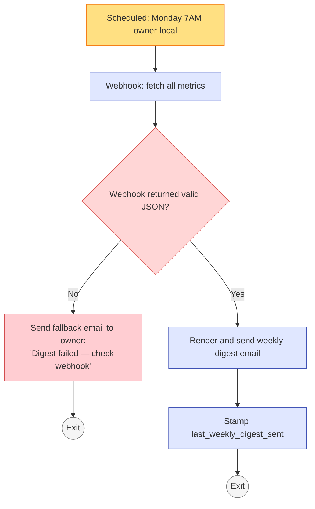
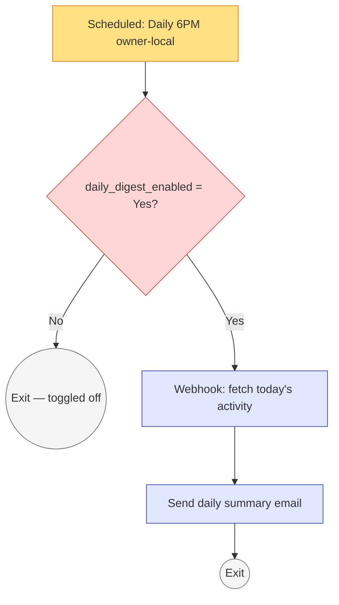
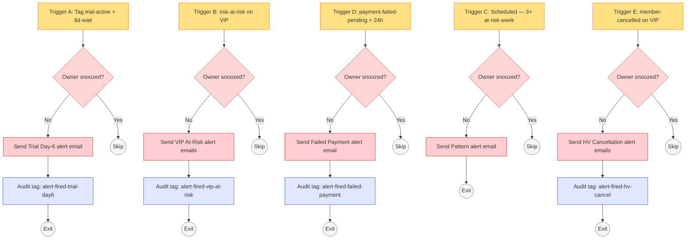

# #10 — Workflow Specs: Owner Reporting

> Three workflows make up the owner-reporting system: Weekly Digest, Daily Summary (optional), and Critical Alerts. The GHL workflow builder should match these specs 1:1.

---

## Workflow A — Weekly Digest

The centerpiece. Runs every Monday at 7 AM and sends the formatted digest email.

### Workflow Header

| Property | Value |
|---|---|
| **Workflow Name** | `10a — Weekly Digest` |
| **Folder** | `10 - Reporting` |
| **Status** | Published / On |
| **Re-entry** | Allowed (runs weekly, repeat enrollment expected) |
| **Quiet hours respected** | No (owner-facing, scheduled time is explicitly owner-friendly) |

### Trigger

**Type:** Scheduled — Recurring

**Schedule:** Every Monday at 7:00 AM `America/Chicago` (owner timezone, from `custom_values.business.timezone`)

**Target:** Non-contact-scoped (workflow runs once a week, not per contact)

---

### Actions (in order)

#### Action 1 — Fetch All Metrics

| Property | Value |
|---|---|
| **Action type** | Webhook |
| **Method** | GET |
| **URL** | `https://hooks.sunrisewellness.com/weekly-digest-metrics` |
| **Headers** | `Authorization: Bearer {{custom_values.api.dashboard_key}}` |
| **Expected response** | JSON object with all metrics (see below) |

**Expected JSON response structure:**

```json
{
  "week_label": "May 12 – May 18",
  "new_leads_week": 31,
  "new_leads_week_delta": 8,
  "trend_arrow_1": "up_green",

  "active_trials": 12,
  "trials_needing_attention_count": 2,
  "trials_needing_attention_names": ["Lin H.", "James K."],

  "trial_to_paid_rate_30d": 52,
  "trial_to_paid_rate_delta": 4,
  "trend_arrow_3": "up_green",

  "active_members": 247,
  "active_members_delta": 3,
  "trend_arrow_4": "up_green",

  "mrr": "24,180",
  "mrr_delta": "240",
  "trend_arrow_5": "up_green",

  "at_risk_count": 6,
  "at_risk_critical_count": 1,
  "at_risk_names": ["Diane K. (flagged 14d)", "James M.", "Priya T."],

  "net_new_month_signed": "+8",
  "net_new_month_trend": "up_green",

  "action_1": "Call Diane K. — at-risk 14 days, last visit Oct 23.",
  "action_2": "Lin H.'s trial expires Wed — personal day-6 call.",
  "action_3": "Sarah M. = top referrer this quarter — drop a thank-you note.",

  "sales_drop_stage": "Trial Active → Conversion Offer",
  "sales_overall_pct": 52,
  "onboarding_drop_stage": "Week 1 Check-In",
  "onboarding_overall_pct": 78,
  "retention_drop_stage": "At-Risk → Save In Progress",
  "retention_save_pct": 34,

  "weekly_insight": "Conversion offer step is dropping 18% — worth A/B testing the day-7 Email subject.",
  "attribution_insight": "Referral converts at 67% vs Instagram's 42%. Doubling referral attention pays back faster than scaling IG spend.",

  "source_breakdown": [
    {"source": "Instagram", "leads": 38, "convert_pct": 42, "ltv_per_lead": 1290},
    {"source": "Google", "leads": 24, "convert_pct": 51, "ltv_per_lead": 1565},
    {"source": "Referral", "leads": 17, "convert_pct": 67, "ltv_per_lead": 2060},
    …
  ],

  "reactivations_week": 2,
  "reactivation_names": ["James K., Lin H."],
  "conversions_week": 5,
  "new_member_names": ["Marcus T., Priya M., Diane K., Sarah L., Alex W."],
  "reviews_week": 3,
  "referrals_week": 1,
  "referrer_names": "Sarah M.",
  "referee_names": "Priya T.",
  "saves_week": 2
}
```

Store the response as workflow variables (`{{metrics.new_leads_week}}`, etc.).

---

#### Action 2 — Send Weekly Digest Email

| Property | Value |
|---|---|
| **Action type** | Send Email |
| **To** | `{{custom_values.business.owner_email}}` |
| **From Name** | `Sunrise Dashboard` |
| **From Email** | `dashboard@sunrisewellness.com` |
| **Reply-To** | `{{custom_values.business.owner_email}}` |
| **Subject** | `Sunrise — Week of {{metrics.week_label}} (7 numbers + this week's actions)` |
| **Template** | `10 — Weekly Digest` (from [emails.md](emails.md), Email 1) |

The email template references the workflow variables stored in Action 1.

---

#### Action 3 — Log Sent Event

| Property | Value |
|---|---|
| **Action type** | Update Custom Value |
| **Custom value** | `reporting.last_weekly_digest_sent` (new — add to custom-values.md) |
| **Value** | `{{now}}` |

(Monitoring: if this value is more than 8 days old, the workflow isn't running. Add a meta-alert: "Weekly digest hasn't fired in 8+ days.")

---

#### Action 4 — Exit

| Property | Value |
|---|---|
| **Action type** | Exit Workflow |

---

### Visual Workflow Diagram



---

### Edge Cases & Handling

| Scenario | Workflow behavior |
|---|---|
| Webhook timeout / failure | Fallback action: send simplified email with subject "[Heads Up] Digest backend down — open dashboard manually." Don't skip the Monday touch. |
| Webhook returns null/empty fields | Email template uses fallbacks: "N/A — insufficient data" instead of blank merge fields. |
| Owner is on vacation (snoozed alerts) | Weekly digest still fires — it's not an alert, it's a scheduled report. Owner can ignore. |
| Daylight savings transition week | Verify schedule respects `America/Chicago` daylight savings. If timezone shifts the email 1 hour, OK — still arrives during the owner-friendly window. |
| Owner email bounces (typo, mailbox full) | GHL surfaces the bounce in send logs. Add a meta-alert: if 2 consecutive digests bounce, alert via Email to owner phone. |

---

### Monitoring

**Smart list "Weekly Digest Health"** (manual):
- Custom value `reporting.last_weekly_digest_sent` > 8 days ago → red

Owner's calendar reminder (manual): "Confirm digest arrived" each Monday at 7:30 AM for the first 4 weeks of operation. After consistent firing, drop the reminder.

---

---

## Workflow B — Daily Lead Summary (Optional)

For owners who want daily evening visibility. Toggleable.

### Workflow Header

| Property | Value |
|---|---|
| **Workflow Name** | `10b — Daily Lead Summary` |
| **Folder** | `10 - Reporting` |
| **Status** | Initially OFF (owner enables after 1+ weeks of weekly digests) |
| **Re-entry** | Allowed |
| **Quiet hours respected** | No (6 PM is intentional) |

### Trigger

**Type:** Scheduled — Recurring

**Schedule:** Daily at 6:00 PM `America/Chicago`

**Pre-trigger filter:** Custom value `reporting.daily_digest_enabled` = `Yes`

(Owner toggles via Settings > Custom Values without touching the workflow.)

---

### Actions

#### Action 1 — Fetch Today's Activity

| Property | Value |
|---|---|
| **Action type** | Webhook |
| **URL** | `https://hooks.sunrisewellness.com/daily-summary` |
| **Method** | GET |
| **Expected response** | JSON with today's activity counts + lists |

**Expected response structure:**

```json
{
  "leads_today": 4,
  "leads_yesterday": 6,
  "trials_booked_today": 2,
  "trials_booked_yesterday": 1,
  "conversions_today": 1,
  "conversions_yesterday": 0,
  "saves_today": 1,
  "saves_yesterday": 0,
  "cancellations_today": 0,
  "cancellations_yesterday": 1,
  "failed_payments_today": 0,
  "failed_payments_yesterday": 1,
  "urgent_items": [
    "Lin H. trial expires tomorrow — no booking yet",
    "Diane K. flagged at-risk 14 days ago — no contact attempted"
  ]
}
```

---

#### Action 2 — Send Daily Summary Email

| Property | Value |
|---|---|
| **Action type** | Send Email |
| **To** | `{{custom_values.business.owner_email}}` |
| **Subject** | `Sunrise today: {{metrics.leads_today}} leads · {{metrics.trials_booked_today}} trials · {{metrics.saves_today}} saves` |
| **Template** | `10 — Daily Activity Summary` (from [emails.md](emails.md), Email 2) |

---

#### Action 3 — Exit

---

### Visual Diagram



---

### Edge Cases & Handling

| Scenario | Workflow behavior |
|---|---|
| Owner toggles off mid-day | Tomorrow's run will check the toggle and exit silently. Today's already-sent email isn't recallable. |
| Quiet day (zero activity all day) | Email still sends — owner is reassured the system is alive. Subject: "Sunrise today: 0 leads · 0 trials · 0 saves" |
| Owner re-enables after months off | Workflow resumes seamlessly — no backfill of missed days. |

---

---

## Workflow C — Critical Alerts

Multi-trigger workflow. Fires only on high-signal events. Designed for low noise.

### Workflow Header

| Property | Value |
|---|---|
| **Workflow Name** | `10c — Critical Alerts` |
| **Folder** | `10 - Reporting` |
| **Status** | Published / On |
| **Re-entry** | Allowed (different triggers for different events) |
| **Quiet hours respected** | Yes for non-urgent; No for VIP at-risk and failed-payment (operationally critical) |

### Triggers (multiple, each branching to its own action chain)

#### Trigger A — Trial Day-6 No Booking

| Property | Value |
|---|---|
| **Trigger type** | Tag added: `trial-active` |
| **Wait** | 6 days |
| **Filter check after wait** | Contact does NOT have tag `trial-attended-1` |
| **Filter** | Contact does NOT have tag `trial-converted` |

#### Trigger B — VIP At-Risk

| Property | Value |
|---|---|
| **Trigger type** | Tag added: `risk-at-risk` OR `risk-critical` |
| **Filter** | Contact has tag `tier-vip` OR `member-vip-veteran` OR `monthly_rate ≥ 200` |

#### Trigger C — 3+ At-Risk in 7 Days (Pattern Alert)

| Property | Value |
|---|---|
| **Trigger type** | Scheduled — weekly (Mondays at 8 AM, 1 hour after weekly digest) |
| **Pre-trigger check** | Webhook returns count of `risk-at-risk` + `risk-critical` tags added in last 7 days |
| **Filter** | Count > 3 |

#### Trigger D — Failed Payment Unrecovered After 24h

| Property | Value |
|---|---|
| **Trigger type** | Tag added: `payment-failed-pending` |
| **Wait** | 24 hours |
| **Filter check after wait** | Tag `payment-failed-pending` still present |

#### Trigger E — High-Value Cancellation

| Property | Value |
|---|---|
| **Trigger type** | Tag added: `member-cancelled` |
| **Filter** | Contact has tag `tier-vip` OR `member-vip-veteran` OR `monthly_rate ≥ 200` |

---

### Universal Pre-Action Check (every trigger)

Before any alert action fires:

| Check | Behavior |
|---|---|
| Custom value `reporting.alerts_snoozed_until` > today | Skip — exit workflow |
| Custom value `reporting.alerts_enabled_at` > tag-added timestamp | Skip — alert is from grace period |

This prevents alert floods during initial enablement and during owner vacations.

---

### Actions Per Trigger Branch

#### Trigger A → Trial Day-6 Alert

1. **Send Email** — Template `10 — Alert · Trial Day-6 No Booking` (from [emails.md](emails.md), Email 3)
2. **Add Tag** (audit): `alert-fired-trial-day6-{date}`

#### Trigger B → VIP At-Risk Alert

1. **Send Email** — Template `10 — Alert · VIP At-Risk` (Email 4)
2. **Send Email to owner** (in addition to email — this is operationally critical): "VIP at-risk: {{contact.first_name}} {{contact.last_name}}. Check email for details + suggested action."
3. **Add Tag** (audit): `alert-fired-vip-at-risk-{date}`

#### Trigger C → Pattern Alert

1. **Send Email** — Template `10 — Alert · At-Risk Pattern` (Email 5)
2. **Add Tag** (audit on workflow-execution log): no contact-tag — this is a non-contact-scoped alert

#### Trigger D → Failed Payment Unrecovered

1. **Send Email** — Template `10 — Alert · Failed Payment Unrecovered` (Email 6)
2. **Add Tag** (audit): `alert-fired-failed-payment-{date}`

#### Trigger E → High-Value Cancellation

1. **Send Email** — Template `10 — Alert · High-Value Cancellation` (Email 7)
2. **Send Email to owner**: "High-value cancellation: {{contact.first_name}} {{contact.last_name}}, ${{contact.monthly_rate}}/mo. Personal call within 24h recommended. Check email."
3. **Add Tag** (audit): `alert-fired-hv-cancel-{date}`

---

### Visual Workflow Diagram



---

### Edge Cases & Handling

| Scenario | Workflow behavior |
|---|---|
| Member tagged at-risk, then immediately recovers (tag removed within minutes) | Trigger B fires the alert anyway — there's no de-bounce. Mitigation: add a 30-min wait before the alert check to absorb noisy tag flips. |
| Same member triggers VIP at-risk twice in 30 days | Each fires an alert. Mitigation: filter on "no `alert-fired-vip-at-risk-*` tag in last 30 days" to prevent re-spam. |
| Trial day-6 check fires at 3 AM | Wait action respects 8 AM – 9 PM contact-local. Owner's local time may differ from contact's; use OWNER's quiet hours for the alert send time. |
| Owner re-enables alerts after long snooze | All triggers fire normally going forward. Past events that occurred during snooze are NOT re-fired (acceptable — that data is on the dashboard). |
| All 5 triggers fire on the same day (chaotic week) | Owner gets 5 emails + 2 Email. Acceptable — these are all real signals. If consistently noisy, raise the at-risk pattern threshold from 3 to 5. |
| Webhook for Trigger C fails | No alert sent. Add fallback: send a meta-alert "Pattern check webhook failed — review at-risk count manually." |

---

### Monitoring Smart Lists

**"Alerts Fired This Week"**:
- Contact has any tag matching `alert-fired-*` added in last 7 days

Owner reviews monthly. If alerts are firing on the same contacts repeatedly without ownership-side action, the alerts aren't driving behavior — investigate or retire those triggers.

**"Alert System Health"** (meta):
- Custom value `reporting.last_alert_check_run` (set by Trigger C run) > 8 days ago → workflow isn't firing

---

## What Lives Outside These Workflows

The reporting system owns the *observation and signaling* layer. It does not own:

- **The data itself** — every metric is sourced from data produced by #01–#09.
- **The smart lists** — those are foundational and live in the Contacts > Smart Lists area, used by both dashboards and workflows.
- **The dashboard rendering** — that's a GHL Dashboard component, configured outside workflow logic.
- **The action the owner takes after an alert** — workflows surface the signal; the owner's judgment closes the loop.
- **Long-form analytics** (cohort retention curves, channel-LTV regressions) — out of scope here; build separately if/when needed.
